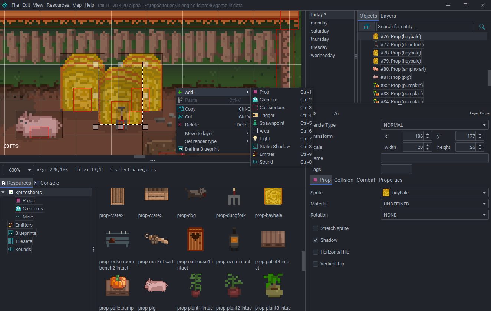
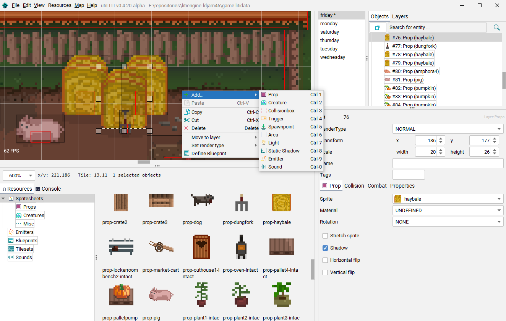
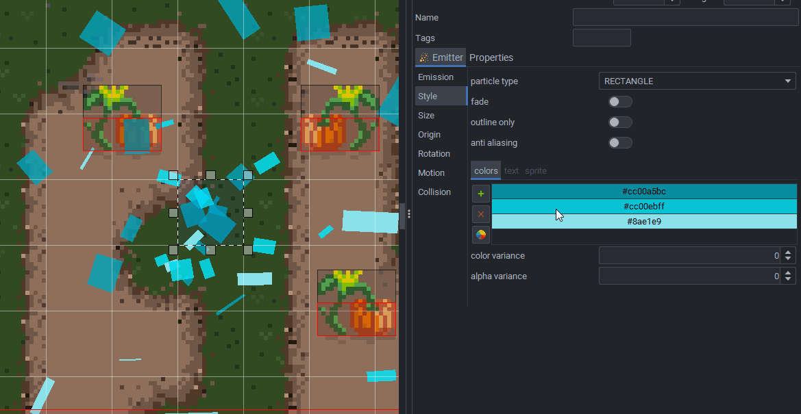

# LITIENGINE Release notes

## v0.5.0-beta - "Farewell, Alpha!" 
This release marks the beginning of a new era for the LITIENGINE. We consider most of the API to be stable and we pretty much settled on the current API design.
With the release of our new Website, the documentation and other information about the engine are easier to use and everything can be found in one place.

It's been a long journey but, finally, we're leaving the Alpha status and are looking forward to even more fruitful experiences with the LITIENGINE in the future.
A big thank you to all members of this community. Without your feedback and contributions we wouldn't be here today. You're awesome! 

#### Fixes 
 * [00178dd](https://github.com/gurkenlabs/litiengine/commit/00178dd052d21a5aab3c237c4849161614f89645) Fixed NullPointerException when rendering Shapes
 * [00178dd](https://github.com/gurkenlabs/litiengine/commit/00178dd052d21a5aab3c237c4849161614f89645) Fixed vertical position when rendering Text with Alignment.
 * [2c55195](https://github.com/gurkenlabs/litiengine/commit/2c5519506f858fe13432fb91b529a680c41d19f4) Fixed NullPointerException when setting opacity on an image.
 * [7c46a6f](https://github.com/gurkenlabs/litiengine/commit/7c46a6f20039d09bb12a51283b45321b0d477975) Fixed issue with collision dimension <= 0
 * [0deffc4](https://github.com/gurkenlabs/litiengine/commit/0deffc4bf72f14afbf02333d93a8222595513497) Zoom changed event is now fired after changing the zoom
 * [eb1ca1e](https://github.com/gurkenlabs/litiengine/commit/eb1ca1e8bf386c18f74d6d89ec0280b44a5cdd8f) Fixed issue with "stuttering" `PositionLockCamera`
 * [afe8639](https://github.com/gurkenlabs/litiengine/commit/afe863922ad3b9e45cc9e9f3048034cdc2dff577) Fixed `EntityEmitters` to update their position correctly once the corresponding entity moves.

#### Features/Improvements
 * [3455fa6](https://github.com/gurkenlabs/litiengine/commit/3455fa6b1b98ccc4cd8e6fbd15ed34f273776937) Make TileData constructor visibility being non public.
 * [1c9642a](https://github.com/gurkenlabs/litiengine/commit/1c9642a1caf97571a7f852d51a04ba516614a48f) Allow comma separated parameters for random methods.
 * [#139](https://github.com/gurkenlabs/litiengine/issues/139) Add API that supports generating maps from code
 * [#332](https://github.com/gurkenlabs/litiengine/pull/332) Improved `GeometricUtilities`
 * [14eb43c](https://github.com/gurkenlabs/litiengine/commit/14eb43cc4f100306d0eb24e40c084568621dbaa6) Extended `Game.random()` API with support for choosing a random string
 * [8d3f564](https://github.com/gurkenlabs/litiengine/commit/8d3f564407f8bd7aa51d12d32be64af3a0262e0a) Extended `Environment` with the possibility to retrieve entities by a specified `Predicate`
 * [e756f53](https://github.com/gurkenlabs/litiengine/commit/e756f530138898a4b33dfb37435766e7751102f5) Extended `SoundEffect` with the possibility to provide sounds by name
 * [6da1d94](https://github.com/gurkenlabs/litiengine/commit/6da1d94a110024a870c5311e55a306f58a6ce969) Trigger entity moved event from the `EntityNavigator`
 * [c09c1ca](https://github.com/gurkenlabs/litiengine/commit/c09c1cab3c07b7b6e45d92255424fcce15066aa0) Extended the `TextRenderer` with several new method overloads
 * [714dd6e](https://github.com/gurkenlabs/litiengine/commit/714dd6e5659f1b92b5c3de93ca9577a51913568d) Extended `TilesetEntry` with support for collision info

#### Changes
 * [7909f05](https://github.com/gurkenlabs/litiengine/commit/7909f057e8aa010b49e14727f4624ec4712cc8e9) Adjusted the handling of the anim controller affine transform
 * [30093d7](https://github.com/gurkenlabs/litiengine/commit/30093d701e2b7dd2ebb73e91bbfb6203661e565b) Renamed events to suit the naming conventions
 * [#336](https://github.com/gurkenlabs/litiengine/issues/336) Fixed inconsistent Entity Hierarchy by removing `MobileEntity`
 * [bfa2d98](https://github.com/gurkenlabs/litiengine/commit/bfa2d98bf4240ed649e1ea7908a7ee8b73bfb11a) Make the local ID sequence unique globally (over all `Environments`)

#### utiLITI
 * [06b8d0e](https://github.com/gurkenlabs/litiengine/commit/06b8d0eae82569a64869ca8b6c8e25c4c675608f) Improved scrollbar granularity
 * [24cd048](https://github.com/gurkenlabs/litiengine/commit/24cd048ed9a9f2dd9cece9c21d27b654b5a17a18) Added Spawnpoint pivot fields to the editor
 * [3af2988](https://github.com/gurkenlabs/litiengine/commit/3af298878fe8e66287f0ab80338a1458ad013470) Fixed potential exception when removing custom properties
 * [#312](https://github.com/gurkenlabs/litiengine/issues/312) Added a Zoom Combobox
 * [a5436f3](https://github.com/gurkenlabs/litiengine/commit/a5436f312d4303798430f18bb61efa3ae6b6d756) Fixed capitalization on many UI strings
 * [b20fbdd](https://github.com/gurkenlabs/litiengine/commit/b20fbdd41d3a3c9d3ae48aac0f49415474bbefea) Added support for custom properties for `MapArea`
 * [18a7735](https://github.com/gurkenlabs/litiengine/commit/18a7735cd4690eae3f040b430abe8d931bf98a37) Clear map list when opening another game project
 * [160e563](https://github.com/gurkenlabs/litiengine/commit/160e5634e2698913726da5253e92fcc3b1996682) Added right-click shortcut menu to the map list

##### Added Dark Theme and overhauled Light Theme [#340](https://github.com/gurkenlabs/litiengine/pull/340)

With this version, we've introduced theming support for the utiLITI editor with the [DarkLaf](https://github.com/weisJ/darklaf) library.
The theme can be switch at runtime 

**Dark Theme utiLITI**

**Light Theme utiLITI**

##### Revamped the Emitter UI (make it actually usable)

With this version, we revamped the `Emitter` UI in the utiLITI editor such that changes to the emitter are instantly applied. The different parameters have been categorized and the overall usability has been drastically improved.
In addition, we've also added the possibility to configure particle rotation for even more vivid visual effects.

See the related implementations on GitHub:
[#346](https://github.com/gurkenlabs/litiengine/pull/346) [#298](https://github.com/gurkenlabs/litiengine/issues/298) [#345](https://github.com/gurkenlabs/litiengine/issues/345)

#### Misc
 * Added PR templates
 * Added issue templates