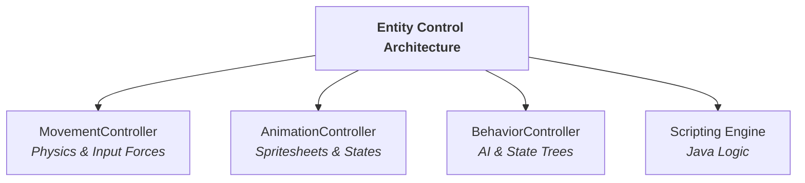

# Control Entities

In LITIENGINE, entity behaviors, animations, locomotion, combat actions, and artificial intelligence are managed through a modular and extensible control architecture. This architecture allows developers to separate game object state (`IEntity`) from dynamic runtime logic.



## The Four Control Paradigms

LITIENGINE offers four distinct yet interoperable ways to drive entity behavior:

### 1. Built-in Entity Controllers (`IEntityController`)
Controllers handle low-level continuous tasks such as keyboard/gamepad-driven movement, pathfinding locomotion, or sprite state transitions:

* **`IMovementController`**: Translates input vectors or navigation paths into 2D velocity forces within the physics engine.
* **`IEntityAnimationController`**: Evaluates entity state flags (e.g. `isIdle`, `isMoving`, `isDead`, custom states) and plays corresponding spritesheet sequences.

### 2. AI & Behavior Controllers
For enemy NPCs, companions, and bosses:

* **`BehaviorController`**: State-machine and behavior-tree implementations for patrol routes, target acquisition, aggro radiuses, and combat sequences.

### 3. Ability & Combat Framework
Structured spell, skill, and combat action system:

* **`Ability`**: Modular spells or physical attacks with cooldowns, range checks, impact effects, and mana/resource costs.

### 4. Modern Scripting Engine (Java)
Write hot-reloadable game logic directly in **utiLITI** or external scripts:

* **Entity Scripts (`EntityScript`)**: Attach custom logic to individual entities without writing boilerplate Java classes.
* **Environment Scripts (`EnvironmentScript`)**: Control level-wide triggers, cutscenes, wave spawners, and interactive puzzles.
* **Game Scripts (`GameScript`)**: Manage game startup, global progression flags, inventory, and cross-map state.

## Chapter Topics

| Topic | Description |
| :--- | :--- |
| **[Entity Controllers](/control-entities/entity-controllers/)** | Understand the controller lifecycle (`addController`, `getController`, `update`). |
| **[Animation Controller](/control-entities/animation-controller/)** | Configure sprite animation rules, frame durations, and custom animation states. |
| **[Movement Controller](/control-entities/movement-controller/)** | Handle keyboard input, gamepad locomotion, velocity, and collision avoidance. |
| **[Behavior Controller](/control-entities/behavior-controller/)** | Build intelligent AI entities with state machines and behavior trees. |
| **[Messaging System](/control-entities/messaging-system/)** | Decouple entity communication via typed message events. |
| **[Ability Framework](/control-entities/ability-framework/)** | Implement cooldown-driven spells, attacks, effects, and area-of-effect abilities. |
| **[Java Scripting Engine](/control-entities/scripting/)** | Write interactive scripts that run dynamically inside the engine. |
| **[Script-Only Game Architecture](/control-entities/script-only-games/)** | Build full LITIENGINE games using scripts and utiLITI without custom Java builds. |
| **[Script Types Guide](/control-entities/scripting/)** | Deep dive into `GameScript`, `EnvironmentScript`, and `EntityScript`. |
| **[Combat & Action Scripting](/control-entities/combat-scripting/)** | Script damage handlers, health bars, weapon swings, and projectile mechanics. |

## Quick Example: Attaching a Custom Controller

```java
public class Player extends Creature {
 public Player() {
 super("player");

 // Add standard keyboard movement controller
 addController(new KeyboardEntityController<>(this));

 // Listen to movement events
 movement().onMoved(e -> {
 // Custom footsteps, trail effects, or stamina drain
 });
 }
}
```
