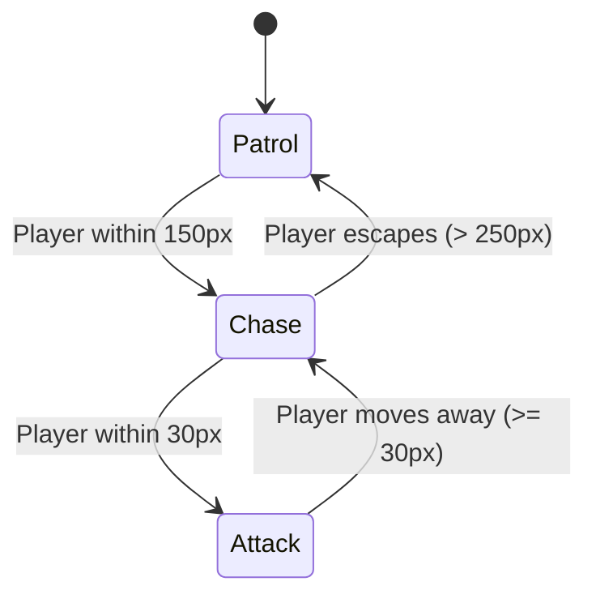

# Behavior Controllers

You can control an `Entity`'s behaviour using implementations of `IBehaviorController`. For example, if you want an enemy to walk around like a madman and then attack the player on sight, you can use the `StateController` implementation. Another example would be cutscenes, where you want to move entities on a predetermined path and then switch to normal walking once the cutscene has finished. 

## Example
Let's suppose we have a `Creature` such as a rat that's supposed to move along a given path.

These are the required components for making it happen:

* A path on your map
* A rat implementation
* A [`MapObjectLoader`](../advanced/custom-mapobjectloaders.md) that associates the path object and the rat
* A [`StateController`](entity-controllers.md) that switches between the rat behaviour states
* Different [`EntityStates`](#implementing-an-ai-state-machine) that represent certain behaviours
* An [`EntityNavigator`](movement-controller.md) to move the rat along the path

### The path MapObject
First of all, we need a collection of points that mark the path for our rat to walk on. 

> The utiLITI editor currently does not allow adding path `MapObjects` to your map due to missing UI. [Add a polyline in the Tiled map editor](https://doc.mapeditor.org/en/stable/manual/objects/#polylines) instead or add the object manually to the .tmx file. 

If you decide to add the path manually, the object xml should look something like this:
```xml
<object id="10" name="rat_path" type="PATH" x="264" y="84" width="0" height="0">
    <polyline points="0,4 -38,9 -40,20 0,20 40,28 48,52 46,100 81,148 68,180"/>
</object>
```

It's important to set the object type `PATH` so that our `MapObjectLoader` will be triggered later.

> While you cannot add the path from within utiLITI, you can at least view it if you enable rendering custom map objects (**Ctrl + K**).

### The Rat
We're going to keep the rat implementation a minimal extension of `Creature` and define some core attributes using annotations:

```java
@EntityInfo(width = 7, height = 4)
@CombatInfo(hitpoints = 1)
@MovementInfo(velocity = 6)
public class Rat extends Creature {

  public Rat() {
    super("rat");
  }

}
```

### The MapObjectLoader

Next, we implement a custom `MapObjectLoader` that can handle the `PATH` object type we have defined earlier.

```java
public class PathMapObjectLoader extends MapObjectLoader {

  public PathMapObjectLoader() {
    super("PATH");
  }

  @Override
  public Collection<IEntity> load(Environment environment, IMapObject mapObject) {
    Collection<IEntity> entities = new ArrayList<>();
    if (!mapObject.getType().equals("PATH")
    || !mapObject.getName().equals("rat_path")
    || mapObject.getPolyline() == null 
    || mapObject.getPolyline().getPoints().isEmpty()) {
      return entities;
    }

    // Convert the mapObject's polyline to a Path2D object.
    final Path2D path = MapUtilities.convertPolyshapeToPath(mapObject);
    if (path == null) {
      return entities;
    }

    final Point2D start = new Point2D.Double(mapObject.getLocation().getX(), mapObject.getLocation().getY());

    // Either initialize a new Rat and add it to the entity list, or access an existing instance.
    Rat rat;
    rat.setLocation(start);
    rat.setMapId(mapObject.getId());
    // Add a behavior controller to the rat.
    rat.addController(new RatController(rat, path));
    
    // For cutscenes, you can let the camera follow our Rat
    Game.world().setCamera(new PositionLockCamera(rat));

    return entities;
  }
}

```

When you initialize your game (before calling `Game.start()`), you need to register the `PathMapObjectLoader` like this:
```java
  Environment.registerMapObjectLoader(new PathMapObjectLoader());
```

### The StateController

Now, we define the conditions for switching between walking randomly and following the predetermined path. For that, we implement a state machine that transitions between states once certain conditions are met. In our example, we begin with the path following behaviour and then switch to random walking once the end of the path is reached. What could happen while walking around to trigger another transition? Get creative with the [`StateController`](entity-controllers.md) mechanics!

```java
public class RatController extends StateController<Rat> {

  private final FollowPathState followPathState;
  private final WalkAroundState randomWalkState;


  public RatController(final Rat entity, final Path2D path) {
    super(entity);
    this.followPathState = new FollowPathState(entity, path);
    this.randomWalkState = new WalkAroundState(entity);
    // Stop navigating if the rat was killed
    followPathState.getNavigator().cancelNavigation(e -> entity.isDead());
    // Trigger the state transition to walk around randomly once the navigator has reached the end of the path.
    followPathState.getTransitions().add(new Transition(1, randomWalkState) {

      @Override
      public boolean conditionsFullfilled() {
        return !followPathState.getNavigator().isNavigating();
      }
    });
    // Set the first state
    setState(followPathState);
  }
}
```

### The EntityStates
In the previous section, we have initialized a `FollowPathState` and a `WalkAroundState`. Let's have a look at how these `EntityStates` work:

#### Following the path

```java
public class FollowPathState extends EntityState<Creature> {

  private EntityNavigator navigator;
  private final Path2D path;
  private boolean started;

  public FollowPathState(final Creature entity, final Path2D path) {
    super("FOLLOW_PATH", entity, Game.world().environment());
    this.path = path;
    // Add an EntityNavigator that can move our entity along paths. Since we want to determine the path manually, pass null as the PathFinder parameter to the constructor.
    this.navigator = new EntityNavigator(entity, null);
  }

  @Override
  public void perform() {
    // let the EntityNavigator start navigating.
    if (!started) {
      navigator.navigate(path);
      this.started = true;
    }
  }

  public EntityNavigator getNavigator() {
    return navigator;
  }
}
```

The `FollowPathState` simply tells an `EntityNavigator` to move our entity along the given path.

#### Walking around randomly

```java
public class WalkAroundState extends EntityState<Creature> {
  private static final int ANGLE_CHANGE_INTERVAL = 3000;
  private int angle;
  private long lastAngleChange;

  public WalkAroundState(final Creature entity) {
    super("WALK_AROUND", entity, Game.world().environment());
  }

  @Override
  public void perform() {
    if (getEntity().isDead()) {
      return;
    }

    final long currentTick = Game.loop().getTicks();

    if (angle == 0 || Game.time().since(lastAngleChange) > ANGLE_CHANGE_INTERVAL) {
      this.angle = Game.random().nextInt(360);
      this.lastAngleChange = currentTick;
    }

    Game.physics().move(getEntity(), angle, getEntity().getTickVelocity());
  }
}
```

The `WalkAroundState` waits for 3000 milliseconds and then changes the walking direction randomly. Right now, there are no conditions defined to return from the `WalkAroundState` to the `FollowPathState`. Try to come up with ideas for that and implement the transitions in the `RatController`!

## AI State Machine Lifecycle Diagram

The state transitions of our enemy AI can be visualized with this state diagram:



---

## Implementing an AI State Machine

Below is a complete, runnable enemy AI state machine implementing a 3-state lifecycle (**Patrol** &rarr; **Chase** &rarr; **Attack**):

```java title="src/main/java/com/example/game/ai/EnemyAIController.java" linenums="1"
package com.example.game.ai;

import de.gurkenlabs.litiengine.Game;
import de.gurkenlabs.litiengine.entities.Creature;
import de.gurkenlabs.litiengine.entities.behavior.EntityState;
import de.gurkenlabs.litiengine.entities.behavior.EntityTransition;
import de.gurkenlabs.litiengine.entities.behavior.StateMachine;
import java.awt.geom.Point2D;

public class EnemyAIController extends StateMachine {
  private final Creature enemy;
  private final Creature player;

  public EnemyAIController(Creature enemy, Creature player) {
    this.enemy = enemy;
    this.player = player;

    // Define States
    PatrolState patrol = new PatrolState(enemy);
    ChaseState chase = new ChaseState(enemy, player);
    AttackState attack = new AttackState(enemy, player);

    // Define Transitions
    patrol.getTransitions().add(new EntityTransition<>(1, chase, e -> getDistanceToPlayer() < 150));
    chase.getTransitions().add(new EntityTransition<>(1, attack, e -> getDistanceToPlayer() < 30));
    chase.getTransitions().add(new EntityTransition<>(2, patrol, e -> getDistanceToPlayer() > 250));
    attack.getTransitions().add(new EntityTransition<>(1, chase, e -> getDistanceToPlayer() >= 30));

    // Initial state
    this.setState(patrol);
  }

  private double getDistanceToPlayer() {
    return enemy.getCenter().distance(player.getCenter());
  }

  private static class PatrolState extends EntityState<Creature> {
    public PatrolState(Creature enemy) {
      super("PATROL", enemy);
    }

    @Override
    public void perform() {
      // Roam or wander around origin
    }
  }

  private static class ChaseState extends EntityState<Creature> {
    private final Creature target;

    public ChaseState(Creature enemy, Creature target) {
      super("CHASE", enemy);
      this.target = target;
    }

    @Override
    public void perform() {
      // Navigate towards player location
      getEntity().getMovementController().applyForce(target.getCenter(), 50);
    }
  }

  private static class AttackState extends EntityState<Creature> {
    private final Creature target;

    public AttackState(Creature enemy, Creature target) {
      super("ATTACK", enemy);
      this.target = target;
    }

    @Override
    public void perform() {
      // Execute combat attack or ability
    }
  }
}
```
