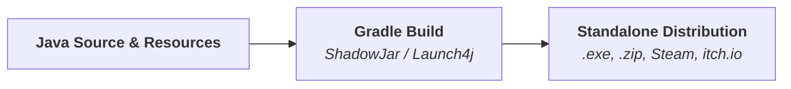

# Deploying LITIENGINE Games

This guide walks you through building, packaging, and distributing your LITIENGINE game as a standalone, player-ready executable for **Windows**, **Linux**, and **macOS**.



## 1. Release Preparation

Before building a release distribution, ensure your project is properly configured for production:

1. **Update Game Version**:
 * Increment your version number in `build.gradle` (e.g. `version = "1.0.0"`).
 * Update the metadata in your main entry point:
 ```java
Game.info().setName("My Game");
Game.info().setVersion("v1.0.0");
 ```

2. **Disable Debug Flags**:
 * Ensure `Game.config().debug().setDebug(false)` or disable debug properties in `config.properties`.
3. **Verify Resource Bundle**:
 * Ensure all maps, tilesets, spritesheets, and sounds are packed into `game.litidata` or placed correctly in your runtime `resources/` folder.

---

## 2. Build Automation with Gradle

Modern LITIENGINE games target **Java 25 or later**. Below is a recommended `build.gradle` using the standard Gradle `application` plugin, `shadow` (uber-jar), and `launch4j` for generating native Windows `.exe` wrappers:

```groovy
plugins {
  id 'java'
  id 'application'
  id 'com.gradleup.shadow' version '8.3.6'
  id 'edu.sc.seis.launch4j' version '3.0.5'
}

group = 'com.mygame'
version = '1.0.0'

java {
  toolchain {
    languageVersion = JavaLanguageVersion.of({{ java_version }})
  }
}

application {
  mainClass = 'com.mygame.Program'
}

repositories {
  mavenCentral()
}

dependencies {
  implementation 'de.gurkenlabs:litiengine:{{ version }}'
}

// Configure fat / shadow jar
shadowJar {
  archiveBaseName.set('mygame')
  archiveClassifier.set('all')
  archiveVersion.set(project.version.toString())
}

// Configure Windows .exe generation
launch4j {
  mainClassName = 'com.mygame.Program'
  icon = "${projectDir}/icon.ico"
  outputDir = 'libs'
  outfile = "mygame-${project.version}.exe"
  jarTask = tasks.shadowJar
  companyName = 'My Game Studio'
  headerType = 'gui'
  jreMinVersion = '21'
  bundledJrePath = 'jre'
  jvmOptions = ['-Xms256m', '-Xmx1024m']
}

// Package standalone Windows distribution zip
tasks.register('distZipWindows', Zip) {
  group = 'distribution'
  dependsOn tasks.createExe

  archiveFileName = "mygame-${project.version}-win.zip"
  destinationDirectory = file("${buildDir}/distributions")

  from("${buildDir}/launch4j") {
    include '*.exe'
  }
  from(projectDir) {
    include 'config.properties'
    include 'game.litidata'
  }
}

// Package standalone Cross-Platform JAR distribution
tasks.register('distZipUniversal', Zip) {
  group = 'distribution'
  dependsOn tasks.shadowJar

  archiveFileName = "mygame-${project.version}-universal.zip"
  destinationDirectory = file("${buildDir}/distributions")

  from(tasks.shadowJar.archiveFile)
  from(projectDir) {
    include 'config.properties'
    include 'game.litidata'
  }
}
```

---

## 3. Bundling the Java Runtime (JRE)

Players should not be required to manually install Java on their systems. You can bundle a lightweight JRE with your game using **`jlink`** or **`jpackage`**:

```bash
# Create a minimal bundled JRE containing only required modules
jlink --no-header-files --no-man-pages --compress=2 \
--add-modules java.base,java.desktop,java.logging,java.management \
--output build/distributions/jre
```

Place the output `jre/` directory inside your game distribution root alongside `mygame.exe` (matching `bundledJrePath = 'jre'` in Launch4j).

---

## 4. Testing Your Distribution

Before releasing your build:

1. **Extract to a Clean Directory**: Extract the distribution zip to a separate folder or VM without a pre-installed Java SDK.
2. **Launch via Executable**: Double-click `mygame.exe` (or run `java -jar mygame-all.jar` on Linux/macOS).
3. **Verify Assets & Audio**: Verify that fonts, spritesheets, `.litidata` resource bundles, and music tracks load without file-not-found exceptions.
4. **Verify Save Game & Config Directory**: Ensure the game writes configuration files and savegames to the user's local application data directory rather than trying to write into restricted program files directories.

---

## 5. Distributing to Game Platforms

### GitHub Releases
1. Navigate to your repository's **Releases** page and click **Draft a new release**.
2. Tag the release (e.g. `v1.0.0`) and enter release patch notes.
3. Upload your packaged `.zip` artifacts and publish.

### Steamworks
1. Log in to the [Steamworks Partner Portal](https://partner.steamgames.com/).
2. Navigate to your app dashboard: **Edit Steamworks Settings &rarr; Steampipe &rarr; Builds**.
3. Upload your game build directory (containing the executable, bundled JRE, `game.litidata`, and `steam_appid.txt`).
4. Set the build live on your `default` or `beta` branch.

### itch.io
1. Go to your game project dashboard on [itch.io](https://itch.io).
2. Scroll to the **Uploads** section and click **Upload files**.
3. Select your Windows/Linux/macOS ZIP distributions and mark them as executable.
4. Set the release public or notify followers with a new devlog post.

---

## Best Practices

!!! tip
    - **Always Bundle the JRE**: Bundling Java ensures consistent performance, prevents JVM version conflicts, and creates a seamless zero-configuration experience for players.
    - **Use Relative Paths**: Always load assets via `Resources.load("game.litidata")` or classloader streams rather than hardcoded absolute file system paths.
    - **Automate with CI/CD**: Set up a GitHub Actions workflow to build and package your cross-platform zip files automatically whenever a new version tag is pushed.

## See Also
- **[Savegames Guide](savegames.md)** - Persisting player data across game sessions
- **[Configuration](configuration\README.md)** - Managing runtime game configuration properties
