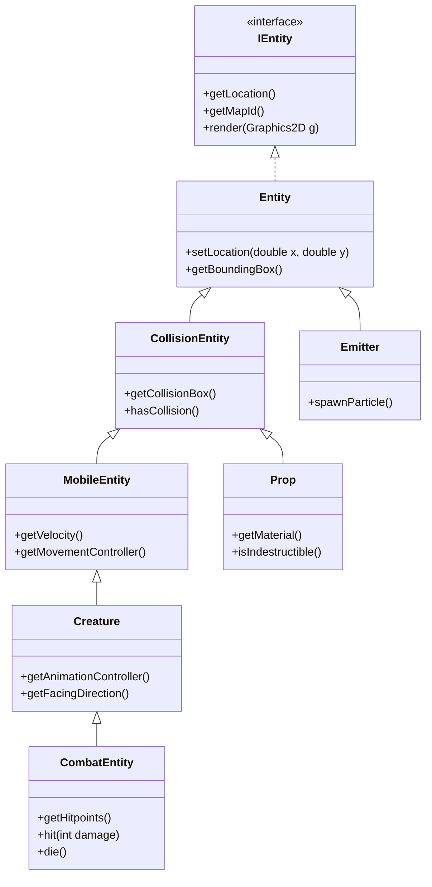
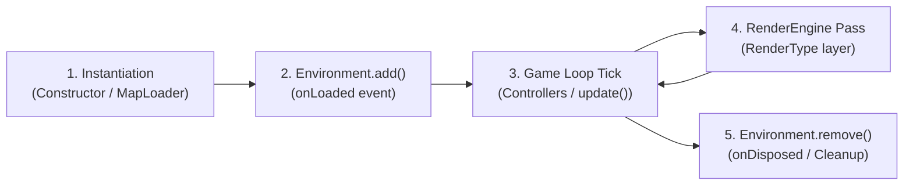

# Entity Framework

In LITIENGINE, every dynamic and interactive object that exists within a game world is an **Entity** (implementing `IEntity`). The **Entity Framework** provides the foundational architecture for managing game objects, their spatial transformations, physics collision boundaries, rendering order, animation states, combat mechanics, and event lifecycles.



## Core Concepts

### 1. Entities & Environments
Entities live inside an `Environment` (a loaded game level or map). When an environment is loaded via `Game.world().loadEnvironment("mapName")`, all entities registered in that environment are automatically updated on each game tick and rendered to the screen.

```java
// Spawn an entity dynamically into the active environment
Creature monster = new Creature("monster-sprite");
monster.setLocation(200, 150);
Game.world().environment().add(monster);
```

### 2. Tiled Maps & MapObjects Integration
Entities can be created in code or placed visually in the **utiLITI Editor** / **Tiled Editor**. When a map loads, LITIENGINE's `MapObjectLoader` automatically instantiates concrete entity classes from map object layers matching their `type` property.

### 3. Static Metadata via Annotations
Instead of setting sizes, bounding boxes, and speeds manually in constructors, LITIENGINE provides declarative annotations:
* `@EntityInfo`: Configures entity dimensions, custom render tags, and render layers.
* `@MovementInfo`: Configures base velocity, acceleration, and deceleration.
* `@CollisionInfo`: Sets up collision boxes and interaction obstacles.
* `@CombatInfo`: Configures base hitpoints, teams, and invulnerability states.

```java
@EntityInfo(width = 24, height = 32)
@MovementInfo(velocity = 90)
@CollisionInfo(collision = true, collisionBoxWidth = 16, collisionBoxHeight = 12)
public class Goblin extends Creature {
  public Goblin() {
    super("goblin");
  }
}
```

## Chapter Topics

| Topic | Description |
| :--- | :--- |
| **[Default Entity Types](default-entity-types.md)** | Explore built-in entities: `Creature`, `Prop`, `Emitter`, `LightSource`, `Trigger`, and `SoundSource`. |
| **[Props](props.md)** | Learn how to place, customize, and destroy interactive props in your world. |
| **[Subscribe to Entity Events](subscribe-to-entity-events.md)** | Hook into entity lifecycle events (`onMoved`, `onHit`, `onDying`, `onRendered`). |
| **[Annotations for Static Information](annotations-for-static-information.md)** | Configure static attributes declaratively with `@EntityInfo`, `@MovementInfo`, and `@CombatInfo`. |
| **[Custom Entity Implementations](../advanced/advanced-entity-knowledge/custom-entity-implementations.md)** | Create complex, custom entity classes from scratch. |
| **[Custom MapObjectLoaders](../advanced/custom-mapobjectloaders.md)** | Map custom Tiled object types directly to your Java entity classes. |

## Entity Lifecycle



1. **Instantiation**: Constructed in Java code or loaded from a `.tmx` MapObject via `MapObjectLoader`.
2. **Environment Attachment**: Added to an active `Environment`. The entity receives its map ID and triggers `onLoaded` listeners.
3. **Update Phase**: The game loop updates attached controllers (Movement, AI Behaviors, Animations).
4. **Render Phase**: The RenderEngine draws the entity on its designated `RenderType` layer (BACKGROUND, GROUND, SURFACE, NORMAL, OVERLAY).
5. **Disposal**: When removed or killed, `dispose()` cleans up listeners, cancels active tweens, and detaches from physics.
