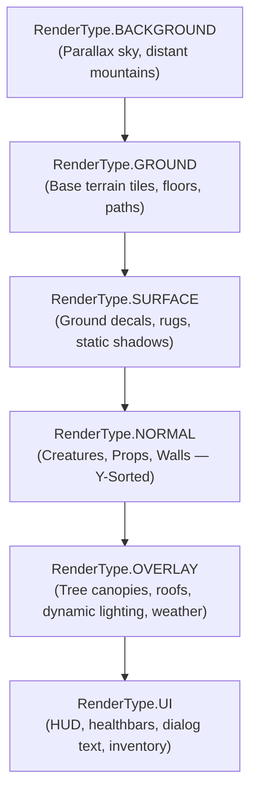

# Entity Annotations & Architecture Matrix

LITIENGINE uses declarative Java annotations to define static metadata (bounding boxes, movement velocity, combat stats, render layers) when entities are instantiated from map objects or spawned in code.

---

## Interactive Collision Box & Pivot Visualizer

Experiment with entity dimensions and `@CollisionInfo` alignments to see how bounding boxes align with character feet in 2.5D top-down games:

<div class="interactive-card" markdown="1">

<div style="display: flex; gap: 1.5rem; flex-wrap: wrap; align-items: flex-start;">
  <div style="flex: 1; min-width: 260px;">
    <div style="margin-bottom: 0.6rem;">
      <label style="font-weight: 600; font-size: 0.85rem;">Collision Box Width (<span id="lbl-box-w">16px</span>):</label>
      <input id="rng-box-w" type="range" min="4" max="32" value="16" style="width: 100%;">
    </div>
    <div style="margin-bottom: 0.6rem;">
      <label style="font-weight: 600; font-size: 0.85rem;">Collision Box Height (<span id="lbl-box-h">12px</span>):</label>
      <input id="rng-box-h" type="range" min="4" max="32" value="12" style="width: 100%;">
    </div>
    <div style="margin-bottom: 0.6rem;">
      <label style="font-weight: 600; font-size: 0.85rem;">Vertical Alignment (`Valign`):</label>
      <select id="sel-valign" style="width: 100%; padding: 0.35rem; border-radius: 4px; background: var(--md-code-bg-color); color: var(--md-default-fg-color); border: 1px solid var(--md-default-fg-color--lighter);">
        <option value="Valign.DOWN" selected>Valign.DOWN (Anchored to Feet for 2.5D)</option>
        <option value="Valign.MIDDLE">Valign.MIDDLE (Centered)</option>
        <option value="Valign.TOP">Valign.TOP (Top Anchored)</option>
      </select>
    </div>
    <div style="font-size: 0.8rem;">
      <strong>Generated Annotation:</strong>
      <pre style="margin-top: 0.25rem; padding: 0.5rem; border-radius: 4px; background: var(--md-code-bg-color); font-size: 0.72rem;"><code id="box-code-preview">@EntityInfo(width = 32, height = 32)
@CollisionInfo(collisionBoxWidth = 16, collisionBoxHeight = 12, collisionBoxValign = Valign.DOWN)</code></pre>
    </div>
  </div>
  <div style="flex: 1; min-width: 260px; text-align: center;">
    <canvas id="box-canvas" width="220" height="200" style="border: 1px solid var(--md-default-fg-color--lighter); border-radius: 6px; background: var(--md-code-bg-color); max-width: 100%; height: auto;"></canvas>
    <div style="font-size: 0.75rem; color: var(--md-default-fg-color--lighter); margin-top: 0.25rem;">Entity Sprite (Blue) vs Physics Collider (Red)</div>
  </div>
</div>

</div>

<script>
(function() {
  function initBoxVisualizer() {
    const canvas = document.getElementById('box-canvas');
    const rngW = document.getElementById('rng-box-w');
    const rngH = document.getElementById('rng-box-h');
    const lblW = document.getElementById('lbl-box-w');
    const lblH = document.getElementById('lbl-box-h');
    const selValign = document.getElementById('sel-valign');
    const codePreview = document.getElementById('box-code-preview');
    if (!canvas || !rngW || !rngH) return;

    const ctx = canvas.getContext('2d');

    function update() {
      const boxW = parseInt(rngW.value);
      const boxH = parseInt(rngH.value);
      const valign = selValign.value;
      lblW.textContent = boxW + "px";
      lblH.textContent = boxH + "px";

      codePreview.textContent = "@EntityInfo(width = 32, height = 32)\n@CollisionInfo(collision = true, collisionBoxWidth = " + boxW + ", collisionBoxHeight = " + boxH + ", collisionBoxValign = " + valign + ")";

      ctx.clearRect(0, 0, canvas.width, canvas.height);
      const scale = 4;
      const entityW = 32 * scale;
      const entityH = 32 * scale;
      const ex = (canvas.width - entityW) / 2;
      const ey = (canvas.height - entityH) / 2;

      // Draw Ground Tile
      ctx.fillStyle = "rgba(128, 128, 128, 0.15)";
      ctx.fillRect(ex - 20, ey + entityH - 10, entityW + 40, 20);

      // Draw Entity Sprite Frame
      ctx.fillStyle = "rgba(41, 182, 246, 0.25)";
      ctx.strokeStyle = "#29b6f6";
      ctx.lineWidth = 2;
      ctx.fillRect(ex, ey, entityW, entityH);
      ctx.strokeRect(ex, ey, entityW, entityH);

      // Draw Stick figure / Character silhouette
      ctx.fillStyle = "#29b6f6";
      ctx.beginPath();
      ctx.arc(ex + entityW / 2, ey + 24, 12, 0, Math.PI * 2);
      ctx.fill();
      ctx.fillRect(ex + entityW / 2 - 8, ey + 40, 16, 40);

      // Calculate Collision Box Position
      const cw = boxW * scale;
      const ch = boxH * scale;
      const cx = ex + (entityW - cw) / 2;
      let cy = ey + entityH - ch;
      if (valign === "Valign.MIDDLE") cy = ey + (entityH - ch) / 2;
      else if (valign === "Valign.TOP") cy = ey;

      // Draw Collision Box (Red)
      ctx.fillStyle = "rgba(239, 83, 80, 0.4)";
      ctx.strokeStyle = "#ef5350";
      ctx.lineWidth = 2;
      ctx.fillRect(cx, cy, cw, ch);
      ctx.strokeRect(cx, cy, cw, ch);

      // Labels
      ctx.fillStyle = "#ffffff";
      ctx.font = "11px sans-serif";
      ctx.fillText("Entity: 32×32", ex + 4, ey + 14);
      ctx.fillStyle = "#ff8a80";
      ctx.fillText("Collider: " + boxW + "×" + boxH, cx + 4, cy + ch - 6);
    }

    rngW.addEventListener('input', update);
    rngH.addEventListener('input', update);
    selValign.addEventListener('change', update);
    update();
  }

  if (typeof document$ !== 'undefined') {
    document$.subscribe(initBoxVisualizer);
  } else {
    document.addEventListener('DOMContentLoaded', initBoxVisualizer);
  }
})();
</script>

---

## Built-in Entity Architecture Matrix

LITIENGINE includes 9 pre-built entity classes optimized for 2D level design and physics partitioning:

| Entity Class | Base Hierarchy | Physics Collision Default | Render Layer | Primary Purpose & utiLITI Tool |
|:---|:---|:---|:---|:---|
| **`Creature`** | `CombatEntity` &rarr; `Entity` | Dynamic (`Align.CENTER`, `Valign.DOWN`) | `NORMAL` | Playable characters, NPCs, enemies with animation states and steering navigation. |
| **`Prop`** | `CollisionEntity` &rarr; `Entity` | Static (Obstacle) | `NORMAL` / `SURFACE` | Interactive world objects (crates, trees, chests, destructible barrels). |
| **`Trigger`** | `Entity` | None (Sensor Area) | `NONE` (Editor Overlay) | Volume regions activating scripts, teleports, cutscenes, and quest dialogs. |
| **`Spawnpoint`** | `Entity` | None (Position Marker) | `NONE` (Editor Overlay) | Respawn locations, creature spawn anchors, and camera checkpoint nodes. |
| **`CollisionBox`** | `CollisionEntity` &rarr; `Entity` | Static Solid Bounding Box | `NONE` | Invisible physics barriers preventing characters from walking through walls. |
| **`LightSource`** | `Entity` | None | `OVERLAY` / Dark Ambient | Dynamic radial or ambient 2D lighting nodes with real-time shadow casting. |
| **`StaticShadow`** | `Entity` | None | `SURFACE` / `SHADOW` | Static drop-shadow geometry baked below props and structures. |
| **`Emitter`** | `Entity` | None (Custom Particle Bounds) | `NORMAL` / `OVERLAY` | Particle systems spawning sparks, dust, weather, magic spells, and smoke. |
| **`SoundSource`** | `Entity` | None | `NONE` | Positional 2D audio emitter with automatic distance falloff attenuation. |

---

## Render Layer Hierarchy

Entities are sorted and rendered in strict depth order to guarantee proper occlusion:



---

## Available Annotation Reference

### 1. `@EntityInfo`
Configures dimensions and render layer placement:

```java title="Player.java"
@EntityInfo(
    width = 32, // Entity width in pixels
    height = 32, // Entity height in pixels
    renderType = RenderType.NORMAL // Rendering layer
)
public class Player extends Creature { ... }
```

| Parameter | Type | Default | Description |
|:---|:---|:---|:---|
| `width` | `int` | `16` | Bounding box width in pixels |
| `height` | `int` | `16` | Bounding box height in pixels |
| `renderType` | `RenderType` | `RenderType.NORMAL` | Layer depth for engine render sorting |

---

### 2. `@CollisionInfo`
Configures physics bounding box dimensions, collision type, and alignment:

```java title="Chest.java"
@CollisionInfo(
    collision = true,
    collisionBoxWidth = 16,
    collisionBoxHeight = 12,
    collisionBoxAlign = Align.CENTER,
    collisionBoxValign = Valign.DOWN
)
public class Chest extends Prop { ... }
```

| Parameter | Type | Default | Description |
|:---|:---|:---|:---|
| `collision` | `boolean` | `true` | Enables/disables solid physics registration |
| `collisionBoxWidth` | `int` | `-1` (Full Width) | Collider width in pixels |
| `collisionBoxHeight` | `int` | `-1` (Full Height) | Collider height in pixels |
| `collisionBoxAlign` | `Align` | `Align.CENTER` | Horizontal anchoring: `LEFT`, `CENTER`, `RIGHT` |
| `collisionBoxValign` | `Valign` | `Valign.DOWN` | Vertical anchoring: `TOP`, `MIDDLE`, `DOWN` |

---

### 3. `@MovementInfo`
Configures locomotion speeds and steering characteristics:

```java title="Goblin.java"
@MovementInfo(
    velocity = 80, // Pixels per second
    acceleration = 20, // Acceleration rate
    deceleration = 40, // Deceleration rate
    turnOnMove = true // Face movement heading
)
public class Goblin extends Creature { ... }
```

| Parameter | Type | Default | Description |
|:---|:---|:---|:---|
| `velocity` | `float` | `0.0f` | Maximum movement speed in pixels per second |
| `acceleration` | `float` | `0.0f` | Speed increase rate |
| `deceleration` | `float` | `0.0f` | Speed decrease rate |
| `turnOnMove` | `boolean` | `true` | Automatically updates sprite direction when moving |

---

### 4. `@CombatInfo`
Configures health attributes and faction alignment:

```java title="Boss.java"
@CombatInfo(
    hitpoints = 500,
    team = 2,
    isIndestructible = false,
    isTarget = true
)
public class Boss extends Creature { ... }
```

| Parameter | Type | Default | Description |
|:---|:---|:---|:---|
| `hitpoints` | `int` | `100` | Maximum health points |
| `team` | `int` | `0` | Team/faction ID for friend/foe targeting |
| `isIndestructible` | `boolean` | `false` | When `true`, entity ignores all incoming damage |
| `isTarget` | `boolean` | `true` | Can be selected and locked-on by abilities |

---

### 5. `@AnimationInfo`
Binds spritesheet naming prefixes for automatic state animation:

```java title="Hero.java"
@AnimationInfo(
    spritePrefix = "hero",
    spriteBatched = true
)
public class Hero extends Creature { ... }
```

---

## See Also

<div class="grid cards" markdown>

- :material-cube-outline:{ .lg .middle } **[Custom Entities](/entity-framework/custom-entities/)**

    ---

    Step-by-step guide to extending `Creature`, `Prop`, and registering custom loaders.

- :material-lightning-bolt-outline:{ .lg .middle } **[Ability Framework](/control-entities/ability-framework/)**

    ---

    Attaching abilities, cooldowns, and combat effects with `@AbilityInfo`.

</div>

*[EntityInfo]: Configures dimensions and render layer placement
*[CollisionInfo]: Defines physics bounding box dimensions and alignment
*[MovementInfo]: Configures locomotion velocity, acceleration, and heading
*[CombatInfo]: Defines hitpoints, team factions, and damage immunity
*[AnimationInfo]: Binds spritesheet name prefixes for automatic state animation
*[RenderType]: Render depth layer (BACKGROUND, GROUND, SURFACE, NORMAL, OVERLAY, UI)
*[Creature]: Living entity supporting locomotion, health, combat, and AI navigation
*[Prop]: Interactive or decorative world object with optional collision and health
*[Trigger]: Invisible sensor volume that fires events when entered or activated
