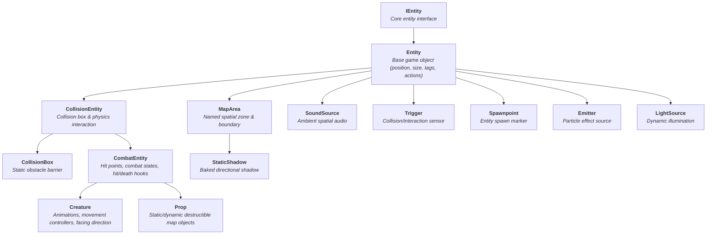

# Default Entity Types

## Master Entity Blueprint Matrix

Choose the optimal entity type for your game objects:

| Icon | Entity Type | Purpose / Use Case | Default Collision | Key Annotations | utiLITI Object Type | Key Behaviors & Hooks |
| :---: | :--- | :--- | :--- | :--- | :--- | :--- |
| { .utiliti-icon } | **[`Creature`](#creature)** | Living characters, NPCs, enemies, players | Yes (Dynamic box) | `@EntityInfo`, `@MovementInfo`, `@CombatInfo`, `@CollisionInfo` | [`CREATURE`](../tile-maps/map-objects.md#map-object-types) | `onMoved`, `onHit`, `onDeath`, `onResurrect` |
| { .utiliti-icon } | **[`Prop`](#prop)** | Interactive/static map objects (chests, trees, pots) | Configurable | `@EntityInfo`, `@CollisionInfo` | [`PROP`](../tile-maps/map-objects.md#map-object-types) | `onHit`, `onDeath`, `PropState` |
| { .utiliti-icon } | **[`CollisionBox`](#collisionbox)** | Static physics obstacle barrier / wall | Static collider | None | [`COLLISIONBOX`](../tile-maps/map-objects.md#map-object-types) | `isObstructingLight()`, pathfinding blocking |
| { .utiliti-icon } | **[`Trigger`](#trigger)** | Invisible event zones (doors, cutscenes, teleporters) | Sensor only | `@EntityInfo` | [`TRIGGER`](../tile-maps/map-objects.md#map-object-types) | `addActivatedListener`, `addDeactivatedListener` |
| { .utiliti-icon } | **[`Spawnpoint`](#spawnpoint)** | Level entry points and entity spawn markers | None | `@EntityInfo` | [`SPAWNPOINT`](../tile-maps/map-objects.md#map-object-types) | `onSpawned`, `spawn(IEntity)` |
| { .utiliti-icon } | **[`LightSource`](#lightsource)** | Dynamic/static ambient lights & torches | None | `@EntityInfo` | [`LIGHTSOURCE`](../tile-maps/map-objects.md#map-object-types) | `activate()`, `deactivate()`, `setColor()` |
| { .utiliti-icon } | **[`SoundSource`](#soundsource)** | Ambient or looping positional audio emitters | None | `@EntityInfo` | [`SOUNDSOURCE`](../tile-maps/map-objects.md#map-object-types) | `play()`, `setLoop(boolean)`, `setRange(int)` |
| { .utiliti-icon } | **[`StaticShadow`](#staticshadow)** | Baked directional drop shadows | None | None | [`STATICSHADOW`](../tile-maps/map-objects.md#map-object-types) | `getShadowType()`, `setOffset()` |
| { .utiliti-icon } | **[`Emitter`](#emitter)** | Particle sources (fire, weather, explosions) | None | `@EntityInfo` | [`EMITTER`](../tile-maps/map-objects.md#map-object-types) | `onFinished`, `data().setEmitterDuration(...)` |
| { .utiliti-icon } | **[`MapArea`](#maparea)** | Named spatial zones, boundary detection, scripts | Sensor / None | `@EntityInfo` | [`AREA`](../tile-maps/map-objects.md#map-object-types) | Zone boundary queries, `getArea(name)` |

---

LITIENGINE provides a hierarchy of built-in entity types. Each type builds upon the previous, adding more functionality.

## Entity Hierarchy



## Entity

The base class for all game objects.

```java
public class MyEntity extends Entity {
  public MyEntity() {
    super("my-entity");
    setLocation(100, 100);
    setSize(32, 32);
  }
}
```

### Key Properties
- **Name**: Unique identifier
- **Location**: X/Y position in the world
- **Size**: Width and height
- **MapId**: ID from map object
- **Tags**: String tags for categorization
- **RenderType**: Rendering layer (`NONE`, `BACKGROUND`, `GROUND`, `SURFACE`, `NORMAL`, `OVERLAY`, `UI`)

## CollisionEntity

Extends `Entity` with collision detection capabilities.

```java
@EntityInfo(width = 32, height = 32)
@CollisionInfo(collisionBoxWidth = 28, collisionBoxHeight = 28, collision = true, collisionType = Collision.STATIC)
public class Wall extends CollisionEntity {
  public Wall() {
    super("wall");
  }
}
```

### Collision Types (`Collision`)
- **`DYNAMIC`** (default): Collides with static geometry and other dynamic entities (used for actors, creatures, moving obstacles).
- **`STATIC`**: Immovable geometry that dynamic entities collide against (used for walls, map boundaries).
- **`NONE`**: Disables collision resolution for this entity.
- **`ANY`**: Special filter flag used exclusively for `PhysicsEngine` spatial queries and raycasts (cannot be assigned directly to an entity's `collisionType`).

### Key Properties
- Collision box dimensions and offset
- Collision type (`DYNAMIC`, `STATIC`, `NONE`)

## CombatEntity

Extends `CollisionEntity` with health and combat mechanics.

```java
@EntityInfo(width = 32, height = 32)
@CombatInfo(hitpoints = 100, team = 1)
public class Destructible extends CombatEntity {
  public Destructible() {
    super("destructible");
  }
}
```

### Key Properties
- **Hitpoints**: Current and maximum health
- **Team**: For friend/foe identification
- **Indestructible**: Cannot be damaged
- **Target**: Can be targeted by abilities

### Events
```java
combatEntity.onHit(hitEvent -> { /* took damage */ });
combatEntity.onDeath((victim, hitEvent) -> { /* died */ });
combatEntity.onResurrect(resurrected -> { /* revived */ });
```

## Creature

The most feature-rich entity type for living characters. Extends `CombatEntity` with movement, directional facing, and state animation controllers.

```java
@EntityInfo(width = 18, height = 18)
@MovementInfo(velocity = 70, acceleration = 10)
@CombatInfo(hitpoints = 50)
@CollisionInfo(collisionBoxWidth = 14, collisionBoxHeight = 16, collision = true)
public class Player extends Creature {
  public Player() {
    super("player"); // Spritesheet name
  }
}
```

### Features
- Automatic animation controller from spritesheets
- Movement controller integration
- Facing direction tracking (`Direction.UP`, `DOWN`, `LEFT`, `RIGHT`)
- State management (`idle`, `walk`, `dead`)

### Key Methods
```java
creature.getFacingDirection(); // Current facing direction
creature.setSpritesheetName("player-alt"); // Change spritesheet animation source
creature.isIdle(); // Check if not moving
creature.isDead(); // Check if dead
```

## Prop

Static or interactive objects in the game world. Extends `CombatEntity` directly (does NOT inherit creature movement).

```java
@EntityInfo(width = 32, height = 32)
@CollisionInfo(collision = true)
public class Barrel extends Prop {
  public Barrel() {
    super("barrel"); // Spritesheet name
  }
}
```

### Prop States
- **INTACT**: More than 50% health or indestructible
- **DAMAGED**: Less than 50% health
- **DESTROYED**: Zero health

### State-based Spritesheets
```java
prop-barrel-intact.png
prop-barrel-damaged.png
prop-barrel-destroyed.png
```

## Other Entity Types

### Trigger
Area-based event triggers activated on collision or user interaction.

```java
Trigger trigger = new Trigger(TriggerActivation.COLLISION, "door_sensor", "open_door");
trigger.addActivatedListener(event -> {
    IEntity entity = event.getEntity();
    // Action triggered when entity enters zone
});
trigger.addDeactivatedListener(event -> {
    // Action triggered when entity leaves zone
});
```

### LightSource
Dynamic lighting entities.

```java
LightSource light = new LightSource(150, Color.ORANGE, LightSource.Type.ELLIPSE, true);
light.setLocation(100, 100);
Game.world().environment().add(light);
```

### Emitter
Particle effect sources.

```java
Emitter emitter = new Emitter(100, 100);
emitter.data().setEmitterDuration(5000);
Game.world().environment().add(emitter);
emitter.activate();
```

### Spawnpoint
Entity spawn locations and player start markers.

```java
Spawnpoint spawn = new Spawnpoint(Direction.RIGHT);
spawn.setName("player_start");
spawn.setLocation(100, 100);
spawn.spawn(new Player());
```

### CollisionBox
Static collision obstacles that block physical movement and pathfinding.

```java
// Create an immovable collision barrier (e.g. wall, boundary)
CollisionBox wall = new CollisionBox(0, 0, 320, 16);
wall.setObstructingLight(true); // Optionally cast dynamic lighting shadows
Game.world().environment().add(wall);
```

### SoundSource
Positional ambient audio emitters with automatic 2D distance falloff.

```java
SoundSource waterfall = new SoundSource("waterfall.ogg");
waterfall.setLocation(250, 180);
waterfall.setLoop(true);
waterfall.setRange(300); // Audible within 300px radius
Game.world().environment().add(waterfall);
waterfall.play();
```

### StaticShadow
Baked directional drop shadows for buildings, trees, and large scenery.

```java
StaticShadow shadow = new StaticShadow(100, 100, 64, 32, StaticShadowType.DOWN);
shadow.setOffset(12);
Game.world().environment().add(shadow);
```

### MapArea
Named spatial boundary zones for script triggers, camera bounds, and room queries.

```java
MapArea bossArena = new MapArea(500, 200, 400, 300);
bossArena.setName("boss_arena");
Game.world().environment().add(bossArena);

// Query if an entity is inside the area
if (bossArena.getBoundingBox().contains(player.getCenter())) {
  // Trigger boss phase or room containment
}
```

## Choosing the Right Type

| Icon | Use Case | Entity Type | utiLITI Object Type |
| :---: | :--- | :--- | :--- |
| { .utiliti-icon } | Player characters, enemies, companions, NPCs | [`Creature`](#creature) | `CREATURE` |
| { .utiliti-icon } | Interactive/destructible scenery (chests, barrels, levers) | [`Prop`](#prop) | `PROP` |
| { .utiliti-icon } | Invisible static barriers, walls, level boundaries | [`CollisionBox`](#collisionbox) | `COLLISIONBOX` |
| { .utiliti-icon } | Collision/interaction event sensors (doors, traps, portals) | [`Trigger`](#trigger) | `TRIGGER` |
| { .utiliti-icon } | Player spawn positions, enemy respawn points | [`Spawnpoint`](#spawnpoint) | `SPAWNPOINT` |
| { .utiliti-icon } | Torches, lanterns, campfires, dynamic lighting | [`LightSource`](#lightsource) | `LIGHTSOURCE` |
| { .utiliti-icon } | Positional waterfalls, crackling fires, ambient soundscapes | [`SoundSource`](#soundsource) | `SOUNDSOURCE` |
| { .utiliti-icon } | Directional drop shadows underneath static obstacles | [`StaticShadow`](#staticshadow) | `STATICSHADOW` |
| { .utiliti-icon } | Particle bursts, weather effects, fire, smoke | [`Emitter`](#emitter) | `EMITTER` |
| { .utiliti-icon } | Spatial triggers, cutscene zones, camera boundaries | [`MapArea`](#maparea) | `AREA` |
| :lucide-box:{ .utiliti-icon } | Lightweight decorative entity without physics | `Entity` | - |

## See Also

- [Map Objects](../tile-maps/map-objects.md) - Learn how map objects are placed, configured, and loaded from utiLITI and Tiled maps
- [Entity Framework Overview](README.md) - Entity lifecycle and management
- [Annotations](annotations.md) - Declarative configuration with `@EntityInfo`, `@CollisionInfo`, and `@CombatInfo`
- [Props](props.md) - Deep dive into prop states and destructible objects
