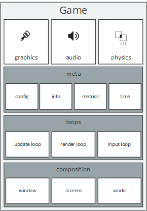
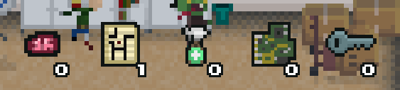
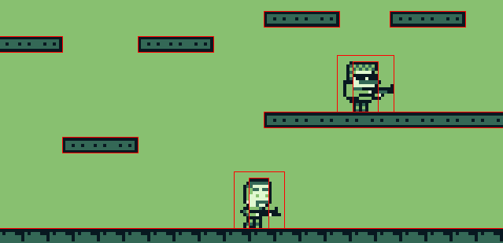
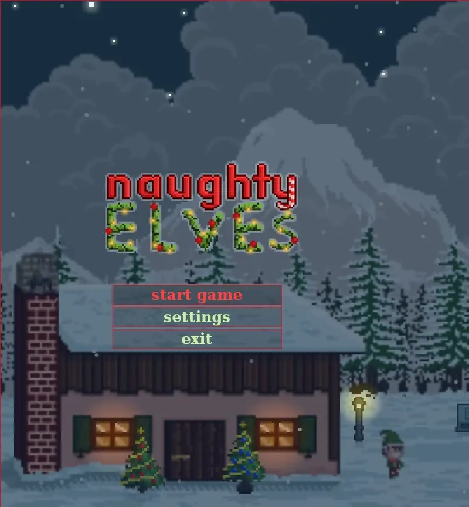

# The Game API 



The static `Game` class is undoubtedly one of the classes that you will call the most when creating a game with LITIENGINE. It is designed to be the static container that provides access to all important aspects of the engine., e.g. it holds the GameInfo, the RenderEngine, the SoundEngine and many other major components.

We designed the API such that all important parts that make up the game are directly accessible via the Game class statically. To be more technical, it is essentially a collection of core Singleton instances.

The Game class will also be your starting point when setting up a new LITIENGINE project. In order to launch your game, you need to at least initialize and start the game infrastructure from your application's entry point.

```java
public static void main(String[] args) {
  Game.init(args);
  Game.start();
}
```

Additionally, event listeners for the most basic operations of a Game life cycle can be registered on the Game class:

```java
Game.addGameListener(new GameListener() {
  @Override
  public void initialized(String... args) {
    // do sth when game is initialized
  }
  @Override
  public void started() {
    // do sth when game started
  }

  @Override
  public void terminated() {
    // do sth when game terminated
  }
});
```

## Major Components

The `Game` class provides access to the engine's three major parts that are responsible for rendering, the audio as well as the physical restraints an LITIENGINE games.

### The RenderEngine: `Game.graphics()`

The 2D Render Engine is used to render texts, shapes and entities at their location in the `Environment` with respect to the `Camera` location and zoom. A typical use-case for calls to the `RenderEngine` is the composition of a graphical user interface.

```java
// Example: render "my text" at the location of an entity
Game.graphics().renderText(g, "my text", myEntity.getX(), myEntity.getY());
```



### The SoundEngine: `Game.audio()`

The 2D Sound Engine provides methods to playback sounds and music in your game. It allows to define the 2D coordinates from which a sound originates and support the audio formats **.wav**, **.mp3** and **.ogg**.

```java
// Example: play a sound at environment location (50/50)
Game.audio().playSound("my-sound.ogg", 50, 50);
```

### The PhysicsEngine: `Game.physics()`



### The TweenEngine: `Game.tweens()`
The tweening framework is a powerful tool that allows you to animate properties of different types of objects in your game. It is a simple way to create smooth interpolations, e.g. for position, size, rotation, opacity, and more.



## Meta Components

* `Game.config()`
* `Game.info()`
* `Game.metrics()`
* `Game.time()`

```java
System.out.println("Game version is: " + Game.info().getVersion());
```

## Game Loops

In the LITIENGINE, the game logic is decoupled from the framerate and run in a separate loop. The same applies to the player input. The engine internally manages two separate loops that prevent them from interfering with each other.

* `Game.loop()` - Main loop for game logic AND rendering
* Input Loop - Internal loop for processing player input

## Composition

* `Game.world()`
* `Game.window()`
* `Game.screens()`

## Troubleshooting & Common Pitfalls

??? question "Sprite rendering is blurry or anti-aliased"
    Enable pixel-perfect scaling in your configuration: `Game.config().graphics().setGraphicQuality(GraphicQuality.VERYHIGH)` and ensure integer scale factors.

??? question "Audio (.mp3 / .ogg) fails to play"
    Ensure the audio SPI provider libraries (`mp3spi`, `vorbisspi`) are included on your runtime classpath if loading non-standard `.wav` sound files.

??? question "Physics collision boxes appear offset from entity sprites"
    Check `@CollisionInfo(collisionBoxWidth, collisionBoxHeight, align, valign)` annotations or inspector offsets to ensure the box is anchored to the creature's feet.
