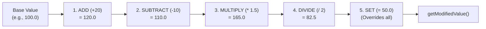

# Attributes & Modifiers

The **Attributes Subsystem** (`de.gurkenlabs.litiengine.attributes`) provides a numerical property framework for handling base values, calculated modified values, value ranges, and stacking modifiers. It powers entity statistics (health, mana, movement speed), combat calculations, and particle lifetimes across LITIENGINE.



---

## Attribute API Method Reference

| Class / Method | Return Type | Description |
|:---|:---|:---|
| `Attribute(T initialValue)` | Constructor | Creates a new attribute with an initial base value. |
| `getValue()` / `getBaseValue()` | `T` | Returns the raw, unmodified base value. |
| `get()` / `getModifiedValue()` | `T` | Computes and returns the value after all active modifiers are applied. |
| `addModifier(AttributeModifier<T> mod)` | `void` | Attaches an active modifier to this attribute. |
| `removeModifier(AttributeModifier<T> mod)`| `void` | Detaches a modifier from this attribute. |
| `modifyBaseValue(AttributeModifier<T> mod)`| `void` | Permanently alters the base value using the given modifier. |
| `RangeAttribute(T val, T min, T max)` | Constructor | Creates a bounded attribute clamped between `min` and `max`. |
| `getMin()` / `getMax()` | `T` | Returns the base minimum or maximum bounds. |
| `getModifiedMin()` / `getModifiedMax()` | `T` | Returns the range bounds after boundary modifiers are applied. |

---

## 1. Basic Attributes (`Attribute<T>`)

An `Attribute<T extends Number>` encapsulates a numeric value. While `getBaseValue()` returns the baseline number, `getModifiedValue()` (or `get()`) calculates the final value dynamically on demand.

```java
import de.gurkenlabs.litiengine.attributes.Attribute;
import de.gurkenlabs.litiengine.attributes.AttributeModifier;
import de.gurkenlabs.litiengine.attributes.Modification;

// 1. Create an attribute with a base attack power of 50
Attribute<Double> attackPower = new Attribute<>(50.0);

// 2. Attach a +15 flat damage bonus (e.g. from an equipped iron sword)
AttributeModifier<Double> swordBonus = new AttributeModifier<>(Modification.ADD, 15.0);
attackPower.addModifier(swordBonus);

System.out.println("Base Damage: " + attackPower.getBaseValue());       // 50.0
System.out.println("Total Damage: " + attackPower.getModifiedValue()); // 65.0

// 3. Remove the modifier when unequipped
attackPower.removeModifier(swordBonus);
System.out.println("After Unequip: " + attackPower.getModifiedValue()); // 50.0
```

---

## 2. Modification Types & Evaluation Order

Modifiers implement `Comparable<AttributeModifier<T>>` and are automatically sorted and applied in a fixed mathematical order regardless of the order in which they were attached:

| `Modification` Type | Order | Mathematical Operation | Typical Gameplay Use Case |
|:---|:---|:---|:---|
| **`ADD`** | `1` | `result + modifyValue` | Flat gear bonuses (+20 Attack, +10 Armor). |
| **`SUBTRACT`** | `2` | `result - modifyValue` | Flat penalties (-5 Defense debuff). |
| **`MULTIPLY`** | `3` | `result * modifyValue` | Percentage buffs (Berserk potion: +50% -> `1.5`). |
| **`DIVIDE`** | `4` | `result / modifyValue` | Slow effects (Frost nova: 50% slow -> `2.0`). |
| **`SET`** | `5` | `modifyValue` | Total overrides (Stun/Root: sets velocity to `0`). |

```java
Attribute<Float> moveSpeed = new Attribute<>(100f);

// Attach a +20 flat boots bonus and a 50% haste multiplier in arbitrary order
moveSpeed.addModifier(new AttributeModifier<>(Modification.MULTIPLY, 1.5));
moveSpeed.addModifier(new AttributeModifier<>(Modification.ADD, 20.0));

// ADD (100 + 20 = 120) is evaluated before MULTIPLY (120 * 1.5 = 180)
System.out.println("Speed with Boots + Haste: " + moveSpeed.getModifiedValue()); // 180.0
```

---

## 3. Bounded Range Attributes (`RangeAttribute<T>`)

`RangeAttribute<T extends Number & Comparable<T>>` extends `Attribute<T>` to guarantee that calculated values remain strictly within minimum and maximum limits.

```java
import de.gurkenlabs.litiengine.attributes.RangeAttribute;

// Bounded health attribute: current=100, min=0, max=100
RangeAttribute<Integer> health = new RangeAttribute<>(100, 0, 100);

// Clamp behavior is automatic
health.set(150);
System.out.println("Clamped to Max: " + health.get()); // 100

health.set(-25);
System.out.println("Clamped to Min: " + health.get()); // 0
```

Both `min` and `max` bounds can also receive independent modifiers via `addMinModifier()` and `addMaxModifier()`:

```java
// Increase maximum health cap by 25 from a relic
AttributeModifier<Integer> relicCap = new AttributeModifier<>(Modification.ADD, 25);
health.addMaxModifier(relicCap);

System.out.println("New Max Health: " + health.getModifiedMax()); // 125
```

---

## 4. Temporary Buffs & Timed Modifiers

Because `AttributeModifier` exposes an active state (`setActive(boolean)`), modifiers can be toggled without detaching them:

```java
import de.gurkenlabs.litiengine.Game;
import de.gurkenlabs.litiengine.attributes.Attribute;
import de.gurkenlabs.litiengine.attributes.AttributeModifier;
import de.gurkenlabs.litiengine.attributes.Modification;

public class SpeedPotion {
  public static void apply(Attribute<Float> velocity) {
    AttributeModifier<Float> haste = new AttributeModifier<>(Modification.MULTIPLY, 1.35); // +35%
    velocity.addModifier(haste);

    // Expire modifier after 5000 milliseconds (5 seconds)
    Game.loop().perform(5000, () -> {
      velocity.removeModifier(haste);
    });
  }
}
```

---

## 5. Listening to Attribute Changes

`Attribute` uses Java's standard `PropertyChangeSupport` to emit change events when base values or modifiers change:

```java
Attribute<Double> mana = new Attribute<>(100.0);

mana.addListener(event -> {
  System.out.println("Mana changed from " + event.getOldValue() + " to " + event.getNewValue());
});
```

---

## See Also

- [Entity Framework](../entity-framework/README.md) - Entity architectures and components
- [Creature Entities](../entity-framework/default-entity-types.md#creature) - Using attributes for velocity and combat
- [Game Loop](loops.md) - Managing timed buff expirations
