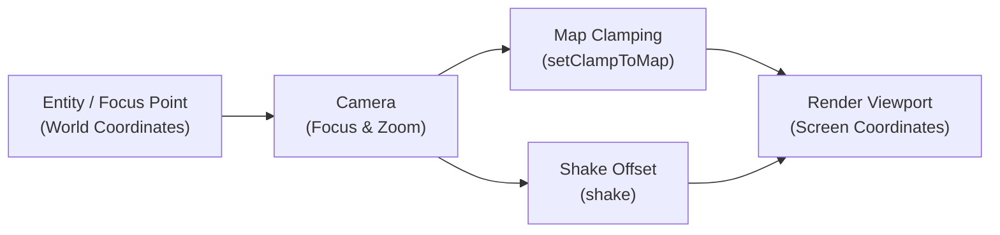

# Camera & Viewport

## Camera API Method Reference

| Method Signature | Return Type | Description |
| :--- | :--- | :--- |
| `setFocus(Point2D point)` | `void` | Centers camera viewport directly on the given map coordinates. |
| `setFocus(IEntity entity)` | `void` | Binds camera focus to follow an entity's center point continuously. |
| `setClampToMap(boolean clamp)` | `void` | Restricts the viewport so the camera never displays area outside map boundaries. |
| `setZoom(float zoom, int duration)` | `void` | Smoothly animates camera zoom scale over the specified duration in milliseconds. |
| `shake(double intensity, int duration, int frequency)` | `void` | Triggers a screen-shake trauma effect. |
| `getMapLocation(Point2D screenPoint)` | `Point2D` | Converts viewport/screen pixel coordinates to map-space coordinates. |
| `getViewportLocation(Point2D mapPoint)` | `Point2D` | Converts world map coordinates to window screen pixels. |

---

In LITIENGINE, the `Camera` (implementing `ICamera` and `Tweenable`) manages the viewpoint through which players experience the 2D game world. It handles focus tracking, map boundary clamping, smooth panning, zoom transitions, screen shake, and viewport coordinate conversions.



## Interactive Viewport & Pixel Scale Simulator

Experiment with base resolutions, integer pixel zoom multipliers, and screen shake trauma:

<div class="interactive-card">
<div style="display: flex; gap: 1.5rem; flex-wrap: wrap; align-items: flex-start;">
<div style="flex: 1; min-width: 260px;">
<div style="margin-bottom: 0.75rem;">
<label style="font-weight: 600; font-size: 0.85rem; display: block;">Base Virtual Resolution:</label>
<select id="cam-res-select" style="width: 100%; padding: 0.4rem; border-radius: 4px; background: var(--md-code-bg-color); color: var(--md-default-fg-color); border: 1px solid var(--md-default-fg-color--lighter);">
<option value="320x180">320 × 180 (Retro 16:9 16px Pixel Art)</option>
<option value="480x270" selected>480 × 270 (Standard 2D Native)</option>
<option value="640x360">640 × 360 (High-Density 2D)</option>
</select>
</div>
<div style="margin-bottom: 0.75rem;">
<label style="font-weight: 600; font-size: 0.85rem; display: flex; justify-content: space-between;">
<span>Zoom Scale (<span id="lbl-zoom">2.0x</span>):</span>
</label>
<input id="rng-zoom" type="range" min="1.0" max="4.0" step="0.5" value="2.0" style="width: 100%;">
</div>
<div style="margin-bottom: 0.75rem;">
<button id="btn-shake" class="md-button" style="width: 100%; font-size: 0.8rem;">Trigger Screen Shake</button>
</div>
<div style="font-size: 0.8rem;">
<strong>Java Configuration:</strong>
<pre style="margin-top: 0.25rem; padding: 0.5rem; border-radius: 4px; background: var(--md-code-bg-color); font-size: 0.75rem;"><code id="cam-code-preview">Game.world().camera().setZoom(2.0f, 0);
Game.world().camera().setClampToMap(true);</code></pre>
</div>
</div>
<div style="flex: 1; min-width: 280px; text-align: center;">
<canvas id="cam-canvas" width="320" height="200" style="border: 1px solid var(--md-default-fg-color--lighter); border-radius: 6px; background: #111; max-width: 100%; height: auto;"></canvas>
<div style="font-size: 0.75rem; color: var(--md-default-fg-color--lighter); margin-top: 0.25rem;">Viewport Render with Pixel Grid & Player Tracking</div>
</div>
</div>
</div>

<script>
(function() {
  function initCameraSimulator() {
    const canvas = document.getElementById('cam-canvas');
    const resSelect = document.getElementById('cam-res-select');
    const rngZoom = document.getElementById('rng-zoom');
    const lblZoom = document.getElementById('lbl-zoom');
    const btnShake = document.getElementById('btn-shake');
    const codePreview = document.getElementById('cam-code-preview');
    if (!canvas || !resSelect || !rngZoom) return;

    const ctx = canvas.getContext('2d');
    let shakeTrauma = 0;
    let playerPos = { x: 160, y: 100 };
    let playerTarget = { x: 160, y: 100 };

    function updateCode() {
      const z = parseFloat(rngZoom.value).toFixed(1);
      lblZoom.textContent = z + "x";
      codePreview.textContent = "Game.world().camera().setZoom(" + z + "f, 0);\nGame.world().camera().setClampToMap(true);";
    }

    btnShake.addEventListener('click', () => { shakeTrauma = 8.0; });
    rngZoom.addEventListener('input', updateCode);
    resSelect.addEventListener('change', updateCode);

    canvas.addEventListener('mousemove', (e) => {
      const rect = canvas.getBoundingClientRect();
      playerTarget.x = (e.clientX - rect.left) * (canvas.width / rect.width);
      playerTarget.y = (e.clientY - rect.top) * (canvas.height / rect.height);
    });

    function draw() {
      ctx.clearRect(0, 0, canvas.width, canvas.height);
      const zoom = parseFloat(rngZoom.value);

      // Smooth tracking
      playerPos.x += (playerTarget.x - playerPos.x) * 0.1;
      playerPos.y += (playerTarget.y - playerPos.y) * 0.1;

      // Calculate shake offset
      let ox = 0, oy = 0;
      if (shakeTrauma > 0) {
        ox = (Math.random() - 0.5) * shakeTrauma * 2;
        oy = (Math.random() - 0.5) * shakeTrauma * 2;
        shakeTrauma = Math.max(0, shakeTrauma - 0.3);
      }

      ctx.save();
      ctx.translate(canvas.width / 2 + ox, canvas.height / 2 + oy);
      ctx.scale(zoom, zoom);
      ctx.translate(-playerPos.x, -playerPos.y);

      // Draw Map Tiles (Checkerboard)
      const tileSize = 20;
      for (let tx = 0; tx < 320; tx += tileSize) {
        for (let ty = 0; ty < 200; ty += tileSize) {
          ctx.fillStyle = ((tx + ty) / tileSize) % 2 === 0 ? "#1c2128" : "#24292f";
          ctx.fillRect(tx, ty, tileSize, tileSize);
        }
      }

      // Draw Map Borders
      ctx.strokeStyle = "#4caf50";
      ctx.lineWidth = 2;
      ctx.strokeRect(0, 0, 320, 200);

      // Draw Player
      ctx.fillStyle = "#29b6f6";
      ctx.fillRect(playerPos.x - 8, playerPos.y - 12, 16, 24);
      ctx.fillStyle = "#ffffff";
      ctx.fillRect(playerPos.x - 4, playerPos.y - 8, 8, 8);

      ctx.restore();
      requestAnimationFrame(draw);
    }

    updateCode();
    draw();
  }

  if (typeof document$ !== 'undefined') {
    document$.subscribe(initCameraSimulator);
  } else {
    document.addEventListener('DOMContentLoaded', initCameraSimulator);
  }
})();
</script>

---

## Accessing the Camera

The active camera is accessed via the game world:

```java
Camera camera = Game.world().camera();
```

## Focus & Tracking

### Setting Focus Directly
Center the camera on specific world coordinates or follow an entity:

```java
// Focus on specific coordinates
Game.world().camera().setFocus(500, 350);

// Focus on an entity
IEntity player = Game.world().environment().get("player");
if (player != null) {
  Game.world().camera().setFocus(player.getCenter());
}
```

### Smooth Panning
Pan the camera smoothly to a target destination over a duration (in ticks):

```java
// Pan to a target point over 60 ticks (1 second at 60 UPS)
Point2D cutsceneTarget = new Point2D.Double(1200, 800);
Game.world().camera().pan(cutsceneTarget, 60);
```

### Continuous Entity Tracking
To have the camera follow the player automatically, update the focus in a game loop listener or an `IUpdateable`:

```java
public class PlayerCameraFollower implements IUpdateable {
  private final IEntity player;

  public PlayerCameraFollower(IEntity player) {
    this.player = player;
  }

  @Override
  public void update() {
    if (this.player != null && !this.player.isDead()) {
      Game.world().camera().setFocus(this.player.getCenter());
    }
  }
}

// Attach follower to the game loop
Game.loop().attach(new PlayerCameraFollower(player));
```

---

## Map Clamping

By default, moving the camera near map borders may reveal black void space outside the map. Enable **Map Clamping** to restrict the viewport strictly within the map boundaries:

```java
// Prevent the camera viewport from seeing outside map borders
Game.world().camera().setClampToMap(true);

// Configure alignment when the viewport is larger than the map
Game.world().camera().setClampAlign(Align.CENTER, Valign.MIDDLE);
```

---

## Zoom Transitions

LITIENGINE supports instantaneous zoom adjustments as well as interpolated zoom transitions:

```java
// Instant zoom (2.0 = 2x magnification)
Game.world().camera().setZoom(2.0f, 0);

// Smooth zoom to 1.5x over 500 milliseconds
Game.world().camera().setZoom(1.5f, 500);

// Listen for zoom changes
Game.world().camera().onZoom(e -> {
  System.out.println("New zoom level: " + e.getZoom());
});
```

---

## Screen Shake Effects

Add impact to explosions, heavy hits, and earthquakes using the built-in shake system:

```java
// shake(intensity, delayBetweenShakesMs, durationTicks)
// Trigger a screen shake with intensity 3.0, updating every 20ms for 30 ticks
Game.world().camera().shake(3.0, 20, 30);
```

---

## Coordinate Transformations

Convert seamlessly between **World Coordinates** (where objects live on the map) and **Viewport Coordinates** (where pixels appear on the screen):

```java
// Convert Screen/Mouse position to Map World position (e.g. for mouse aiming/targeting)
Point2D mouseScreenPos = Input.mouse().getLocation();
Point2D worldTargetPos = Game.world().camera().getMapLocation(mouseScreenPos);

// Convert Map World position to Screen Viewport position (e.g. for drawing custom HUD pointers)
Point2D entityWorldPos = enemy.getLocation();
Point2D screenPos = Game.world().camera().getViewportLocation(entityWorldPos.getX(), entityWorldPos.getY());
```

---

## Tweening the Camera

Because `Camera` implements `Tweenable`, you can drive camera animations using `Game.tweens()`:

```java
// Tween camera location to a new position using quad easing
Game.tweens().begin(Game.world().camera(), TweenType.LOCATION_XY, 1000)
.target(800f, 600f)
.ease(TweenFunction.QUAD_INOUT)
.begin();

// Tween camera zoom level
Game.tweens().begin(Game.world().camera(), TweenType.ZOOM, 800)
.target(2.5f)
.ease(TweenFunction.CUBIC_OUT)
.begin();
```

---

## See Also
* **[Game World](/game-api/game-world/)** - Environment management
* **[Render Engine](/game-api/render-engine/)** - 2D rendering pipeline
* **[Tweens](/game-api/tweens/)** - Animation and easing engine

*[Game.world()]: Accesses active Environment, Camera, and Entity World registry
*[Game.world().camera()]: Manages active Camera viewport, focus tracking, zoom, and shake
*[ICamera]: Camera interface defining coordinate transformations and focus tracking
*[setClampToMap]: Restricts the viewport so camera never displays space outside map boundaries
*[setFocus]: Binds camera focus to an entity or world coordinate
*[Point2D]: Standard 2D floating-point coordinate (x, y)
