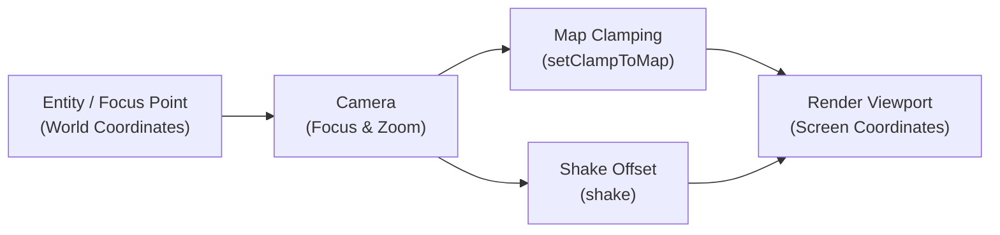

# Camera & Viewport

## Camera API Method Reference

| Method Signature | Return Type | Description |
| :--- | :--- | :--- |
| `setFocus(Point2D point)` | `void` | Centers camera viewport directly on the given map coordinates. |
| `setFocus(IEntity entity)` | `void` | Binds camera focus to follow an entity's center point continuously. |
| `setClampToMap(boolean clamp)` | `void` | Restricts the viewport so the camera never displays area outside map boundaries. |
| `setZoom(float zoom, int duration)` | `void` | Smoothly animates camera zoom scale over the specified duration in milliseconds. |
| `shake(double intensity, int duration, int frequency)` | `void` | Triggers a screen-shake trauma effect. |
| `getMapLocation(Point2D screenPoint)` | `Point2D` | Converts viewport/screen pixel coordinates to map-space coordinates. |
| `getViewportLocation(Point2D mapPoint)` | `Point2D` | Converts world map coordinates to window screen pixels. |

---

In LITIENGINE, the `Camera` (implementing `ICamera` and `Tweenable`) manages the viewpoint through which players experience the 2D game world. It handles focus tracking, map boundary clamping, smooth panning, zoom transitions, screen shake, and viewport coordinate conversions.



## Accessing the Camera

The active camera is accessed via the game world:

```java
Camera camera = Game.world().camera();
```

## Focus & Tracking

### Setting Focus Directly
Center the camera on specific world coordinates or follow an entity:

```java
// Focus on specific coordinates
Game.world().camera().setFocus(500, 350);

// Focus on an entity
IEntity player = Game.world().environment().get("player");
if (player != null) {
 Game.world().camera().setFocus(player.getCenter());
}
```

### Smooth Panning
Pan the camera smoothly to a target destination over a duration (in ticks):

```java
// Pan to a target point over 60 ticks (1 second at 60 UPS)
Point2D cutsceneTarget = new Point2D.Double(1200, 800);
Game.world().camera().pan(cutsceneTarget, 60);
```

### Continuous Entity Tracking
To have the camera follow the player automatically, update the focus in a game loop listener or an `IUpdateable`:

```java
public class PlayerCameraFollower implements IUpdateable {
 private final IEntity player;

 public PlayerCameraFollower(IEntity player) {
 this.player = player;
 }

 @Override
 public void update() {
 if (this.player != null && !this.player.isDead()) {
 Game.world().camera().setFocus(this.player.getCenter());
 }
 }
}

// Attach follower to the game loop
Game.loop().attach(new PlayerCameraFollower(player));
```

---

## Map Clamping

By default, moving the camera near map borders may reveal black void space outside the map. Enable **Map Clamping** to restrict the viewport strictly within the map boundaries:

```java
// Prevent the camera viewport from seeing outside map borders
Game.world().camera().setClampToMap(true);

// Configure alignment when the viewport is larger than the map
Game.world().camera().setClampAlign(Align.CENTER, Valign.MIDDLE);
```

---

## Zoom Transitions

LITIENGINE supports instantaneous zoom adjustments as well as interpolated zoom transitions:

```java
// Instant zoom (2.0 = 2x magnification)
Game.world().camera().setZoom(2.0f, 0);

// Smooth zoom to 1.5x over 500 milliseconds
Game.world().camera().setZoom(1.5f, 500);

// Listen for zoom changes
Game.world().camera().onZoom(e -> {
 System.out.println("New zoom level: " + e.getZoom());
});
```

---

## Screen Shake Effects

Add impact to explosions, heavy hits, and earthquakes using the built-in shake system:

```java
// shake(intensity, delayBetweenShakesMs, durationTicks)
// Trigger a screen shake with intensity 3.0, updating every 20ms for 30 ticks
Game.world().camera().shake(3.0, 20, 30);
```

---

## Coordinate Transformations

Convert seamlessly between **World Coordinates** (where objects live on the map) and **Viewport Coordinates** (where pixels appear on the screen):

```java
// Convert Screen/Mouse position to Map World position (e.g. for mouse aiming/targeting)
Point2D mouseScreenPos = Input.mouse().getLocation();
Point2D worldTargetPos = Game.world().camera().getMapLocation(mouseScreenPos);

// Convert Map World position to Screen Viewport position (e.g. for drawing custom HUD pointers)
Point2D entityWorldPos = enemy.getLocation();
Point2D screenPos = Game.world().camera().getViewportLocation(entityWorldPos.getX(), entityWorldPos.getY());
```

---

## Tweening the Camera

Because `Camera` implements `Tweenable`, you can drive camera animations using `Game.tweens()`:

```java
// Tween camera location to a new position using quad easing
Game.tweens().begin(Game.world().camera(), TweenType.LOCATION_XY, 1000)
 .target(800f, 600f)
 .ease(TweenFunction.QUAD_INOUT)
 .begin();

// Tween camera zoom level
Game.tweens().begin(Game.world().camera(), TweenType.ZOOM, 800)
 .target(2.5f)
 .ease(TweenFunction.CUBIC_OUT)
 .begin();
```

---

## See Also
* **[Game World](game-world.md)** - Environment management
* **[Render Engine](render-engine.md)** - 2D rendering pipeline
* **[Tweens](tweens.md)** - Animation and easing engine
