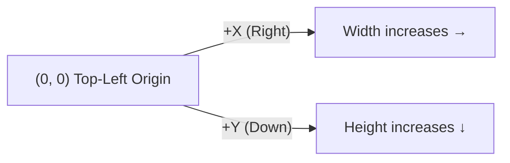
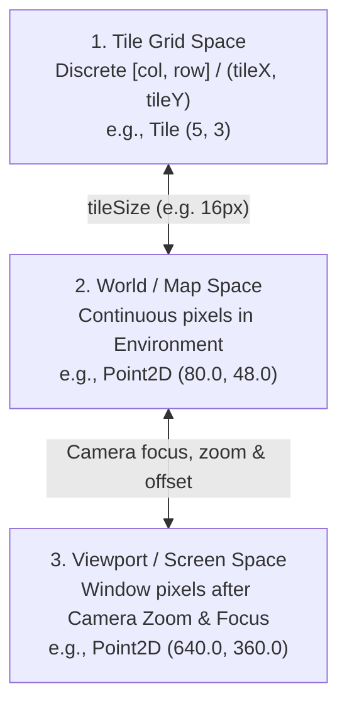

# Coordinate Systems & Spatial Spaces

Understanding how coordinates work across rendering, physics, tile maps, and player input is essential for positioning entities accurately, aiming projectiles, and building HUD elements.

LITIENGINE uses a unified 2D coordinate system inherited from **Java AWT / Java 2D**. All engine subsystems (`Environment`, `IEntity`, `Camera`, `PhysicsEngine`) share the exact same underlying axes and origin.

---

## The Top-Left Origin `(0, 0)`

In standard Cartesian graphing, the origin `(0, 0)` is at the bottom-left and Y values increase upward. In computer graphics and Java AWT—and therefore in **LITIENGINE**—the origin `(0, 0)` is located at the **top-left corner**:

* **X-axis (`+X`)**: Increases **to the right** (horizontal position).
* **Y-axis (`+Y`)**: Increases **downward** (vertical position).



```text
 (0, 0) -------------------------> +X (Width)
   |
   |      (X: 100, Y: 50)
   |         * Entity Position
   |
   V
  +Y (Height)
```

!!! note "Why Top-Left Origin?"
    LITIENGINE builds directly upon the standard Java 2D / AWT rendering pipeline and Tiled map (`.tmx`) format. In raster display hardware, memory buffers are scanned left-to-right, row-by-row from top to bottom. Following this standard avoids costly coordinate inversion overhead on every render and physics tick.

---

## The Three Coordinate Spaces

While all subsystems share the same top-left origin orientation, you will work with positions across **three distinct coordinate spaces**:



### 1. World (Map) Space

* **Units:** Continuous floating-point pixels (`Point2D` / `double`).
* **Origin:** Top-left corner `(0, 0)` of the active map / `Environment`.
* **Used by:** Entities (`IEntity.getLocation()`), colliders, static map objects, emitters, and light sources.

```java
// Spawn an enemy at world pixel position (160, 240)
Creature goblin = new Creature("goblin");
goblin.setLocation(160.0, 240.0);
Game.world().environment().add(goblin);
```

### 2. Viewport (Screen) Space

* **Units:** Integer / floating-point pixels relative to the game window / render canvas.
* **Origin:** Top-left corner `(0, 0)` of the visible game window.
* **Used by:** `Input.mouse().getLocation()`, HUD overlays, floating health bars, screen-space UI components.

When the camera follows a player or pans around a large map, an entity's **World position** remains fixed, but its **Viewport position** shifts on screen depending on camera focus and zoom.

### 3. Tile Grid Space

* **Units:** Discrete integer grid cell indices (`col`, `row` or `tileX`, `tileY`).
* **Origin:** Top-left tile `(0, 0)` of the map.
* **Used by:** Pathfinding (`AStarGrid`), Wang autotiling, tile map layer inspections, and grid-based puzzle logic.

```text
World Coordinates:  [0px ... 15px] | [16px ... 31px] | [32px ... 47px]
Tile Grid Index:        Col 0      |      Col 1      |      Col 2
```

---

## Transforming Between Coordinate Spaces

LITIENGINE provides built-in utilities to seamlessly convert coordinates between Screen, World, and Tile spaces.

### Screen &harr; World Transformations

The `Camera` (`Game.world().camera()`) translates between window viewport pixels and world map coordinates:

```java title="CoordinateConversions.java"
import de.gurkenlabs.litiengine.Game;
import de.gurkenlabs.litiengine.input.Input;
import java.awt.geom.Point2D;

// 1. Convert Screen (Mouse) -> World Map Coordinates
// Useful for aiming, clicking on world entities, or spawning items at mouse cursor
Point2D mouseScreenPos = Input.mouse().getLocation();
Point2D worldTargetPos = Game.world().camera().getMapLocation(mouseScreenPos);

// 2. Convert World Map Coordinates -> Screen Viewport Coordinates
// Useful for drawing custom HUD pointers, nameplates, or health bars over world entities
Point2D enemyWorldPos = goblin.getLocation();
Point2D enemyScreenPos = Game.world().camera().getViewportLocation(enemyWorldPos);
```

### World &harr; Tile Grid Transformations

Convert continuous world pixel positions to discrete tile cell coordinates and vice versa:

```java title="TileConversions.java"
import de.gurkenlabs.litiengine.Game;
import de.gurkenlabs.litiengine.environment.tilemap.IMap;
import de.gurkenlabs.litiengine.util.geom.GeometricUtilities;
import java.awt.Point;
import java.awt.geom.Point2D;

IMap map = Game.world().environment().getMap();
int tileWidth = map.getTileWidth();   // e.g. 16
int tileHeight = map.getTileHeight(); // e.g. 16

// 1. World Point -> Tile Grid Coordinate (Column, Row)
Point2D worldPos = player.getCenter();
int tileX = (int) (worldPos.getX() / tileWidth);
int tileY = (int) (worldPos.getY() / tileHeight);
Point tileGridCoord = new Point(tileX, tileY);

// 2. Tile Grid Coordinate -> World Pixel Position (Top-Left of Tile)
int targetCol = 10;
int targetRow = 15;
Point2D tileWorldPos = new Point2D.Double(targetCol * tileWidth, targetRow * tileHeight);

// 3. Tile Grid Coordinate -> World Center of Tile
Point2D tileCenterWorldPos = new Point2D.Double(
    (targetCol + 0.5) * tileWidth,
    (targetRow + 0.5) * tileHeight
);
```

---

## Entity Anchors vs. Collision Bounds

A frequent source of confusion when performing distance checks, line-of-sight raycasts, or collision checks is the distinction between an entity's **Location**, **Center**, and **Collision Box**:

```text
+-----------------------------+ <--- entity.getLocation() (Top-Left Anchor)
|                             |
|          ( x )              | <--- entity.getCenter() (Centroid)
|      +---------------+      |
|      |               |      |
|      | Collision Box |      | <--- entity.getCollisionBox()
|      +---------------+      |
+-----------------------------+
```

| Method / Property | Reference Point | Best Used For |
|:---|:---|:---|
| `entity.getLocation()` | **Top-Left** `(x, y)` | Setting/getting sprite render bounding box origin. |
| `entity.getCenter()` | **Centroid** `(x + w/2, y + h/2)` | Distance calculations, targeting angles, AI vision, and sound source positioning. |
| `entity.getCollisionBox()` | **Offset Rectangle** | Solid physics resolution, obstacle sliding, and projectile hit detection. |

### Common Pitfall: The "One-Tile-Off" Bug

If you pass an entity's `getLocation()` (top-left corner) to a tile-based pathfinding query or collision check, the position tested is the **top-left corner of the entity's sprite**, not where its feet or center stand:

```java
// Incorrect: Uses top-left corner (0, 0 of sprite) - may evaluate to the tile above/left of the character
Point2D wrongPos = player.getLocation();
int wrongTileX = (int) (wrongPos.getX() / map.getTileWidth());
int wrongTileY = (int) (wrongPos.getY() / map.getTileHeight());

// Correct: Uses entity center or feet for accurate spatial and tile queries
Point2D centerPos = player.getCenter();
int correctTileX = (int) (centerPos.getX() / map.getTileWidth());
int correctTileY = (int) (centerPos.getY() / map.getTileHeight());
```

Similarly, for raycasting or line-of-sight checks, always raycast between **centers**:

```java
// Raycast from enemy center to player center
RaycastHit hit = Game.physics().raycast(enemy.getCenter(), player.getCenter(), RaycastType.STATIC);
boolean canSeePlayer = (hit == null);
```

---

## Quick Reference Summary

| Need | Code |
|:---|:---|
| Get mouse world position | `Game.world().camera().getMapLocation(Input.mouse().getLocation())` |
| Get entity screen position | `Game.world().camera().getViewportLocation(entity.getLocation())` |
| Get entity center in world | `entity.getCenter()` |
| Move entity relative | `entity.setLocation(entity.getX() + dx, entity.getY() + dy)` |
| Convert world to tile col/row | `(int)(point.getX() / map.getTileWidth()), (int)(point.getY() / map.getTileHeight())` |
| Raycast line of sight | `Game.physics().raycast(entityA.getCenter(), entityB.getCenter(), RaycastType.STATIC)` |

---

## Related Documentation

* [Camera & Viewport](camera.md)
* [2D Physics & Spatial Quadtrees](physics-engine.md)
* [Game World & Environments](game-world.md)
* [Player Mouse Input](../player-input/mouse-input.md)
