# Game Loop

The `GameLoop` is the heart of LITIENGINE. It coordinates logic updates, physics calculations, timed actions, and rendering in a deterministic sequence on each tick.

---

## Game Loop Architecture

In LITIENGINE, the main `GameLoop` executes update logic and triggers the render pass sequentially within each tick iteration:

```mermaid
flowchart TD
    subgraph InputProcessing["Input Device Polling"]
        HW["Hardware Devices"] --> InputState["Input.keyboard / Input.mouse / Input.gamepads"]
    end

    subgraph TickExecution["GameLoop.process() (Tick Interval: 1000 / getTickRate())"]
        Step1["1. updateInvariableEngineComponents() (Clock & runtime state)"] --> Step2["2. super.process() (Update IUpdateable components & active Environment)"]
        Step2 --> Step3["3. executeTimedActions() (Evaluate perform callbacks)"]
        Step3 --> Step4["4. updateCamera() (Focus target tracking & shake offsets)"]
        Step4 --> Step5["5. render() (Render active Screen on Graphics2D canvas)"]
        Step5 --> Step6["6. trackMetrics() (Compute FPS, UPS, and frame timing)"]
    end
```



### Execution Order in `GameLoop.process()`

On every tick, `GameLoop` runs the following stages sequentially:

1. **Invariable Engine Updates**: Updates internal runtime components and state.
2. **`IUpdateable` Execution & Environment**: Iterates over registered `IUpdateable` components, advancing entity behaviors, physics simulation, and particle systems.
3. **Timed Action Dispatch**: Evaluates scheduled delay callbacks registered via `Game.loop().perform(...)`.
4. **Camera Focus Update**: Recalculates camera target tracking, bounding box map clamping, and screen shake trauma offsets.
5. **Screen & Component Render**: Renders the active `Screen` and environment layers via the AWT graphics pipeline to the window render canvas.
6. **Metrics Tracking**: Records tick execution duration and calculates live FPS / UPS metrics.

---

## Using `Game.loop()`

The `Game.loop()` method provides global access to the active `IGameLoop`:

### The `IUpdateable` Interface

To execute custom game logic every tick, implement `IUpdateable` and attach your object to the loop:

```java
public class MovingPlatform extends Entity implements IUpdateable {

  public MovingPlatform() {
    super("platform");
    Game.loop().attach(this);
  }

  @Override
  public void update() {
    // This method executes on every game loop tick
    setLocation(getX() + 1, getY());
  }

  public void destroy() {
    // Detach when no longer active
    Game.loop().detach(this);
  }
}
```

---

## Tick Rate & Timing Configuration

The tick interval is dynamically calculated based on the configured tick rate:

$$\text{Tick Interval (ms)} = \frac{1000}{\text{getTickRate()} \times \text{scale}}$$

```java
// Get the time passed since the last tick (in milliseconds)
long deltaTime = Game.loop().getDeltaTime();

// Get total tick count since game startup
long totalTicks = Game.loop().getTicks();

// Current tick rate (default: 60 ticks/second)
int tickRate = Game.loop().getTickRate();

// Adjust the tick rate programmatically
Game.loop().setTickRate(60);
```

### Configuring Max FPS

The engine tick rate and frame rate target are configured via client properties or `Game.config()`:

```java
// Set target update and frame rate
Game.config().client().setMaxFps(60);
```

```properties title="config.properties"
# Maximum FPS and update tick rate (default: 60)
cl_maxFps=60

# Show game metrics overlay (FPS, UPS)
cl_showGameMetrics=false
```

---

## Scheduling Timed Actions

`GameLoop` provides built-in action schedulers without needing raw Java `Thread.sleep` or timer threads:

```java
// Schedule an action to execute after a delay in milliseconds (e.g. 2000 ms = 2 seconds)
int actionId = Game.loop().perform(2000, () -> {
  System.out.println("Delayed task executed!");
});

// Cancel a scheduled action by its ID before it executes
Game.loop().removeAction(actionId);
```

---

## Common Patterns

### Entity AI Update with Lifecycle Cleanup

```java
@EntityInfo(width = 32, height = 32)
public class Enemy extends Creature implements IUpdateable {

  public Enemy() {
    super("enemy");
    Game.loop().attach(this);
  }

  @Override
  public void update() {
    if (this.isDead()) {
      Game.loop().detach(this);
      return;
    }

    chasePlayer();
  }

  private void chasePlayer() {
    // Enemy movement and AI logic
  }
}
```

---

## See Also

- [Game World & Environments](game-world.md) - Loading maps and managing entity lifecycles
- [Screens & Game States](screens.md) - Managing title, gameplay, and UI screens
- [Player Input](../player-input/README.md) - Handling keyboard, mouse, and gamepads
