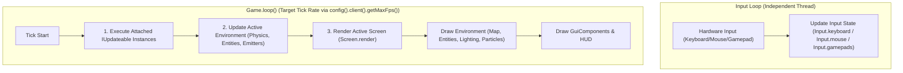

# Game Loop

## Game Loop Architecture

LITIENGINE coordinates game updates and rendering through a unified main loop (`Game.loop()`) while polling input devices independently for low-latency responsiveness:



- **Game Loop** (`Game.loop()`) - Executes time-dependent logic (physics, entity controllers, AI) and triggers the rendering pass on each tick.
- **Input Loop** - Processes keyboard, mouse, and gamepad hardware input on an independent thread for maximum responsiveness.

## The Main Game Loop - `Game.loop()`

The `Game.loop()` method returns the main `IGameLoop` that executes all game logic and triggers rendering. Its tick rate is configured via `config().client().getMaxFps()` (default: 60 ticks/second), ensuring physics, AI, and time-dependent systems behave consistently.

!!! note
    The game loop executes both the update and rendering phases. It updates the active environment, executes attached `IUpdateable`s, and then renders the currently active `Screen` by passing the `Graphics2D` context to all components and layers.

### IUpdateable Interface

To execute custom logic every tick, implement the `IUpdateable` interface and attach it to the loop:

```java
public class MyEntity extends Entity implements IUpdateable {

  @Override
  public void update() {
    // This code runs every tick (default: 60 times per second)
    setLocation(getX() + 1, getY());
  }
}

// Attach the entity to the game loop
MyEntity entity = new MyEntity();
Game.loop().attach(entity);

// Later, detach when no longer needed
Game.loop().detach(entity);
```

### Loop Properties

```java
// Get the time passed since the last tick (in milliseconds)
long deltaTime = Game.loop().getDeltaTime();

// Get total ticks since game started
long totalTicks = Game.loop().getTicks();

// Get the current tick rate (ticks per second)
int tickRate = Game.loop().getTickRate();

// Modify tick rate (default is 60)
Game.loop().setTickRate(30);
```

### Timed Actions

Schedule actions to execute after a delay:

```java
// Execute after 2 seconds (120 ticks at 60 tick rate)
int actionId = Game.loop().execute(120, () -> {
  System.out.println("Delayed action executed!");
});

// Cancel a timed action by setting execution time to -1
Game.loop().alterExecutionTime(actionId, -1);
```

## Why Separate Loops?

LITIENGINE separates game logic/rendering from input processing for several advantages:

1. **Consistent Physics**: Game logic runs at a fixed rate, preventing physics bugs from variable framerates
2. **Responsive Controls**: Input processing continues even if rendering slows
3. **Predictable Behavior**: Game state updates are deterministic
4. **Decoupled Systems**: Input doesn't interfere with game logic timing

## Configuration

Configure loop behavior in your `config.properties`:

```properties
# Game loop tick rate (updates per second)
client_updaterate=60

# Maximum FPS (0 = unlimited)
cl_maxFps=60

# Show game metrics (FPS, UPS)
cl_showGameMetrics=false
```

## Common Patterns

### Entity with Update Logic

```java
@EntityInfo(width = 32, height = 32)
public class Enemy extends Creature implements IUpdateable {

  public Enemy() {
    super("enemy");
    Game.loop().attach(this);
  }

  @Override
  public void update() {
    if (this.isDead()) {
      Game.loop().detach(this);
      return;
    }

    // AI behavior runs every tick
    chasePlayer();
  }

  private void chasePlayer() {
    // Movement logic
  }
}
```

### Game State Timer

```java
public class GameTimer implements IUpdateable {
  private int secondsRemaining;

  public GameTimer(int seconds) {
    this.secondsRemaining = seconds;
    Game.loop().attach(this);
  }

  @Override
  public void update() {
    // Track time using deltaTime
    // 60 ticks = 1 second at default tick rate
  }
}
```

## See Also

- [Game.world()](/game-api/game-world/) - Environment management
- [Game.screens()](/game-api/screens/) - Screen management
- [Player Input](/player-input/) - Input handling details
