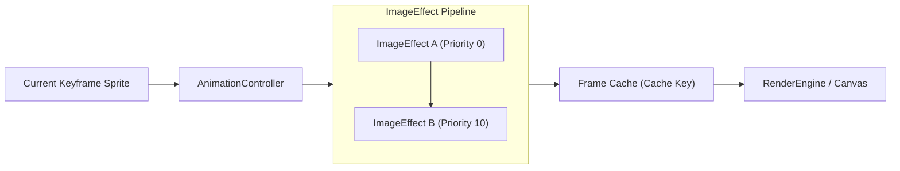

# Image & Render Effects

LITIENGINE provides an extensible **Image Effect pipeline** within its graphics subsystem. While [RenderEngine](render-engine.md) manages viewport transformations, scene layers, and direct drawing calls, **Image Effects** operate directly on sprite frames before they are drawn.

Managed by the [AnimationController](../control-entities/animation-controller.md), image effects allow you to apply dynamic visual feedback—such as flashing an entity white or red when hit, fading a ghost out, casting procedural contact shadows, or rotating dynamic sprites—without authoring separate spritesheets for every state.

---

## Architecture Overview



1. **Sprite Interception**: Before a keyframe is rendered, the entity's `AnimationController` runs the source `BufferedImage` through its active list of `ImageEffect` instances.
2. **Priority Ordering**: Effects are sorted by priority (`getPriority()`). Lower-priority effects execute first, allowing higher-priority filters to layer on top.
3. **Time-To-Live (TTL)**: Effects can be temporary (with a defined lifespan in milliseconds) or permanent (`ttl = 0`). The `AnimationController` automatically prunes expired effects during its update pass.
4. **Frame Caching**: The controller builds a composite cache key from the spritesheet, the keyframe index, and the hash codes of all active effect names to avoid redundant CPU pixel operations.

---

## Pixel Flashing with `OverlayPixelsImageEffect`

The most common real-time sprite effect in 2D combat is **pixel flashing** (e.g., flashing solid white or red for a fraction of a second when an entity takes damage).

LITIENGINE provides `OverlayPixelsImageEffect` (`de.gurkenlabs.litiengine.graphics.OverlayPixelsImageEffect`), which overlays all visible (non-transparent) pixels with a target `java.awt.Color`.

### Hurt Flash Recipe

To flash an entity red for 150 milliseconds when damaged:

```java
package com.example.game.combat;

import de.gurkenlabs.litiengine.entities.Creature;
import de.gurkenlabs.litiengine.graphics.OverlayPixelsImageEffect;
import java.awt.Color;

public class CombatFeedback {
  // Semi-transparent vivid red for a hit-reaction blink
  private static final Color DAMAGE_FLASH_COLOR = new Color(255, 50, 50, 220);
  private static final int FLASH_DURATION_MS = 150;

  public static void registerDamageFlash(Creature creature) {
    creature.onHit(event -> {
      // Add the overlay effect directly to the entity's animation controller
      creature.animations().add(new OverlayPixelsImageEffect(FLASH_DURATION_MS, DAMAGE_FLASH_COLOR));
    });
  }
}
```

### Solid White Invulnerability / Stun Flash

You can also pass opaque colors such as `Color.WHITE` to produce the classic retro white-silhouette flash:

```java
// Flash solid white for 100 milliseconds
entity.animations().add(new OverlayPixelsImageEffect(100, Color.WHITE));
```

Under the hood, `OverlayPixelsImageEffect` delegates to `Imaging.flashVisiblePixels(image, color)`, preserving the alpha silhouette while repainting non-transparent pixels.

---

## Built-In Image Effects

LITIENGINE includes several ready-to-use `ImageEffect` implementations in `de.gurkenlabs.litiengine.graphics`:

| Effect Class | Primary Use Case | Key Parameters |
| :--- | :--- | :--- |
| `OverlayPixelsImageEffect` | Hit flash, elemental aura, status tinting | `ttl` (ms), `Color` |
| `TransparencyImageEffect` | Invisibility, ghost phase, death dissolution | `ttl` (ms), `alpha` (`0.0f` – `1.0f`) |
| `CreatureShadowImageEffect` | Dynamic procedural contact shadow under creatures | `Creature`, `Color` (optional), offsets |
| `RotationImageEffect` | Rotating standalone images or spinning props | `ttl` (ms), `angle` (degrees) |
| `EntityRotationImageEffect` | Auto-syncing sprite rotation to entity angle | `IEntity` |

### Transparency & Fading (`TransparencyImageEffect`)

Apply a uniform alpha multiplier to an entity's sprite. This is ideal for stealth abilities, invulnerability frames, or gradual fading:

```java
import de.gurkenlabs.litiengine.graphics.TransparencyImageEffect;

// Make entity semi-transparent (50% opacity) for 3 seconds
TransparencyImageEffect ghostEffect = new TransparencyImageEffect(3000, 0.5f);
entity.animations().add(ghostEffect);
```

### Dynamic Contact Shadows (`CreatureShadowImageEffect`)

Instead of baking shadows into sprite artwork, you can attach `CreatureShadowImageEffect`. It automatically calculates an elliptical shadow at the base of the creature according to its bounding dimensions:

```java
import de.gurkenlabs.litiengine.entities.Creature;
import de.gurkenlabs.litiengine.graphics.CreatureShadowImageEffect;
import java.awt.Color;

public class ShadowHelper {
  public static void attachShadow(Creature creature) {
    // Permanent shadow effect (ttl = 0)
    CreatureShadowImageEffect shadow = new CreatureShadowImageEffect(creature, new Color(0, 0, 0, 80));
    
    // Fine-tune shadow vertical offset to match feet position
    shadow.setOffsetY(2f);
    
    creature.animations().add(shadow);
  }
}
```

!!! note "Creature Death Handling"
    `CreatureShadowImageEffect` automatically suspends shadow rendering when `creature.isDead()` evaluates to `true`.

---

## Creating Custom Image Effects

You can implement custom per-pixel filters by extending `ImageEffect` and overriding `BufferedImage apply(BufferedImage image)`.

### Example: Grayscale / Petrification Effect

The following custom effect converts a sprite to grayscale—useful when an entity is frozen, petrified into stone, or defeated:

```java title="GrayscaleImageEffect.java"
package com.example.game.graphics;

import de.gurkenlabs.litiengine.graphics.ImageEffect;
import de.gurkenlabs.litiengine.util.Imaging;
import java.awt.image.BufferedImage;

public class GrayscaleImageEffect extends ImageEffect {

  public GrayscaleImageEffect(int ttl) {
    super(ttl, "GrayscaleEffect");
  }

  @Override
  public BufferedImage apply(BufferedImage image) {
    if (image == null) {
      return null;
    }

    // Create an accelerated compatible image with alpha transparency
    BufferedImage result = Imaging.getCompatibleImage(image.getWidth(), image.getHeight());
    if (result == null) {
      return image;
    }

    // Process visible pixels
    for (int x = 0; x < image.getWidth(); x++) {
      for (int y = 0; y < image.getHeight(); y++) {
        int argb = image.getRGB(x, y);
        int alpha = (argb >> 24) & 0xff;

        // Skip completely transparent pixels
        if (alpha == 0) {
          continue;
        }

        int r = (argb >> 16) & 0xff;
        int g = (argb >> 8) & 0xff;
        int b = argb & 0xff;

        // Standard luminance calculation
        int gray = (int) (0.299 * r + 0.587 * g + 0.114 * b);
        int newPixel = (alpha << 24) | (gray << 16) | (gray << 8) | gray;

        result.setRGB(x, y, newPixel);
      }
    }

    return result;
  }
}
```

You can then apply it just like built-in effects:

```java
// Turn entity to stone for 5 seconds
entity.animations().add(new GrayscaleImageEffect(5000));
```

---

## Managing Effects with `AnimationController`

### Adding and Removing Effects

`IAnimationController` manages the lifecycle of all attached `ImageEffect` instances:

```java
// Add an effect
ImageEffect flash = new OverlayPixelsImageEffect(200, Color.WHITE);
entity.animations().add(flash);

// Explicitly remove an effect before its TTL expires
entity.animations().remove(flash);

// Query active effects
List<ImageEffect> activeEffects = entity.animations().getImageEffects();
```

### Effect Limits and Performance

- **Maximum Active Effects**: By default, `AnimationController` caps simultaneous image effects per entity at `10` (`MAX_IMAGE_EFFECTS`). Calls beyond this threshold are ignored.
- **Garbage Collection Optimization**: Always construct reusable target images with `Imaging.getCompatibleImage(w, h)` to utilize hardware-accelerated VRAM buffers.
- **Cache Invalidation**: Every unique effect name returned by `ImageEffect.getName()` contributes to `buildCurrentCacheKey()`. When creating dynamic custom effects, ensure `getName()` returns a stable or categorized identifier rather than unique nanosecond timestamps to preserve cache efficiency.

---

## Standalone Utilities: `Imaging` Class

If you need to transform static images or UI textures outside the `AnimationController` lifecycle, use `Imaging` (`de.gurkenlabs.litiengine.util.Imaging`):

```java
import de.gurkenlabs.litiengine.util.Imaging;
import java.awt.Color;
import java.awt.image.BufferedImage;

// 1. One-off pixel flashing
BufferedImage flashedImage = Imaging.flashVisiblePixels(sourceImage, Color.RED);

// 2. Adjust transparency
BufferedImage ghostIcon = Imaging.setAlpha(iconImage, 0.4f);

// 3. Add high-contrast outline border around sprite pixels
BufferedImage outlined = Imaging.border(sourceImage, Color.BLACK, 1);

// 4. Scale buffered image
BufferedImage scaled = Imaging.scale(sourceImage, 2.0);
```

---

## See Also

- [2D Graphics & RenderEngine](render-engine.md) - Viewport rendering pipeline and custom `IRenderable` layers
- [Animation Controller](../control-entities/animation-controller.md) - Spritesheet states and rules
- [Particle System](../advanced/particle-system.md) - Visual effects with dynamic emitters and particles
- [Dynamic Lighting](../advanced/dynamic-lighting.md) - 2D ambient and point light sources
