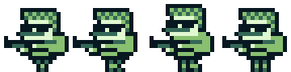

# 2D Graphics

## The Render Engine - `Game.graphics()`

The 2D `RenderEngine` is used to render texts, shapes, images and entities at their location in the `Environment` and with respect to the `Camera`'s location and zoom. Notice that the location lies within the coordinate space of the current `Environment`. The `RenderEngine` will translate the coordinates to a location on the screen.

Internally, it uses the static renderer implementations to actually execute the drawing operations on the `Graphics2D` object. This class basically prepares the specified render subject and passes them to a renderer with the current correct context.

```java
// render "my text" at the environment location (50/100)
Game.graphics().renderText(g, "my text", 50, 100);

// render "my text" at the location of an entity
Game.graphics().renderText(g, "my text", myEntity.getX(), myEntity.getY());

// render a rectangle (50x50 px) at the environment location (50/100)
Rectangle2D rect = new Rectangle2D.Double(50, 100, 50, 50);
Game.graphics().renderShape(g, rect);
```

> Rendering an `Entity` explicitly over the `RenderEngine` should never be necessary as long as the Entity was added to the game's current `Environment`. The rendering process of the current `Environment` takes care of drawing all the entities and implicitly calls these methods on the `RenderEngine`.

### Available Renderers

These classes can be useful when composing a GUI with images, text or shapes which are rendered at a certain location on the screen.

* **Image Renderer** \(renders `Images`\)
* **Shape Renderer** \(renders `Shapes`\)
* **Text Renderer** \(renders `Strings`\)

## Rendering Entities with a `Spritesheet`

The engine facilitates the usage of **Single-purpose spritesheets** to render entities with a matching sprite for their current state. Rendering an `Entity` is controlled by its assigned `AnimationController`. There is a pre-defined convention-based set of animation rules, that allows you to get quick results without having to write too much code. The LITIEngine works best with **single-purpose spritesheets**, i.e. every animation should have a dedicated spritesheet.

> It's possible to use a single spritesheet with multiple animations but the provided infrastructure for this is limited and it would probably end up in some custom code that defines which part of the spritesheet should be used by the animations.

### Animation

Any entity that uses a spritesheet needs an `AnimationController` which decides the spritesheet that should be rendered and provides the appropriate sprite for the `RenderEngine`.

In the following example, we use a `Player` entity that inherits from the default entity type `Creature`. The `CreatureAnimationController` which is assigned to all creatures provides the default animation rules for this type of entity.



Notice the name of the spritesheet file above: `gurknukem-walk-left.png` - It follows the pattern: "SPRITE\_PREFIX"-"STATE"-"DIRECTION".png.

* The "SPRITE\_PREFIX" is determined by `Creature.getSpritePrefix()` which can either be set directly or specified in the creature's constructor.
* The default animation rules for creatures distinguish between 3 different "STATES": `idle`, `walk` and `dead`.
* As "DIRECTION" you can specify any value of the `Direction` enum. 

By default, the option to use flipped horizontal sprites as fallback is enabled, which means that you must only specify a sprite with either right or left direction.

Specifying a direction is optional and the `CreatureAnimationController` will also search for and use any fallback sprites without a defined direction.

In general, you are not limited to any of the pre-defined animation rules. You can decide to extend the animation controller or write one from scratch that better suits your needs.

More details on this can be found in the [Animation Controller](..\control-entities\animation-controller.md) chapter.

## The Graphics instance - `Graphics2D`

All of LITIENGINE's rendering happens on a **Java AWT** `Canvas` component and there's **no expicit OpenGL** involved. By that, the engine is one of the very few on the market that achieves an efficient rendering process with **plain Java**.

The `Canvas` provides a `Graphics2D` object which is passed though the engine on every frame and receives all the drawing operations. This object is basically an empty canvas we're drawing the elements of our game on.

For more information, read the [Official Java Documentation on Graphics2D](https://docs.oracle.com/javase/7/docs/api/java/awt/Graphics2D.html).

!!! warning "Rendering Lifecycle Rule"
    Never invoke `Graphics2D` draw calls directly outside of the render pipeline (`IRenderable.render(Graphics2D g)` or `Screen.render(Graphics2D g)`). Doing so disrupts double-buffering and causes viewport tearing.


---

## Custom Graphics & Post-Processing Examples

LITIENGINE allows you to attach custom `IRenderable` callbacks to the render pipeline for custom HUDs, minimaps, and ambient color washes:

### Example 1: Day/Night Cycle Ambient Light Tint
Renders a smooth fullscreen colored tint over the world layers without obstructing the UI layer:

```java title="DayNightAmbientRenderer.java"
package com.example.game.graphics;

import de.gurkenlabs.litiengine.Game;
import de.gurkenlabs.litiengine.graphics.IRenderable;
import de.gurkenlabs.litiengine.graphics.RenderType;
import java.awt.AlphaComposite;
import java.awt.Color;
import java.awt.Composite;
import java.awt.Graphics2D;

public class DayNightAmbientRenderer implements IRenderable {
  // Midnight blue tint with 40% darkness alpha
  private Color ambientColor = new Color(10, 15, 45, 110);

  public DayNightAmbientRenderer() {
    // Register to the OVERLAY layer so tiles and creatures are tinted, but UI stays crisp
    Game.world().environment().registerForRendering(this, RenderType.OVERLAY);
  }

  @Override
  public void render(Graphics2D g) {
    Composite orig = g.getComposite();
    // Use AlphaComposite for smooth color blending
    g.setComposite(AlphaComposite.SrcOver);
    g.setColor(this.ambientColor);
    
    // Fill the entire visible camera viewport
    g.fillRect(0, 0, (int) Game.window().getResolution().getWidth(), (int) Game.window().getResolution().getHeight());
    g.setComposite(orig);
  }
}
```

---

### Example 2: Dynamic In-Game Radar / Minimap Overlay
Transforms world coordinates into a top-right corner radar HUD:

```java title="MinimapRadar.java"
package com.example.game.graphics;

import de.gurkenlabs.litiengine.Game;
import de.gurkenlabs.litiengine.entities.IEntity;
import de.gurkenlabs.litiengine.graphics.IRenderable;
import de.gurkenlabs.litiengine.graphics.RenderType;
import java.awt.Color;
import java.awt.Graphics2D;
import java.awt.geom.Point2D;

public class MinimapRadar implements IRenderable {
  private final int radarX = 20;
  private final int radarY = 20;
  private final int radarSize = 120;
  private final float scale = 0.08f; // Scale ratio from world to radar

  public MinimapRadar() {
    // Register on the UI layer so the radar draws on top of everything
    Game.world().environment().registerForRendering(this, RenderType.UI);
  }

  @Override
  public void render(Graphics2D g) {
    // 1. Draw radar background
    g.setColor(new Color(0, 0, 0, 180));
    g.fillRect(radarX, radarY, radarSize, radarSize);
    g.setColor(Color.WHITE);
    g.drawRect(radarX, radarY, radarSize, radarSize);

    // 2. Draw active entities on the radar
    for (IEntity entity : Game.world().environment().all()) {
      Point2D pos = entity.getLocation();
      int dotX = radarX + (int) (pos.getX() * scale);
      int dotY = radarY + (int) (pos.getY() * scale);

      // Clamp inside radar bounds
      if (dotX >= radarX && dotX <= radarX + radarSize && dotY >= radarY && dotY <= radarY + radarSize) {
        g.setColor(entity.getName() != null && entity.getName().startsWith("player") ? Color.CYAN : Color.RED);
        g.fillOval(dotX - 2, dotY - 2, 4, 4);
      }
    }
  }
}
```

## Text and Font Rendering (`TextRenderer`)

LITIENGINE provides the static `TextRenderer` utility to render crisp strings, multiline text, alignments, and high-visibility outlines:

```java
package com.example.game.rendering;

import de.gurkenlabs.litiengine.Align;
import de.gurkenlabs.litiengine.Valign;
import de.gurkenlabs.litiengine.graphics.TextRenderer;
import de.gurkenlabs.litiengine.resources.Resources;
import java.awt.Color;
import java.awt.Font;
import java.awt.Graphics2D;

public class CustomHudRenderer {
  public static void drawHud(Graphics2D g) {
    // 1. Set active font and color
    Font pixelFont = Resources.fonts().get("fonts/pixel.ttf", 16f);
    g.setFont(pixelFont);
    g.setColor(Color.WHITE);

    // 2. Simple text at pixel coordinates
    TextRenderer.render(g, "Score: 1250", 20, 30);

    // 3. Text with High-Contrast Outline (great for floating damage / HUD)
    TextRenderer.renderWithOutline(g, "BOSS INCOMING!", 400, 100, Color.BLACK);

    // 4. Centered / Aligned Text within a bounding area
    TextRenderer.render(g, "PAUSED", 0, 200, Align.CENTER, Valign.MIDDLE);
  }
}
```
<script type="application/ld+json">
{
 "@context": "https://schema.org",
 "@type": "TechArticle",
 "headline": "LITIENGINE 2D Graphics & RenderEngine Guide",
 "description": "Double-buffered AWT graphics rendering pipeline, sprite transformations, shape drawing, and TextRenderer high-contrast outlines.",
 "author": {
 "@type": "Organization",
 "name": "Gurkenlabs",
 "url": "https://gurkenlabs.com"
 },
 "inLanguage": "en"
}
</script>
