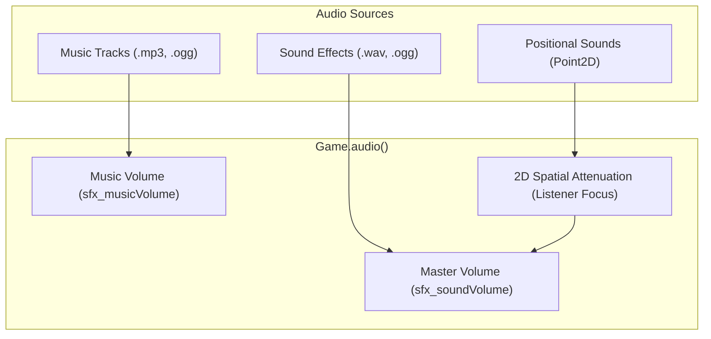

# Sound Engine

The `SoundEngine` (`Game.audio()`) handles all sound effects, ambient background audio, and background music streaming. It natively supports `.wav`, `.mp3`, and `.ogg` audio formats without external native C libraries.



## Playing Sound Effects

### Global (Non-Positional) Sounds
Play interface sounds, notifications, or player feedback anywhere in the world:

```java
// Play a loaded sound resource
Game.audio().playSound("button-click.wav");

// Play with explicit volume multiplier and loop state
Sound hitSound = Resources.sounds().get("hit.ogg");
Game.audio().playSound(hitSound, false, 1.0f);
```

---

## 2D Positional & Spatial Audio

LITIENGINE calculates stereo panning and volume falloff automatically based on distance from the camera focus (or active player entity listener):

```java
// Play an explosion at an entity's world position
Point2D explosionPoint = bossEnemy.getCenter();
Game.audio().playSound("explosion.wav", explosionPoint);

// Positional audio automatically fades as the camera moves farther away
Game.audio().playSound("waterfall.wav", waterfallEntity.getLocation());
```

---

## Background Music

Music is streamed asynchronously to optimize memory usage:

```java
// Play looping background music
Game.audio().playMusic("overworld-theme.mp3");

// Stop or pause music
Game.audio().stopMusic();

// Switch tracks with fading
Game.audio().playMusic("boss-theme.ogg");
```

---

## Volume Control & Configuration

Adjust audio levels globally or connect them to in-game options sliders:

```java
// Master sound effects volume (0.0f to 1.0f)
Game.audio().setSoundVolume(0.8f);

// Background music volume (0.0f to 1.0f)
Game.audio().setMusicVolume(0.5f);

// Read current configured volumes
float currentSfxVolume = Game.config().sound().getSoundVolume();
float currentMusicVolume = Game.config().sound().getMusicVolume();
```

In `config.properties`:

```properties
sfx_soundVolume=0.8
sfx_musicVolume=0.5
```

---

## See Also

* **[Resource Management](../resource-management/README.md)** - Loading sound resources into `.litidata`
* **[Game World](game-world.md)** - Environment & entity locations
