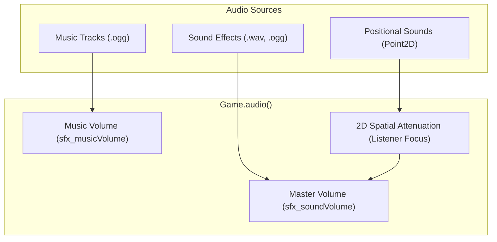

# Sound Engine

The `SoundEngine` (`Game.audio()`) handles all sound effects, ambient background audio, and background music streaming. It natively supports `.wav` and `.ogg` audio formats without external native C libraries.



## Playing Sound Effects

### Global (Non-Positional) Sounds
Play interface sounds, notifications, or player feedback anywhere in the world:

```java
// Play a loaded sound resource
Game.audio().playSound("button-click.wav");

// Play with explicit volume multiplier and loop state
Sound hitSound = Resources.sounds().get("hit.ogg");
Game.audio().playSound(hitSound, false, 1.0f);
```

---

## 2D Positional & Spatial Audio

LITIENGINE calculates stereo panning and volume falloff automatically based on distance from the camera focus (or active player entity listener):

```java
// Play an explosion at an entity's world position
Point2D explosionPoint = bossEnemy.getCenter();
Game.audio().playSound("explosion.wav", explosionPoint);

// Positional audio automatically fades as the camera moves farther away
Game.audio().playSound("waterfall.wav", waterfallEntity.getLocation());
```

---

## Background Music

Music is streamed asynchronously to optimize memory usage:

```java
// Play looping background music
Game.audio().playMusic("overworld-theme.ogg");

// Stop or pause music
Game.audio().stopMusic();

// Switch tracks with fading
Game.audio().playMusic("boss-theme.ogg");
```

---

## Volume Control & Configuration

Adjust audio levels globally or connect them to in-game options sliders:

```java
// Master sound effects volume (0.0f to 1.0f)
Game.audio().setSoundVolume(0.8f);

// Background music volume (0.0f to 1.0f)
Game.audio().setMusicVolume(0.5f);

// Read current configured volumes
float currentSfxVolume = Game.config().sound().getSoundVolume();
float currentMusicVolume = Game.config().sound().getMusicVolume();
```

In `config.properties`:

```properties
sfx_soundVolume=0.8
sfx_musicVolume=0.5
```

---

## See Also
* **[Resource Management](../resource-management/README.md)** - Loading sound resources into `.litidata`
* **[Game World](game-world.md)** - Environment & entity locations

---

## 2D Spatial Audio & Audio Channel Mastering

LITIENGINE's audio engine supports multi-bus volume controls and realistic 2D positional attenuation:

### 1. Multi-Bus Volume Management

Separate Master, Music (BGM), and Sound Effect (SFX) volumes in your audio settings:

```java title="src/main/java/com/example/game/audio/AudioManager.java" linenums="1"
package com.example.game.audio;

import de.gurkenlabs.litiengine.Game;
import de.gurkenlabs.litiengine.sound.Sound;
import de.gurkenlabs.litiengine.sound.Track;
import de.gurkenlabs.litiengine.resources.Resources;

public class AudioManager {
  private static float masterVolume = 1.0f;
  private static float musicVolume = 0.8f;
  private static float sfxVolume = 1.0f;

  public static void setMasterVolume(float volume) {
    masterVolume = Math.clamp(volume, 0.0f, 1.0f);
    Game.audio().setMasterPlayback(masterVolume);
  }

  public static void playMusic(String trackName) {
    Track musicTrack = Resources.tracks().get(trackName);
    Game.audio().playMusic(musicTrack, true); // true = seamless loop
  }

  public static void playSound(String soundName) {
    Sound sound = Resources.sounds().get(soundName);
    Game.audio().playSound(sound, false, 1, sfxVolume * masterVolume);
  }
}
```

### 2. Positional 2D Spatial Sound (Distance Attenuation)

Play audio centered at specific world coordinates or attached to moving entities. As the player moves away from the sound source, volume attenuates naturally:

```java
// Play positional explosion sound originating from a barrel entity
Game.audio().playSound(
Resources.sounds().get("explosion.ogg"),
barrelEntity.getCenter(),
false // do not loop
);

// Continuous spatial hum originating from a generator prop
Game.audio().playSound(
Resources.sounds().get("generator_hum.ogg"),
generatorProp,
true // loop continuously
);
```

!!! tip "Spatial Sound Range"
    By default, LITIENGINE computes attenuation based on the distance between the sound origin and the active `Camera` center. Ensure your player entity is tracked by the camera using `Game.world().camera().setFocus(player)`.
