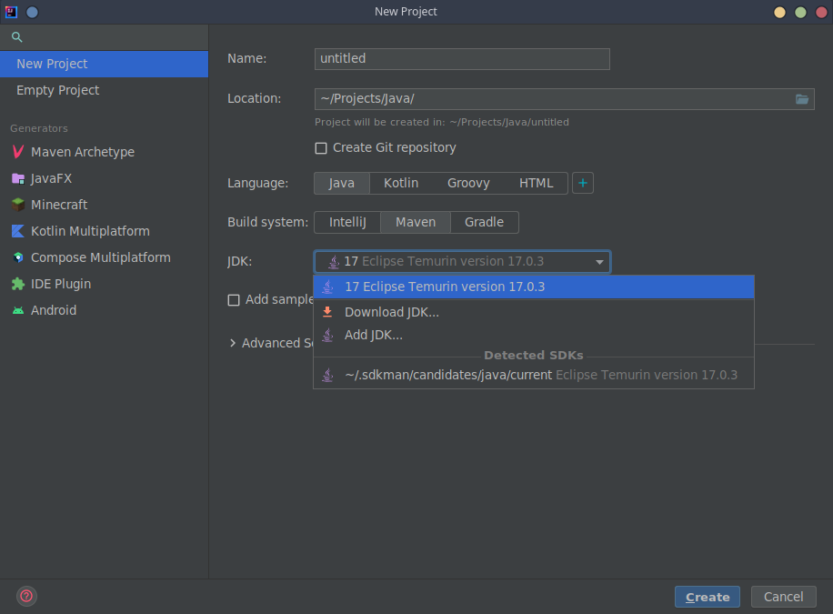
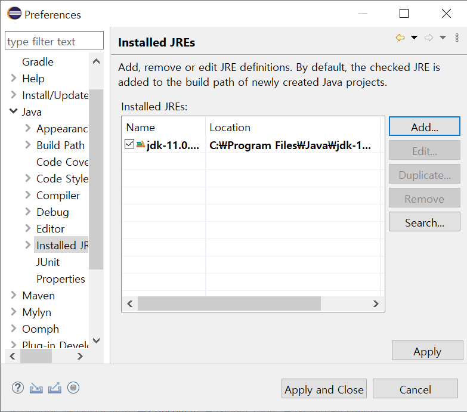

# Development Environment

## Setup IDE

> We highly recommend developing your LITIENGINE game with an IDE (Integrated Development Environment). An IDE provides code completion, interactive debugging, Gradle integration, hot reloading, and test execution that a plain text editor cannot provide.

The most popular IDEs for modern Java development are:

- **[IntelliJ IDEA](https://www.jetbrains.com/idea/)** (Recommended) — The premier IDE for Java, featuring best-in-class Gradle support, seamless navigation, and direct compatibility with utiLITI's script workflows. Both the free Community Edition and Ultimate Edition work great.
- **[Visual Studio Code](https://code.visualstudio.com/)** — Lightweight editor with the *Extension Pack for Java*.
- **[Eclipse IDE](https://www.eclipse.org/)** — Traditional open-source Java development environment.

---

### IntelliJ IDEA (Recommended)

1. Open IntelliJ IDEA and choose **New Project** (or **Open** if opening an existing Gradle project).
2. Select **Java** or **Gradle** with the **Java** language.
3. In the **JDK** dropdown, select your installed **Java {{ java_version }}** JDK. If it is not listed, click **Add JDK...** -> **Download JDK...** or navigate to your local JDK directory.
4. When opening an existing LITIENGINE project, IntelliJ will automatically detect `build.gradle` / `build.gradle.kts` and configure all project dependencies and source directories.

> **Tip (Linux & macOS):** You can use **[SDKMAN!](https://sdkman.io/)** to manage your JDK installations easily. Once installed, run `sdk install java` to install the latest JDK, which will be detected by your IDE. For details, see the [SDKMAN! Documentation](https://sdkman.io/usage).

---

### Eclipse

If you use Eclipse as your IDE:

1. Open Eclipse and unfold **Java** in the **Preferences** menu.
2. Select **Installed JREs**, click **Add**, and choose **Standard VM**.
3. Click **Directory...**, navigate to your installed JDK {{ java_version }} folder, and click **Finish**.
4. Set the new JDK as the default workspace JRE and click **Apply and Close**.

## macOS & Apple Silicon Notes

When developing on macOS (Sonoma, Ventura, Sequoia with M1/M2/M3/M4 Apple Silicon):

* **Java Baseline**: Use an **AArch64 (ARM64)** build of OpenJDK {{ java_version }} or GraalVM (e.g. Eclipse Temurin or via SDKMAN: `sdk install java`).
* **Foreign Memory Access (Input4j)**: LITIENGINE automatically manages Panama FFM bindings on macOS for low-latency gamepad and keyboard polling.
* **utiLITI UI on Retina Displays**: If text appears tiny on high-DPI displays, Swing UI scaling is automatically adjusted by the JVM. You can explicitly set `-Dsun.java2d.uiScale=2.0` in your IDE run configuration if needed.
