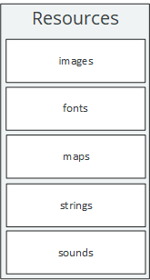

# Resource Management



The static `Resources` class is the engine's entry point for accessing any kind of resource from within your LITIENGINE project. A resource is any non-executable data that is deployed with your game. The `Resources` class provides access to different types of `ResourcesContainers` and is used by different \(loading\) mechanisms to make resources available during runtime. LITIENGINE supports various different resource types, including:

* images
* fonts
* maps
* \(localizable\) strings
* spritesheets
* sounds

## Resource Containers

`ResourcesContainer` is an abstract implementation for all classes that contain a certain resource type. Basically, it's an in-memory cache of the resources and provides access to manage the resources.

Internally, the resources are stored in a `ConcurrentHashMap` where the keys are String identifiers and the values are your individual resource objects.

There are various overloads for `ResourcesContainer.add(...)` and `ResourcesContainer.get(...)`, allowing you to adjust these operations to your needs. All the `ResourcesContainer`'s contents and its listeneres can be discarded with `ResourcesContainer.clear()`.

### Listeners

You can register `ResourcesContainerListener`s with `addContainerListener(ResourcesContainerListener<T> listener)` to get notified whenever a resource was added to or removed from your `ResourcesContainer`. Removing listeners works analogically with `removeContainerListener(ResourcesContainerListener<T> listener)`

## Resource Folders

## Images

### Spritesheets

## Sounds

## Maps 

## Strings

## Fonts

## Blueprints

## Resource Loading Cheat Sheet

LITIENGINE provides specialized static resource repositories via `Resources.*`:

```java
package com.example.game;

import de.gurkenlabs.litiengine.graphics.Spritesheet;
import de.gurkenlabs.litiengine.resources.Resources;
import de.gurkenlabs.litiengine.sound.Sound;
import java.awt.Font;
import java.awt.image.BufferedImage;

public class ResourceManager {
 public static void preloadAssets() {
 // 1. Load complete binary bundle (.litidata)
 Resources.load("game.litidata");

 // 2. Spritesheets (image path, frame width, frame height)
 Spritesheet heroSprites = Resources.spritesheets().load("sprites/hero.png", 24, 24);

 // 3. Sounds (supports .wav natively, MP3/OGG via SPI)
 Sound jumpSound = Resources.sounds().get("audio/jump.wav");

 // 4. TrueType / OpenType Fonts
 Font retroFont = Resources.fonts().get("fonts/pixel.ttf", 16f);

 // 5. Raw BufferedImages
 BufferedImage logo = Resources.images().get("branding/logo.png");
 }
}
```
