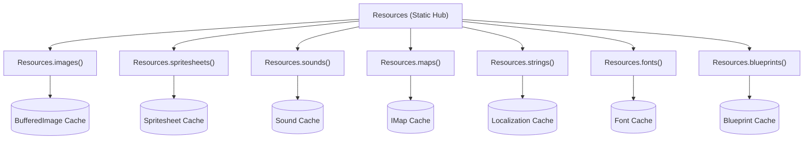

# Resource Management

The `Resources` class (`de.gurkenlabs.litiengine.resources.Resources`) is the central gateway for accessing, caching, and managing non-executable game assets across your LITIENGINE project. Whether your assets are stored as raw files on the filesystem, inside your compiled application JAR, or bundled in a compressed `.litidata` archive, the `Resources` API provides unified, thread-safe access to every asset container.



---

## Resource Containers

All specialized repositories in `Resources` extend the generic `ResourcesContainer<T>`. A `ResourcesContainer` acts as a thread-safe, in-memory cache backed by a `ConcurrentHashMap<String, T>`, indexed by unique string identifiers or file paths.

### Container Operations

| Method | Return Type | Description |
|:---|:---|:---|
| `get(String location)` | `T` | Retrieves an asset from cache, or attempts to load and cache it automatically. |
| `add(String location, T resource)` | `T` | Explicitly registers an in-memory asset with a custom identifier. |
| `contains(String location)` | `boolean` | Checks if an asset with the given identifier is currently cached. |
| `remove(String location)` | `T` | Evicts a specific resource from the in-memory cache. |
| `clear()` | `void` | Evicts all cached assets and resets the container. |
| `count()` | `int` | Returns the total number of cached assets in this container. |
| `getAll()` | `Collection<T>` | Returns an unmodifiable collection of all currently loaded assets. |

### Container Event Listeners

You can attach lifecycle listeners to any container using `addContainerListener(...)` to get notified when assets are loaded, modified, or cleared:

```java
Resources.spritesheets().addContainerListener(new ResourcesContainerListener<Spritesheet>() {
  @Override
  public void added(String resourceName, Spritesheet resource) {
    System.out.println("Loaded spritesheet: " + resourceName);
  }

  @Override
  public void removed(String resourceName, Spritesheet resource) {
    System.out.println("Evicted spritesheet: " + resourceName);
  }

  @Override
  public void cleared() {
    System.out.println("Spritesheet cache cleared.");
  }
});
```

---

## Asset Packaging with `.litidata`

In production, games typically package maps, tilesets, spritesheets, audio files, and entity blueprints into a single binary archive created with the **utiLITI Editor**: `game.litidata`.

Loading this archive automatically populates all corresponding resource containers:

```java
package com.example.game;

import de.gurkenlabs.litiengine.Game;
import de.gurkenlabs.litiengine.resources.Resources;

public class Program {
  public static void main(String[] args) {
    Game.init(args);

    // Loads maps, spritesheets, sounds, and blueprints in a single call
    Resources.load("game.litidata");

    Game.world().loadEnvironment("level1");
    Game.start();
  }
}
```

---

## Supported Asset Types

### 1. Images (`Resources.images()`)
Loads raw `BufferedImage` instances for UI textures, backgrounds, icons, and decorative layers:

```java
// Loads and caches an image from disk or JAR resources
BufferedImage cursor = Resources.images().get("assets/ui/cursor.png");

// Add a procedurally generated image to the cache
BufferedImage canvas = new BufferedImage(64, 64, BufferedImage.TYPE_INT_ARGB);
Resources.images().add("procedural/glow", canvas);
```

### 2. Spritesheets (`Resources.spritesheets()`)
Splits grid-based textures into individual animation keyframes:

```java
// Loads a spritesheet with 32x32 pixel frames
Spritesheet hero = Resources.spritesheets().load("sprites/hero-walk.png", 32, 32);

// Access specific keyframe sprites
BufferedImage firstFrame = hero.getSprite(0);
int totalFrames = hero.getTotalNumberOfSprites();
```

* For batch importing and timing metadata, see **[Sprite Info Files](/resource-management/sprite-info-files/)** and **[Texture Atlases](/resource-management/texture-atlas/)**.

### 3. Sounds (`Resources.sounds()`)
Loads and caches audio tracks and sound effects for the `SoundEngine`:

```java
// Supports standard .wav, and .mp3 / .ogg via Java SPI providers
Sound jumpSfx = Resources.sounds().get("audio/sfx/jump.wav");
Sound bgm = Resources.sounds().get("audio/music/overworld.ogg");

// Play positional sound or background music
Game.audio().playSound(jumpSfx);
Game.audio().playMusic(bgm);
```

### 4. Maps (`Resources.maps()`)
Loads orthogonal, isometric, and staggered tilemaps exported from Tiled (`.tmx` format):

```java
// Retrieve parsed map instance
IMap worldMap = Resources.maps().get("maps/forest.tmx");

// Get map dimensions in tiles and pixels
int mapWidth = worldMap.getSizeInPixels().width;
int mapHeight = worldMap.getSizeInPixels().height;
```

### 5. Localized Strings (`Resources.strings()`)
Manages multi-language string tables for game dialog, UI menus, and localization bundles:

```java
// Load language properties file
Resources.strings().load("lang/messages_en.properties");

// Retrieve localized string with format argument interpolation
String greeting = Resources.strings().get("ui.welcome", player.getName());
```

### 6. Custom Fonts (`Resources.fonts()`)
Loads TrueType (`.ttf`) and OpenType (`.otf`) fonts for crisp UI and text rendering:

```java
// Load custom pixel font with specific point size
Font retroFont = Resources.fonts().get("fonts/pixel-operator.ttf", 16f);

// Apply font to game rendering or GUI components
g.setFont(retroFont);
```

### 7. Entity Blueprints (`Resources.blueprints()`)
Manages reusable entity template configurations created in the utiLITI Editor:

```java
// Retrieve entity blueprint template
Blueprint goblinBlueprint = Resources.blueprints().get("monsters/goblin-archer");

// Build a live game entity from the blueprint
IEntity goblin = goblinBlueprint.build();
Game.world().environment().add(goblin);
```

---

## Memory Management & Preloading

To ensure smooth 60 FPS gameplay without garbage collection hiccups or frame stutter during asset loading:

1. **Preload Assets Before Loading Environments**: Load heavy sound effects, spritesheets, and maps during game initialization or transition screens rather than mid-frame inside the render loop.
2. **Clear Unused Resources Between Levels**:
   ```java
   // Evict specific level assets when switching chapters
   Resources.maps().remove("maps/chapter1.tmx");
   Resources.sounds().clear(); // Reset sound cache
   ```
3. **Use Scaled Texture Atlases**: Combine small decorative sprites into shared tilesets or atlases to maximize batch rendering performance.

---

## Related Documentation

<div class="grid cards" markdown>

- :material-image-multiple:{ .lg .middle } **[Texture Atlases](/resource-management/texture-atlas/)**

    ---

    Create, organize, and optimize animation spritesheets and frame dimensions.

- :material-file-document-edit:{ .lg .middle } **[Sprite Info Files](/resource-management/sprite-info-files/)**

    ---

    Batch import hundreds of spritesheets with custom keyframe duration lists.

- :material-animation-play:{ .lg .middle } **[Animation Controller](/control-entities/animation-controller/)**

    ---

    Bind spritesheets to entity controllers and trigger state-driven animations.

</div>
