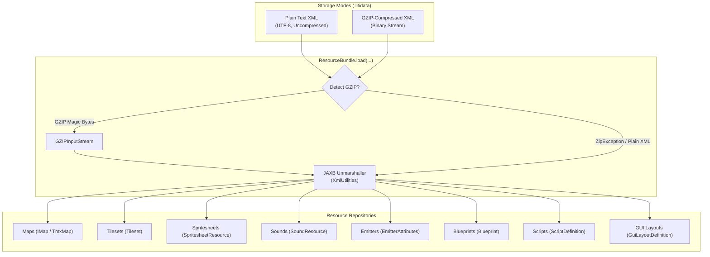

# `.litidata` File Format

The `.litidata` file format is the official project container and asset bundle format used by LITIENGINE. Created and managed via the **utiLITI Editor** and loaded via the `Resources` API (`ResourceBundle`), `.litidata` consolidates maps, tilesets, spritesheets, sound effects, particle emitters, entity blueprints, Java script bindings, and declarative GUI layouts into a single, cohesive file.



---

## Storage Modes & Compression

A `.litidata` file is fundamentally an **XML document** bound via Jakarta XML Binding (JAXB). LITIENGINE natively supports two distinct serialization modes, both using the `.litidata` extension:

| Feature | Uncompressed Plain XML | GZIP-Compressed XML |
|:---|:---|:---|
| **Underlying Format** | Standard UTF-8 XML document | Standard GZIP stream (`GZIPOutputStream`) wrapping the XML |
| **Typical File Size** | Larger (especially with Base64 payloads) | Drastically smaller (up to 80–90% reduction) |
| **Version Control (Git)** | **Ideal**: Human-readable, line diffable, easy conflict resolution | Opaque binary blob; requires Git LFS for large files |
| **Inspection & Debugging** | Can be viewed and edited in any text editor | Must be decompressed before viewing in plain text editors |
| **Recommended Use** | Active game development, team source repositories | Release builds, distribution JARs, packaged assets |

### Transparent Dual-Mode Loading

You do not need to tell LITIENGINE which mode your `.litidata` file uses. When you call `Resources.load("game.litidata")` or `ResourceBundle.load(...)`, the loader automatically probes the stream:

1. It attempts to wrap the file stream in a `GZIPInputStream`.
2. If the stream begins with valid GZIP header bytes, JAXB unmarshals the decompressed XML stream.
3. If a `ZipException` occurs (indicating the file is not GZIP-compressed), the engine seamlessly falls back to parsing the file as plain UTF-8 XML.

---

## Root Structure & XML Schema

The root element of every `.litidata` file is `<litidata>` with a `version` attribute:

```xml
<?xml version="1.0" encoding="UTF-8"?>
<litidata version="1.0">
  <guiLayouts>...</guiLayouts>
  <maps>...</maps>
  <spriteSheets>...</spriteSheets>
  <tilesets>...</tilesets>
  <emitters>...</emitters>
  <blueprints>...</blueprints>
  <scripts>...</scripts>
  <gameScripts>...</gameScripts>
  <entityScripts>...</entityScripts>
  <sounds>...</sounds>
</litidata>
```

### Schema Summary

| Wrapper Element | Child Element | Java Class | Description |
|:---|:---|:---|:---|
| `<guiLayouts>` | `<layout>` | `GuiLayoutDefinition` | Declarative GUI menus and HUD component hierarchies. |
| `<maps>` | `<map>` | `TmxMap` | Complete Tiled TMX map structures, layers, and map objects. |
| `<spriteSheets>` | `<sprite>` | `SpritesheetResource` | Image frame metrics, Base64 pixel data, and keyframe timings. |
| `<tilesets>` | `<tileset>` | `Tileset` | Tiled TSX tileset definitions, tile animations, and Wang sets. |
| `<emitters>` | `<emitter>` | `EmitterAttributes` | Particle emitter physics parameters, colors, and lifecycles. |
| `<blueprints>` | `<blueprint>` | `Blueprint` | Multi-object template definitions for reusable entity groups. |
| `<scripts>` | `<script>` | `ScriptDefinition` | Declarations of external Java or runtime script implementations. |
| `<gameScripts>` | `<binding>` | `ScriptBinding` | Scripts attached to the global game lifecycle. |
| `<entityScripts>` | `<target>` | `EntityScriptBinding` | Scripts attached to specific entity types. |
| `<sounds>` | `<sound>` | `SoundResource` | Sound effect and audio asset descriptors with Base64 data. |

---

## Element Specifications

### 1. GUI Layouts (`<guiLayouts>`)

Defines persistent, resolution-independent UI layouts created in the utiLITI GUI Designer:

```xml
<guiLayouts>
  <layout>
    <name>mainMenu</name>
    <designWidth>1920</designWidth>
    <designHeight>1080</designHeight>
    <components>
      <id>panel_root</id>
      <name>Root Panel</name>
      <type>panel</type>
      <x>480</x>
      <y>180</y>
      <width>960</width>
      <height>720</height>
      <normal>
        <background>-15722448</background>
        <borderRadius>16</borderRadius>
      </normal>
      <children>
        <id>btn_start</id>
        <name>Start Button</name>
        <type>button</type>
        <x>720</x>
        <y>400</y>
        <width>480</width>
        <height>80</height>
        <text>START GAME</text>
        <fontSize>32</fontSize>
        <focusable>true</focusable>
        <normal>
          <background>-15125444</background>
          <borderRadius>8</borderRadius>
        </normal>
        <hover>
          <background>-14118145</background>
          <borderRadius>8</borderRadius>
        </hover>
      </children>
    </components>
  </layout>
</guiLayouts>
```

- **`designWidth` / `designHeight`**: Baseline virtual resolution used for layout calculations and auto-scaling.
- **`<components>`**: Recursive component hierarchy supporting `panel`, `button`, `label`, `checkbox`, `slider`, and `textfield`.
- **Styling States**: Sub-tags `<normal>`, `<hover>`, and `<disabled>` specify ARGB color integers (`<background>`, `<border>`), font sizes, padding, and corner radiuses.

### 2. Maps (`<maps>`)

Contains complete TMX map definitions. LITIENGINE embeds the Tiled map XML directly inside the `<map>` tag:

```xml
<maps>
  <map version="1.2" tiledversion="1.2.2" orientation="orthogonal" renderorder="right-down" width="50" height="50" tilewidth="16" tileheight="16" nextlayerid="5" nextobjectid="12" name="level1">
    <properties>
      <property name="AMBIENTLIGHT" value="#00666666"/>
      <property name="GRAVITY" type="int" value="120"/>
      <property name="MAP_TITLE" value="Dark Woods"/>
    </properties>
    <tileset firstgid="1" source="overworld.tsx"/>
    <layer id="1" name="terrain" width="50" height="50">
      <data encoding="csv">
        1,1,1,1,2,2,...
      </data>
    </layer>
    <objectgroup id="2" name="entities">
      <object id="1" name="spawn_player" type="SPAWNPOINT" x="128" y="256" width="16" height="16"/>
    </objectgroup>
  </map>
</maps>
```

- Tilesets referenced with `<tileset source="..."/>` are automatically resolved against tilesets defined in the bundle's `<tilesets>` collection or on disk.
- Map properties (like `AMBIENTLIGHT`, `GRAVITY`, or custom game parameters) are preserved and deserialized into the runtime `IMap` instance.

### 3. Spritesheets (`<spriteSheets>`)

Declares sprite grids, frame dimensions, optional Base64 pixel payloads, and animation keyframe timing:

```xml
<spriteSheets>
  <sprite width="16" height="18" imageformat="PNG" name="player-walk">
    <image>iVBORw0KGgoAAAANSUhEUgAAAEAAAAASCAYAAADrL9giAAAA4klEQVR42u2WsQ3DIBREKTNCSg+RWTJDyoyRsTxCRsgY6RxRINmID993h0IiI9EYv+M4fzAhHO1oxXY6T0up92ZVGhRvwR4RhlVpUHwLrokwrEqD9hAHH/N9udyum+4NAGVVGrSHOBiBXCQ9bwWAsioN2kOtbF7vJ7wFWqxKQ+EhpJdL3bMAlFVpKDyYIoyBvb+xHiGafOvUXO+lHvxXPdT2TOk09U7s5YfwkANWgq0FoPwQHqyS8ZSvgh/FQ7Ws2Pv8L/FhXTK70/sDfnO1RODEsjyqk/NwAGh6yi+IaHjm/wDnjXF3vhppmQAAAABJRU5ErkJggg==</image>
    <keyframes>100,100,120,100</keyframes>
  </sprite>
</spriteSheets>
```

- **`width` / `height`**: Pixel dimensions of an individual sprite animation frame.
- **`imageformat`**: Format of the embedded image data (typically `PNG`).
- **`<image>`**: Standard RFC 4648 Base64-encoded binary representation of the image file.
- **`<keyframes>`**: Optional comma-separated list of durations (in milliseconds) for each frame in the animation sequence.

### 4. Tilesets (`<tilesets>`)

Stores TSX tileset definitions including tile animations, terrain Wang sets, and custom collision boundaries:

```xml
<tilesets>
  <tileset firstgid="0" name="overworld" tilewidth="16" tileheight="16" tilecount="256" columns="16">
    <image source="sprites/overworld.png" width="256" height="256"/>
    <tile id="14">
      <animation>
        <frame tileid="14" duration="200"/>
        <frame tileid="15" duration="200"/>
        <frame tileid="16" duration="200"/>
      </animation>
    </tile>
  </tileset>
</tilesets>
```

### 5. Particle Emitters (`<emitters>`)

Contains complete particle emitter presets (`EmitterAttributes`) for torches, explosions, smoke, weather, and magic effects:

```xml
<emitters>
  <emitter name="torch-flame">
    <emitterType>POINT</emitterType>
    <particleType>RECTANGLE</particleType>
    <spawnAmount>5</spawnAmount>
    <spawnRate>80</spawnRate>
    <maxParticles>100</maxParticles>
    <minParticleTTL>300</minParticleTTL>
    <maxParticleTTL>800</maxParticleTTL>
    <colors>#ffffaa00,#ffff4400,#ff880000</colors>
    <minDeltaX>-0.2</minDeltaX>
    <maxDeltaX>0.2</maxDeltaX>
    <minDeltaY>-1.5</minDeltaY>
    <maxDeltaY>-0.5</maxDeltaY>
    <fade>true</fade>
  </emitter>
</emitters>
```

### 6. Blueprints (`<blueprints>`)

Blueprints are compound entity templates (`.xtx` format) that group multiple map objects with relative coordinate offsets:

```xml
<blueprints>
  <blueprint name="camp_site" type="AREA" width="96" height="64">
    <object id="1" name="tent" type="PROP" x="0" y="0" width="48" height="48"/>
    <object id="2" name="campfire" type="EMITTER" x="56" y="24" width="16" height="16"/>
  </blueprint>
</blueprints>
```

When built via `blueprint.build(x, y)`, LITIENGINE assigns fresh unique IDs to all child map objects and offsets their world coordinates relative to the target spawn point.

### 7. Scripts & Bindings (`<scripts>`, `<gameScripts>`, `<entityScripts>`)

Declares Java and runtime script bindings managed through the scripting subsystem:

```xml
<scripts>
  <script id="enemy-ai" name="Enemy AI" language="java" source="scripts/EnemyAI.java" implementation="game.scripts.EnemyAI" host="ENTITY" targetType="de.gurkenlabs.litiengine.entities.Creature"/>
  <script id="game-init" name="Game Init" language="java" source="scripts/GameInit.java" implementation="game.scripts.GameInit" host="GAME"/>
</scripts>
<gameScripts>
  <binding script="game-init" enabled="true" order="0">
    <parameters/>
  </binding>
</gameScripts>
<entityScripts>
  <target type="de.gurkenlabs.litiengine.entities.Creature">
    <binding script="enemy-ai" enabled="true" order="1">
      <parameters/>
    </binding>
  </target>
</entityScripts>
```

### 8. Sounds (`<sounds>`)

Audio files (SFX, voice clips, ambient audio) packed into the bundle:

```xml
<sounds>
  <sound name="jump">
    <format>WAV</format>
    <data>UklGRiQAAABXQVZFZm10IBAAAAABAAEAQB8AAEAfAAABAAgAZGF0YQAAAAA=</data>
  </sound>
</sounds>
```

- **`<format>`**: Supported audio format (`WAV`, `OGG`, or `MP3`).
- **`<data>`**: Base64-encoded raw audio file byte stream.

---

## Programmatic Java API

### High-Level Loading: `Resources.load`

In 95% of game projects, you only need a single line of code in your game initialization:

```java
package com.example.game;

import de.gurkenlabs.litiengine.Game;
import de.gurkenlabs.litiengine.resources.Resources;

public class Program {
  public static void main(String[] args) {
    Game.init(args);

    // Loads the entire bundle from the classpath or filesystem
    Resources.load("game.litidata");

    // All resources are now ready to use
    Game.world().loadEnvironment("level1");
    Game.start();
  }
}
```

When `Resources.load("game.litidata")` runs:

1. It resolves `"game.litidata"` via the classloader or local filesystem.
2. It parses the uncompressed or GZIP-compressed `ResourceBundle`.
3. It registers all script definitions and lifecycle bindings with `Game.scripts()`.
4. It populates all static container caches in parallel:
    - `Resources.maps()`
    - `Resources.tilesets()`
    - `Resources.spritesheets()`
    - `Resources.sounds()`
    - `Resources.blueprints()`
    - `Resources.guiLayouts()`

### Low-Level API: `ResourceBundle`

For modding tools, custom editors, level compilers, or procedural asset generation, you can manipulate `ResourceBundle` directly:

```java
import de.gurkenlabs.litiengine.resources.ResourceBundle;
import de.gurkenlabs.litiengine.resources.SpritesheetResource;
import java.awt.image.BufferedImage;
import java.nio.file.Path;

public class BundleGenerator {
  public static void main(String[] args) {
    // 1. Create a fresh in-memory bundle
    ResourceBundle bundle = new ResourceBundle();

    // 2. Add in-memory spritesheets
    BufferedImage spriteImage = new BufferedImage(32, 32, BufferedImage.TYPE_INT_ARGB);
    SpritesheetResource sprite = new SpritesheetResource(spriteImage, "custom-hero", 16, 16);
    bundle.getSpriteSheets().add(sprite);

    // 3. Save as plain UTF-8 XML (uncompressed) for version control
    bundle.save("assets-dev.litidata", false);

    // 4. Save as compressed GZIP bundle for distribution
    bundle.save("assets-release.litidata", true);

    // 5. Load an existing bundle from disk
    ResourceBundle loaded = ResourceBundle.load(Path.of("assets-dev.litidata"));
    System.out.println("Loaded sprites: " + loaded.getSpriteSheets().size());
  }
}
```

---

## utiLITI Editor Workflows

### Project Creation

When you create a new game project in the **utiLITI Editor** (**File -> New Project...** or `Ctrl + N`), utiLITI automatically generates a starter `game.litidata` at the project root and configures `Main.java` to load it upon startup.

### Compressing Projects

You can toggle compression for your project in utiLITI:

1. Open your project in utiLITI.
2. Open the menu: **Resources -> Compress Resource File**.
3. When checked, utiLITI writes the project as a GZIP-compressed binary stream upon saving (`Ctrl + S`).
4. When unchecked, utiLITI formats the output as clean, human-readable indented XML.

!!! tip "Development vs Production Workflow"
    - **During Active Development**: Keep compression **turned off**. Plain text XML allows you and your team to review visual git diffs for map changes, entity placements, and sprite properties in pull requests.
    - **During Release / Packaging**: Enable compression before exporting your final standalone JAR or installer to reduce download sizes and asset footprint.

### Inspecting Compressed `.litidata` via CLI

Because compressed `.litidata` files use standard GZIP compression, you can inspect or decompress them using standard operating system utilities:

=== "Linux / macOS"
    ```bash
    # View the plain XML content without modifying the file
    gzip -dc game.litidata | head -n 30

    # Decompress into a plain XML file
    gzip -dc game.litidata > game-decompressed.xml
    ```

=== "Windows (PowerShell)"
    ```powershell
    # Decompress GZIP litidata to plain XML using .NET streams
    $in = [System.IO.File]::OpenRead("game.litidata")
    $gz = [System.IO.Compression.GZipStream]::new($in, [System.IO.Compression.CompressionMode]::Decompress)
    $out = [System.IO.File]::Create("game-decompressed.xml")
    $gz.CopyTo($out)
    $gz.Close(); $in.Close(); $out.Close()
    ```

---

## Best Practices & Troubleshooting

### Version Control Guidelines

- **Git Line Endings**: Ensure `.gitattributes` treats uncompressed `.litidata` files as text:
  ```gitattributes
  *.litidata text eol=lf
  ```
- **Git LFS**: If your project stores dozens of high-resolution spritesheets or long audio tracks directly embedded in `.litidata`, consider enabling [Git Large File Storage (LFS)](https://git-lfs.github.com/) or keeping large audio files external and loading them via `Resources.sounds().get(...)`.

### Common Issues

!!! warning "Duplicate Resource Names"
    All resource containers (maps, sprites, sounds) require unique names within the bundle. Duplicate names will overwrite previous entries in the in-memory cache during `Resources.load(...)`.

!!! caution "External vs Embedded Assets"
    Maps and tilesets can reference external files (e.g. `<tileset source="tileset.tsx"/>`). When distributing your game, ensure all referenced TSX and image files are either placed within the runtime classpath or embedded directly inside `.litidata`.

---

## Related Documentation

<div class="grid cards" markdown>

- :lucide-folder-plus:{ .lg .middle } **[Project Management in utiLITI](../utiliti-editor/create-projects.md)**

    ---

    Scaffolding projects, auto-save settings, and managing `.litidata` files in the editor.

- :lucide-library:{ .lg .middle } **[Resource Management Overview](README.md)**

    ---

    Overview of the static `Resources` API, container caching, and asset pipelines.

- :lucide-file-text:{ .lg .middle } **[Sprite Info Files](sprite-info-files.md)**

    ---

    Format specification for `.info` spritesheet dimension and timing declarations.

</div>
