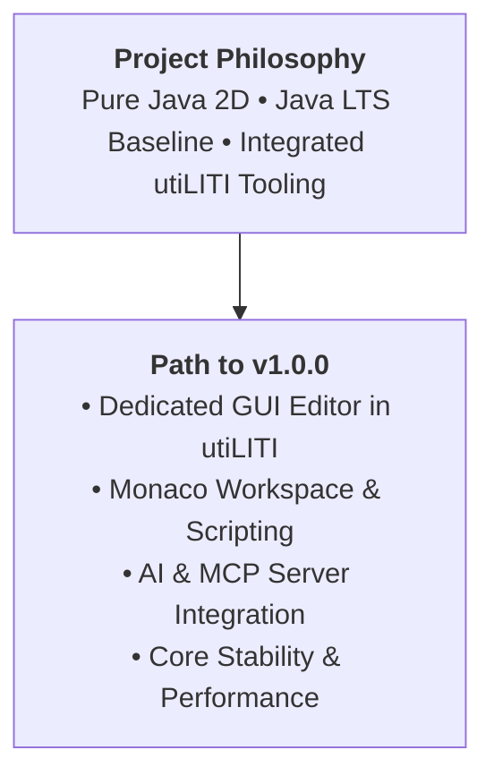

# LITIENGINE Roadmap

LITIENGINE is built with a clear philosophy: provide an accessible, powerful, and completely free 2D game engine in pure Java without external binary dependencies or complex build friction.

## Project Vision & Java Support Policy
* **Pure Java Portability**: Keep the engine lightweight, portable, and straightforward to run on any desktop operating system without managing cumbersome C/C++ native dynamic libraries.
* **Java LTS Baseline**: Development is generally oriented around **Java Long-Term Support (LTS) releases** (such as Java 21 LTS), while proactively adopting groundbreaking JDK features when they provide major advantages (such as the Foreign Function & Memory / Panama API utilized by **[Input4j](https://github.com/gurkenlabs/input4j)** for gamepad input).
* **Integrated Creative Workflow**: Provide a seamless development loop between code, assets, and level design through the **utiLITI Editor**.

---

## Current Focus: Stabilizing Toward v1.0.0

Development is currently focused on consolidating and stabilizing the engine's feature set directly toward the **v1.0.0 production release**:

### 1. Dedicated GUI Editor in utiLITI
* A visual in-editor layout tool for creating, styling, and previewing `GuiComponent` hierarchies, in-game HUDs (health bars, resource meters, dialog boxes), and main menu screens without writing manual coordinate math.

### 2. Enhanced utiLITI Editor & Monaco Workspace
* Built-in **Monaco code editor** embedded directly within utiLITI via Chromium Embedded Framework (CEF).
* Real-time `JavaLanguageService` with syntax diagnostics, clickable problem markers, parameter hints, and hover documentation.
* **Wang Tiles & Auto-Tiling**: Rule-based terrain autotiling and Wang tile pattern generation in the tileset inspector.

### 3. Scripting Engine & Hot-Reload Capabilities
* 3-tier hot-reloadable scripting framework supporting modular **Java** across `GameScript`, `EnvironmentScript`, and `EntityScript`.
* Defensive lifecycle copying, fault-tolerant exception boundaries, and pause state synchronization across event bridges.

### 4. AI & Agent Tooling (MCP Server Integration)
* First-class integration of the **Model Context Protocol (MCP)** (`io.modelcontextprotocol.sdk:mcp`), enabling autonomous AI coding agents (such as Antigravity) to query game metadata, inspect entities, edit maps, and generate code directly alongside developers.

### 5. Core Engine Performance & Stability
* Hardening and profiling the core 2D subsystems:
* **2D RenderEngine**: Optimized AWT Graphics rendering pipelines, sprite animation caching, and lighting composites.
* **2D PhysicsEngine**: Robust raycasting, collision resolution, and movement controller velocity dampening.
* **2D SoundEngine**: Multi-format audio streaming and positional sound spatialization.

---

## Community & Contributing

LITIENGINE is developed collaboratively with its open-source community:

* **Discussions & Support**: Join our [GitHub Discussions](https://github.com/gurkenlabs/litiengine/discussions) and [Discord Community](https://discord.gg/rRB9cKD).
* **Issue Tracker**: Submit bug reports and feature requests via the [GitHub Issues Tracker](https://github.com/gurkenlabs/litiengine/issues).
* **Sponsorship**: Support development via [Open Collective](https://opencollective.com/litiengine).

