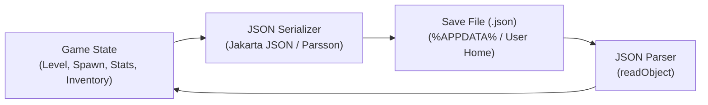

# Savegames & Persistence

Saving and loading player progress is essential for adventure games, RPGs, and high-score arcade titles. LITIENGINE provides full flexibility to structure and store save states using lightweight **JSON** serialization.



---

## 1. Creating the Save Data Model

Define a clean, serializable Java class holding your game snapshot:

```java
import java.io.Serializable;
import java.util.ArrayList;
import java.util.List;

public class GameSaveData implements Serializable {
  private static final long serialVersionUID = 1L;

  private String currentMap = "level1";
  private double playerX = 100.0;
  private double playerY = 150.0;
  private int playerHealth = 100;
  private int score = 0;
  private List<String> inventoryItems = new ArrayList<>();

  public GameSaveData() {}

  // Getters & Setters
  public String getCurrentMap() { return currentMap; }
  public void setCurrentMap(String currentMap) { this.currentMap = currentMap; }

  public double getPlayerX() { return playerX; }
  public void setPlayerX(double playerX) { this.playerX = playerX; }

  public double getPlayerY() { return playerY; }
  public void setPlayerY(double playerY) { this.playerY = playerY; }

  public int getPlayerHealth() { return playerHealth; }
  public void setPlayerHealth(int playerHealth) { this.playerHealth = playerHealth; }

  public int getScore() { return score; }
  public void setScore(int score) { this.score = score; }

  public List<String> getInventoryItems() { return inventoryItems; }
  public void setInventoryItems(List<String> items) { this.inventoryItems = items; }
}
```

---

## 2. Safe Cross-Platform Storage Directory

Never write save files directly into the installation folder (which may be read-only in Program Files or macOS app bundles). Use the user's local application data directory:

```java
import java.io.File;
import java.nio.file.Path;
import java.nio.file.Paths;

public final class SaveManager {
  private static final String GAME_FOLDER = ".mygame";

  public static Path getSaveDirectory() {
    String os = System.getProperty("os.name").toLowerCase();
    String baseDir;

    if (os.contains("win")) {
      baseDir = System.getenv("APPDATA");
      if (baseDir == null) {
        baseDir = System.getProperty("user.home");
      }
    } else if (os.contains("mac")) {
      baseDir = System.getProperty("user.home") + "/Library/Application Support";
    } else {
      // Linux / Unix standard XDG directory
      baseDir = System.getProperty("user.home") + "/.local/share";
    }

    File dir = new File(baseDir, GAME_FOLDER);
    if (!dir.exists()) {
      dir.mkdirs();
    }
    return dir.toPath();
  }
}
```

---

## 3. Saving & Loading Game State

Use Jakarta JSON (bundled in LITIENGINE) or `JsonUtilities` to write and read save data:

```java
import java.io.FileReader;
import java.io.FileWriter;
import java.io.IOException;
import java.nio.file.Path;
import jakarta.json.bind.Jsonb;
import jakarta.json.bind.JsonbBuilder;

public final class SaveManager {
  private static final Jsonb jsonb = JsonbBuilder.create();

  public static void saveGame(String slotName, GameSaveData data) {
    Path saveFile = getSaveDirectory().resolve(slotName + ".json");
    try (FileWriter writer = new FileWriter(saveFile.toFile())) {
      jsonb.toJson(data, writer);
      System.out.println("Saved progress to: " + saveFile);
    } catch (IOException e) {
      e.printStackTrace();
    }
  }

  public static GameSaveData loadGame(String slotName) {
    Path saveFile = getSaveDirectory().resolve(slotName + ".json");
    if (!saveFile.toFile().exists()) {
      return null;
    }

    try (FileReader reader = new FileReader(saveFile.toFile())) {
      return jsonb.fromJson(reader, GameSaveData.class);
    } catch (IOException e) {
      e.printStackTrace();
      return null;
    }
  }
}
```

---

## 4. Restoring the World State

When loading a savegame, re-apply the saved state to the active environment and player entity:

```java
public static void applySave(GameSaveData save) {
  if (save == null) return;

  // 1. Switch to the saved level
  Game.world().loadEnvironment(save.getCurrentMap());

  // 2. Position the player entity
  IEntity player = Game.world().environment().get("player");
  if (player instanceof Creature creature) {
    creature.setLocation(save.getPlayerX(), save.getPlayerY());
  }

  // 3. Center camera
  Game.world().camera().setFocus(save.getPlayerX(), save.getPlayerY());
}
```
