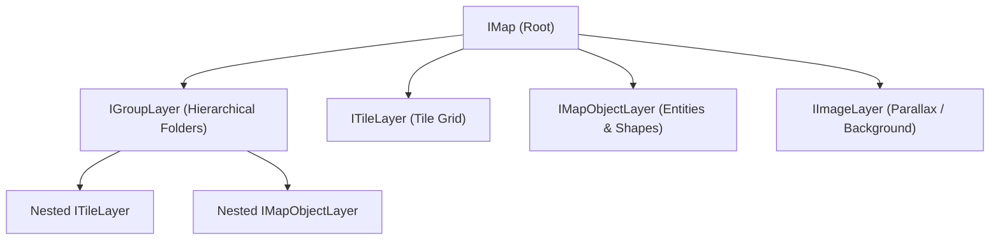

# Tile Maps Overview

LITIENGINE natively loads and renders `.tmx` map files and `.tsx` tilesets exported from the industry-standard [Tiled Map Editor](https://www.mapeditor.org/) or built directly inside **utiLITI**.

---

## Tile Map Documentation Sections

<div class="grid cards" markdown>

- :lucide-box:{ .lg .middle } **[Map Objects](map-objects.md)**

    ---

    Spawning creatures, props, collision boxes, spawnpoints, triggers, and lights directly from map geometries.

- :lucide-settings-2:{ .lg .middle } **[Custom Properties](custom-properties.md)**

    ---

    Reading custom metadata properties, booleans, integers, and color variables from map objects.

- :lucide-box:{ .lg .middle } **[utiLITI Tileset Editor](../utiliti-editor/tileset-editor.md)**

    ---

    Managing embedded vs external tilesets, Wang terrain autotiling rules, and animation frames.

- :lucide-pen-tool:{ .lg .middle } **[Tools & Editing](../utiliti-editor/tools-and-editing.md)**

    ---

    Brush tools, stamps, terrain painters, and layer management in the utiLITI map editor.

</div>

---

## Supported Map Orientations

LITIENGINE supports four map orientations through the `MapOrientations` class (`de.gurkenlabs.litiengine.environment.tilemap.MapOrientations`):

| Orientation | Constant | Description | Mathematical Projection & Notes |
| :--- | :--- | :--- | :--- |
| **Orthogonal** | `MapOrientations.ORTHOGONAL` | Standard top-down or side-scrolling rectangular grid. | Grid tiles are aligned directly with Cartesian screen coordinates `(x * tileWidth, y * tileHeight)`. |
| **Isometric** | `MapOrientations.ISOMETRIC` | True diamond isometric projection. | Transformed via `(x, y) -> ((x - y) / 2, (x + y) / 2)`. Maps require even-numbered tile dimensions. |
| **Isometric Staggered** | `MapOrientations.ISOMETRIC_STAGGERED` | Staggered isometric grid in a rectangular bounding area. | Arranged in alternating rows/columns matching the configured stagger axis (`X` or `Y`) and stagger index (`EVEN` or `ODD`). |
| **Hexagonal** | `MapOrientations.HEXAGONAL` | Flat-topped or pointy-topped hexagonal grid. | Generalization of staggered isometric with a configurable hex side length (`hexsidelength`). Tile dimensions and hex side length must be even numbers. |

```java
import de.gurkenlabs.litiengine.environment.tilemap.IMap;
import de.gurkenlabs.litiengine.environment.tilemap.MapOrientations;
import de.gurkenlabs.litiengine.resources.Resources;

IMap map = Resources.maps().get("level1.tmx");
if (map.getOrientation().equals(MapOrientations.ORTHOGONAL)) {
  System.out.println("Orthogonal level loaded: " + map.getSizeInPixels());
}
```

---

## Layer Architecture

Every map file contains one or more layers organized in a render hierarchy:



### 1. Tile Layers (`ITileLayer`)
A 2D array of Tile GIDs (Global Identifiers) referencing tileset textures. Used for terrain surfaces, floor textures, wall structures, and roofs. Supports animated tiles and custom per-tile collision shapes defined in tilesets.

### 2. Object Layers (`IMapObjectLayer`)
Free-form coordinate layers containing geometric objects. LITIENGINE maps these directly into game entities (see [Map Objects](map-objects.md)), such as `Creature`, `Prop`, `LightSource`, `Trigger`, `StaticShadow`, and `CollisionBox`.

### 3. Image Layers (`IImageLayer`)
Displays a single static texture across the map canvas. Commonly used for backdrop landscapes, skyboxes, or distant parallax scenery. Supports repeat flags and parallax scrolling factors.

### 4. Group Layers (`IGroupLayer`)
Hierarchical container layers that bundle multiple child layers (tile, object, image, or nested group layers). Changing the visibility, opacity, or position offset of a group layer applies universally to all contained sub-layers.

