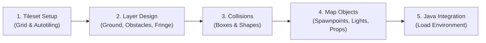
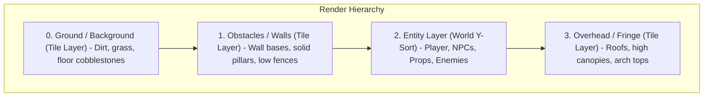

# Creating Tile Maps Tutorial

This tutorial guides you through the complete workflow of creating and integrating a 2D tile map for your LITIENGINE game—from preparing tilesets and structuring render layers to establishing physics boundaries, placing interactive entities, and loading the level in Java 25.



---

## Overview & Tooling

LITIENGINE maps are based on the standard **TMX (Tile Map XML)** specification. You can create and edit maps using two primary tools:

1. **utiLITI Editor**: The official LITIENGINE level and resource editor. It can create maps, paint tiles, define Wang autotiling, configure ambient lighting, and package everything directly into your game's `.litidata` resource bundle.
2. **Tiled Map Editor**: A popular third-party 2D level editor ([mapeditor.org](https://www.mapeditor.org/)). Since LITIENGINE uses `.tmx` natively, maps authored in Tiled can be imported directly into utiLITI or loaded as standalone files.

For this tutorial, we will focus on the workflow using **utiLITI**, highlighting how its native integration with the engine simplifies entity placement and asset packaging.

---

## Step 1: Prepare the Tileset

Before designing a level, you need a **tileset**—an image containing your terrain, walls, and decorative tiles arranged on a uniform grid (typically 16x16, 24x24, or 32x32 pixels).

```text
my-game/
└── assets/
    └── tilesets/
        └── dungeon-tiles.png    # Raw spritesheet texture (e.g., 256x256 image with 16x16 cells)
```

### 1. Import the Tileset into utiLITI

1. Launch **utiLITI** and open your project's `.litidata` file (or select **File -> New...** to create one).
2. Open the **Tileset Editor** via the bottom panel or by selecting **View -> Tileset Editor**.
3. Click the **Import Tileset** button (`+`) in the tileset list.
4. Browse to your tileset image (e.g., `dungeon-tiles.png`).
5. Set the grid parameters:
    - **Tile Width**: `16` (or your chosen cell pixel width).
    - **Tile Height**: `16` (or your chosen cell pixel height).
    - **Margin & Spacing**: `0` (unless your spritesheet contains border gutters).
6. Click **OK**. utiLITI slices the texture into addressable tile cells and assigns each a global tile identifier (GID).

### 2. Configure Wang Terrain Sets (Optional but Recommended)

If your tileset includes terrain transitions (such as grass transitioning into dirt or stone walls meeting floors), you can configure a **Wang Set** to enable automated autotiling:

1. In the **Tileset Editor**, navigate to the **Wang Sets** tab.
2. Click **Add Wang Set**, assign a name (e.g., `StoneDungeon`), and choose **Corner** or **Edge** mode.
3. Assign terrain colors to the corresponding edge or corner cells of your tiles.
4. When painting in the viewport later with the **Terrain Brush (`T`)**, the editor will automatically select the matching corner, wall, and border tiles as you draw.

---

## Step 2: Create the Map & Structure Layers

### 1. Initialize the Map Canvas

1. In utiLITI, select **Map -> New...** from the main menu or press **`Ctrl + Shift + N`**.
2. Configure the new map dialog:
    - **Name**: `dungeon-level-1` (an alphanumeric identifier used to load the level in code).
    - **Orientation**: `Orthogonal` (standard 2D top-down grid).
    - **Map Width / Height**: `30` x `20` (dimensions measured in tile units).
    - **Tile Width / Height**: `16` x `16` (matching your tileset grid).
3. Click **Create**. A blank grid canvas appears in the viewport.

### 2. The Three-Tier Layer Architecture

Proper layer separation is essential for realistic 2D rendering depth. Organize your map into at least three distinct tile layers:



In the **Layers** panel on the right:

1. **Ground Layer (`ground`)**:
    - Contains walkable surfaces (stone floors, grass, water bodies).
    - Rendered below all game entities. Never contains solid collisions.
    - Use the **Bucket Fill Tool (`G`)** to quickly fill the entire canvas with a base floor tile.
2. **Obstacles Layer (`walls`)**:
    - Contains opaque structures, wall segments, and lower halves of pillars.
    - Visually indicates non-passable terrain.
    - Use the **Tile Brush Tool (`B`)** or **Stamp Brush Tool (`S`)** to outline rooms and hallways.
3. **Overhead Layer (`fringe`)**:
    - Contains the tops of walls, archways, and high tree canopies.
    - Rendered *above* the player and entities, creating the illusion of walking behind or underneath tall structures.

!!! tip "Grid Snapping"
    Ensure **Snap to Grid** is enabled on the viewport toolbar (`Ctrl + G` toggles grid display). This prevents misaligned tile painting and keeps boundary lines crisp.

---

## Step 3: Define Collision Geometry

Tiles are purely visual graphics. To prevent players and enemies from walking through walls, you must define physical collision shapes.

LITIENGINE offers two complementary approaches:

### Approach A: Dedicated CollisionBox Objects (Recommended)

Using geometric `CollisionBox` map objects allows you to group large wall sections into single, optimized physics rectangles rather than hundreds of individual per-tile colliders.

1. Switch to the **Map Object Layer** or create one in the Layers panel.
2. Select **Edit -> Add... -> Collision Box** from the menu.
3. In the viewport, click and drag a rectangular bounding box across an entire wall section or perimeter boundary.
4. In the **Entity Inspector** on the right:
    - **Collision**: Verify that the checkbox is checked.
    - **Collision Type**: Set to `STATIC` (static immovable geometry).
5. Repeat for all solid borders and interior room dividers.

```text
+-------------------------------------------------------+
| [CollisionBox: Top Border, 480x16 px]                 |
|=======================================================|
| [Col]                                           [Col] |
| Wall                                             Wall |
|                                                       |
|                                                       |
|=======================================================|
| [CollisionBox: Bottom Border, 480x16 px]              |
+-------------------------------------------------------+
```

### Approach B: Per-Tile Collision Shapes

If your tileset contains irregular shapes (such as diagonal rock slopes):

1. Open the **Tileset Editor** and select the specific tile.
2. Switch to the **Collision Editor** tab.
3. Draw a custom polygon or rectangle fitting the solid portion of that tile.
4. LITIENGINE will automatically instantiate collision boundaries wherever that tile is painted on the map.

!!! note "Visualizing Collisions"
    Press **`Ctrl + H`** in utiLITI to toggle the collision debug overlay. All active collision boundaries will highlight in semi-transparent red/magenta, allowing you to instantly spot gaps in your room walls.

---

## Step 4: Add Entities & Map Objects

Map objects transform a static drawing into a living game world. Select the Object Layer, then use **Edit -> Add...** to place the following entities:

### 1. Player Spawnpoint

Every level needs an entry position:

1. Select **Edit -> Add... -> Spawnpoint**.
2. Click on the canvas inside your walkable floor area.
3. In the **Entity Inspector**:
    - **Name**: Set to `player-spawn` (used in Java code to look up coordinates).
    - **Direction**: Set to `DOWN` or `RIGHT` (the initial facing direction of the spawned player).
    - **Spawn Angle**: Optional rotation angle for top-down aimers.

### 2. Interactive Props

Add environmental props such as crates, barrels, or treasure chests:

1. Select **Edit -> Add... -> Prop**.
2. Click where the object should appear.
3. In the **Entity Inspector**:
    - **Spritesheet**: Select your prop spritesheet (e.g., `prop-chest`).
    - **Material**: Set to `WOOD` or `STONE` (determines sound effects when struck).
    - **Collision Box**: Configure width and height if the prop should block movement.
    - **Indestructible**: Uncheck if player attacks can destroy the prop.

### 3. Atmospheric Lighting

To create moody dungeons or nighttime scenes:

1. Select the map canvas background and open **Map Properties** in the inspector.
2. Set **Ambient Light Color** to a dark blue or dim grey (e.g., `#141824`) and adjust the alpha slider to `0.75` (75% darkness).
3. Select **Edit -> Add... -> Light Source**.
4. Place lights near wall torches or glowing crystals:
    - **Radius**: `120` px.
    - **Light Color**: Warm orange/amber (e.g., `#FFAA33`).
    - **Intensity**: `180`.

---

## Step 5: Save & Package the Level

Once your level design is complete:

1. Press **`Ctrl + S`** in utiLITI to save the active `.litidata` resource container.
2. Place the resulting file in your game project's asset directory:

```text
my-game/
├── src/main/java/...
└── src/main/resources/
    └── game.litidata    # Contains dungeon-level-1.tmx, tilesets, and entity metadata
```

Alternatively, if you prefer external `.tmx` files, select **Map -> Export...** to export standalone `.tmx` and `.tsx` files directly into your resources folder.

---

## Step 6: Load & Run the Map in Java

With the map authored and bundled, load the environment in your Java game application using LITIENGINE's world management API:

```java
package com.example.game;

import java.awt.event.KeyEvent;
import java.awt.geom.Point2D;
import de.gurkenlabs.litiengine.Game;
import de.gurkenlabs.litiengine.entities.CollisionInfo;
import de.gurkenlabs.litiengine.entities.Creature;
import de.gurkenlabs.litiengine.entities.EntityInfo;
import de.gurkenlabs.litiengine.entities.MovementInfo;
import de.gurkenlabs.litiengine.entities.Spawnpoint;
import de.gurkenlabs.litiengine.environment.Environment;
import de.gurkenlabs.litiengine.input.KeyboardEntityController;
import de.gurkenlabs.litiengine.physics.IMovementController;
import de.gurkenlabs.litiengine.resources.Resources;

public class GameApp {

  @EntityInfo(width = 16, height = 16)
  @MovementInfo(velocity = 80)
  @CollisionInfo(collision = true, collisionBoxWidth = 12, collisionBoxHeight = 12)
  public static class PlayerHero extends Creature {
    public PlayerHero() {
      super("hero");
    }

    @Override
    protected IMovementController createMovementController() {
      KeyboardEntityController<PlayerHero> controller = new KeyboardEntityController<>(this);
      controller.addUpKey(KeyEvent.VK_W);
      controller.addDownKey(KeyEvent.VK_S);
      controller.addLeftKey(KeyEvent.VK_A);
      controller.addRightKey(KeyEvent.VK_D);
      return controller;
    }
  }

  public static void main(String[] args) {
    // 1. Initialize engine configuration and window
    Game.init(args);
    Game.window().setTitle("Dungeon Explorer - Tile Map Demo");

    // 2. Load the bundled .litidata container
    Resources.load("game.litidata");

    // 3. Register a callback when the environment loads
    Game.world().onLoaded(environment -> {
      System.out.println("Loaded map: " + environment.getMap().getName());

      // Find the designated player spawnpoint map object
      Spawnpoint spawn = environment.getSpawnpoint("player-spawn");

      PlayerHero player = new PlayerHero();
      if (spawn != null) {
        // Spawn the player at the exact coordinates and facing direction
        spawn.spawn(player);
      } else {
        // Fallback: spawn at center of map
        Point2D center = new Point2D.Double(
            environment.getMap().getSizeInPixels().getWidth() / 2.0,
            environment.getMap().getSizeInPixels().getHeight() / 2.0);
        player.setLocation(center);
        environment.add(player);
      }

      // 4. Focus camera on the player and clamp to map boundaries
      Game.world().camera().setFocus(player.getCenter());
      Game.world().camera().setClampToMap(true);

      // Continuously track player with the camera
      Game.loop().attach(() -> {
        if (!player.isDead()) {
          Game.world().camera().setFocus(player.getCenter());
        }
      });
    });

    // 5. Load the environment by the name specified in utiLITI
    Game.world().loadEnvironment("dungeon-level-1");

    // 6. Start the game loop
    Game.start();
  }
}
```

---

## Best Practices Checklist

When authoring tile maps for production games, follow these proven practices:

- [x] **Power-of-Two Tiles**: Stick to standard tile sizes (`16x16`, `32x32`) to prevent floating-point sub-pixel rendering artifacts.
- [x] **Group Collision Boxes**: Merge long walls into single, wide `CollisionBox` objects. This significantly reduces broad-phase physics overhead compared to single-tile colliders.
- [x] **Camera Clamping**: Always enable `Game.world().camera().setClampToMap(true)` to prevent the viewport from showing black borders outside the map edge.
- [x] **Layer Ordering**: Keep background floor tiles on index 0, obstacle walls on index 1, entities sorted dynamically via `RenderType.NORMAL` (Y-sorted), and overhead roofs on `RenderType.OVERLAY`.
- [x] **Map ID Consistency**: If merging multiple levels, use **Map -> Reassign Map IDs...** in utiLITI to resolve duplicate entity ID conflicts.

---

## Related Documentation

- [Tile Maps Overview](README.md) - Architecture, orientations, and layer types.
- [Map Objects Guide](map-objects.md) - Comprehensive reference for all map entity types.
- [Custom Properties](custom-properties.md) - Reading custom TMX parameters from Java.
- [utiLITI Maps & Environments](../utiliti-editor/maps-and-environments.md) - Map management, ambient darkness, and lighting controls.
- [utiLITI Tileset Editor](../utiliti-editor/tileset-editor.md) - Tileset slicing and Wang terrain setup.
