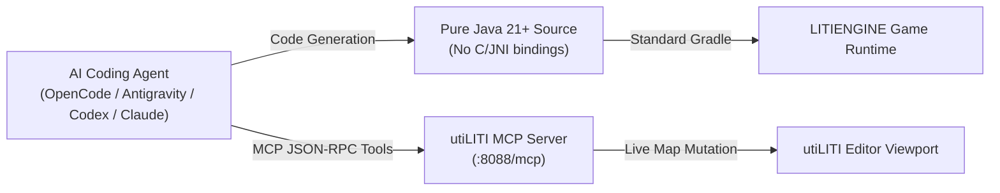

# Developing LITIENGINE Games with AI

Building 2D games in Java is significantly faster and more intuitive when pairing with modern **AI Coding Assistants**. In the open-source spirit, developers can leverage tools like **[OpenCode](https://github.com/opencode-ai/opencode)**, **Google Antigravity**, **OpenAI Codex**, **Claude**, and **Cursor**.

Because **LITIENGINE** is built on pure Java 21+ with zero external C-dependencies, AI agents excel at generating game logic, creating custom entity controllers, writing unit tests, and automating level design through the **utiLITI Model Context Protocol (MCP) Server**.

---

## Why LITIENGINE is Ideal for AI Pair Programming



1. **Open-Source Friendly & Zero C-Dependencies**: Unlike engines that rely on complex OpenGL/Vulkan/C++ native bindings (like LWJGL or LibGDX), LITIENGINE runs on pure Java AWT 2D. AI models do not suffer from native DLL hallucinations or platform-specific compilation crashes.
2. **Declarative Architecture**: Annotations like `@EntityInfo`, `@MovementInfo`, `@CollisionInfo`, and `@AnimationInfo` provide clear, self-documenting metadata that LLMs generate with 100% precision.
3. **Decoupled Game Loops**: The strict separation between `update()` (60 FPS logic ticks) and `render()` (interpolated graphics rendering) prevents common concurrency and game loop timing bugs.
4. **Native MCP Server**: utiLITI embeds a full **Model Context Protocol (MCP)** server, enabling AI agents to inspect, manipulate, and generate game maps live in the editor.

---

## Setting Up `AGENTS.md` for Your Game Repository

To ensure that AI coding assistants adhere strictly to your game's conventions, always include an `AGENTS.md` file in the root of your game project. Modern AI developer tools (including OpenCode, Antigravity, and Cursor) automatically read this file to discover build commands, architecture rules, and testing requirements.

### Downloadable `AGENTS.md` Template

You can download our official, production-ready template and drop it into your repository root:

<div class="grid cards" markdown>

- :material-file-download:{ .lg .middle } **[Download AGENTS.md Template](/assets/templates/AGENTS.txt)**

    ---

    Official LITIENGINE game repository rulebook for OpenCode, Antigravity, OpenAI Codex, Claude, and Cursor.

</div>

### Template Preview & Rules

Below is the complete `AGENTS.md` specification ready to copy:

```markdown title="AGENTS.md"
# AGENTS.md - LITIENGINE Game Repository Guide

This repository contains a 2D game built with **LITIENGINE**, a free, open-source 2D Java Game Engine. This document provides technical rules, project architecture, build instructions, and coding standards for AI coding agents.

## 1. Tech Stack & Rules
- Language: Java 21 LTS or newer
- Build System: Gradle (./gradlew run, ./gradlew test, ./gradlew shadowJar)
- Graphics: Pure Java AWT 2D (zero OpenGL/Vulkan C-bindings)
- Input: Input4j via Panama Foreign Function & Memory (FFM) APIs
- Asset Archive: `game.litidata` created via utiLITI

## 2. Core Architecture Rules
- Application Entry: Always use Game.init(args) -> Resources.load("game.litidata") -> Game.world().loadEnvironment("level1") -> Game.start()
- Asset Retrieval: Never instantiate ImageIO or ImageIcon directly. Always use `Resources.images()`, `Resources.spritesheets()`, `Resources.sounds()`, `Resources.maps()`.
- Entities: Inherit from Creature, Prop, or CollisionEntity. Use @EntityInfo, @MovementInfo, @CollisionInfo.
- Game Scripting: Pure Java only (no Groovy). Hot-reloadable via Monaco script workspace.

## 3. Anti-Patterns to Avoid
- ❌ Never perform disk I/O inside render() or update().
- ❌ Never introduce native C/C++ dependencies.
- ❌ Never hardcode window coordinates; use Game.world().camera().viewportToWorld().
```

---

## Automating Level Design via utiLITI MCP Server

The **utiLITI Editor** features an embedded **Model Context Protocol (MCP)** server running on port `8088`. This allows AI coding agents to interact with your live editor session over JSON-RPC.

### Connecting Your AI Client to utiLITI

Add the utiLITI MCP server to your AI tool configuration:

=== "OpenCode"

    ```json title="~/.config/opencode/mcp.json"
    {
      "mcpServers": {
        "utiliti": {
          "url": "http://localhost:8088/mcp",
          "transport": "sse"
        }
      }
    }
    ```

=== "Google Antigravity"

    ```json title=".gemini/antigravity/mcp.json"
    {
      "mcpServers": {
        "utiliti": {
          "url": "http://localhost:8088/mcp",
          "transport": "sse"
        }
      }
    }
    ```

=== "OpenAI Codex / Custom MCP"

    ```json title="mcp-config.json"
    {
      "mcpServers": {
        "utiliti": {
          "url": "http://localhost:8088/mcp"
        }
      }
    }
    ```

=== "Claude Desktop"

    ```json title="claude_desktop_config.json"
    {
      "mcpServers": {
        "utiliti": {
          "url": "http://localhost:8088/mcp",
          "transport": "sse"
        }
      }
    }
    ```

=== "Cursor"

    ```json title=".cursor/mcp.json"
    {
      "mcpServers": {
        "utiliti": {
          "url": "http://localhost:8088/mcp"
        }
      }
    }
    ```

---

## Real-World AI Game Development Workflows

### 1. Generating Custom Game Entities

Prompt your AI assistant to generate specialized creatures with combat behaviors:

> **Prompt**: *"Create a SkeletonArcher enemy entity in Java that inherits from Creature. It should have 60 HP, a movement speed of 45, a 16x12 collision box, and use the 'skeleton-archer' spritesheet. Include an AttackBehavior that fires arrows when the player is within a 200-pixel radius."*

```java title="src/main/java/com/example/game/entities/SkeletonArcher.java"
package com.example.game.entities;

import de.gurkenlabs.litiengine.Align;
import de.gurkenlabs.litiengine.Valign;
import de.gurkenlabs.litiengine.entities.AnimationInfo;
import de.gurkenlabs.litiengine.entities.CollisionInfo;
import de.gurkenlabs.litiengine.entities.CombatInfo;
import de.gurkenlabs.litiengine.entities.Creature;
import de.gurkenlabs.litiengine.entities.EntityInfo;
import de.gurkenlabs.litiengine.entities.MovementInfo;

@EntityInfo(width = 24, height = 32)
@MovementInfo(velocity = 45)
@CombatInfo(hitpoints = 60, team = 2)
@CollisionInfo(collision = true, collisionBoxWidth = 16, collisionBoxHeight = 12, align = Align.CENTER, valign = Valign.DOWN)
@AnimationInfo(spritePrefix = "skeleton-archer")
public class SkeletonArcher extends Creature {
  public SkeletonArcher() {
    super("skeleton-archer");
  }
}
```

### 2. Live Map Generation via MCP Prompts

With utiLITI running, you can ask your AI assistant to place props and spawnpoints directly onto your active level:

> **Prompt to AI Assistant**: *"Using the utiLITI MCP tools, inspect the active map 'dungeon-level1'. Place 4 wooden torch props along the north wall at y=64 with 128px spacing, and add a dynamic light source of radius 96 with color '#FF8833' on each torch."*

The AI assistant will execute the MCP commands (`add-prop`, `add-light`, `batch-add-entities`) and update the live utiLITI canvas in real-time.

---

## Best Practices for Prompting AI Coding Assistants

| Category | Recommended Practice | Example Instruction |
|:---|:---|:---|
| **Physics & Collision** | Specify collision box dimensions separately from visual sprite size. | *"Set sprite size to 32x32, but set collision box to 16x8 aligned to Valign.DOWN."* |
| **Asset Loading** | Instruct the AI to use `Resources.*` cache accessors. | *"Preload sprites in Program.java using Resources.spritesheets().load(...)."* |
| **Animation Conventions** | Follow the `{prefix}-{state}-{direction}` naming standard. | *"Generate spritesheet references named 'player-walk-left.png' and 'player-idle-down.png'."* |
| **Audio Playback** | Distinguish between 2D positional SFX and streaming BGM. | *"Use Game.audio().playSound(sfx, entity) for positional audio."* |

---

## Frequently Asked Questions

??? question "Can AI assistants generate complete, playable LITIENGINE games?"
    **Yes.** Because LITIENGINE's API surface is concise and declarative, AI assistants like OpenCode, Antigravity, and Codex can easily write the complete Java application code, configure Gradle build files, and use the utiLITI MCP server to generate level maps and entity placements.

??? question "How does the utiLITI MCP server differ from traditional IDE plugins?"
    Traditional IDE plugins only manipulate text files on disk. The **utiLITI MCP Server** connects directly to the running game editor process, enabling AI agents to query live map geometry, trigger immediate visual redraws, and validate entity properties in memory.

??? question "Is Internet access required for AI development with LITIENGINE?"
    No. Once your JDK, Gradle wrapper, and local AI model (such as an offline OpenCode model or local MCP client) are installed, all game compilation, asset loading, and utiLITI editor automation run 100% locally and offline.

---

## Related Documentation

<div class="grid cards" markdown>

- :material-robot-outline:{ .lg .middle } **[utiLITI MCP Server Reference](/utiliti-editor/mcp-server/)**

    ---

    Detailed specification for all 90+ raw primitives and semantic map mutation tools.

- :material-gamepad-variant-outline:{ .lg .middle } **[2D Platformer Tutorial](/tutorials/2d-platformer/)**

    ---

    Step-by-step tutorial building a complete 2D action platformer with LITIENGINE.

- :material-book-open-page-variant:{ .lg .middle } **[API Quick Reference](/getting-started/api-quick-reference/)**

    ---

    Instant cheat sheet covering all engine classes, method signatures, and annotations.

</div>

<script type="application/ld+json">
{
  "@context": "https://schema.org",
  "@type": "TechArticle",
  "headline": "Developing LITIENGINE Games with AI Coding Assistants",
  "description": "Comprehensive guide to building 2D Java games using open-source and modern AI coding assistants (OpenCode, Antigravity, OpenAI Codex, Claude, Cursor) with LITIENGINE and the utiLITI Model Context Protocol (MCP) server.",
  "author": {
    "@type": "Organization",
    "name": "Gurkenlabs"
  },
  "keywords": "LITIENGINE AI, OpenCode, Google Antigravity, OpenAI Codex, AI game development, Model Context Protocol, MCP game engine, AGENTS.md, Java game AI, Cursor, Claude Desktop",
  "articleSection": "Tutorials"
}
</script>
