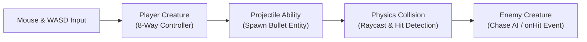

# Top-Down Action Shooter Tutorial

In this tutorial, you will build a fast-paced **Top-Down Action Shooter** inspired by engine patterns in *Star Reaperz* ([`litiengine-ldjam52`](https://github.com/gurkenlabs/litiengine-ldjam52)).



---

## 1. Player Entity with Mouse Aiming

The player moves with `WASD` and turns to face the mouse crosshair:

```java
import java.awt.geom.Point2D;
import java.awt.event.KeyEvent;
import de.gurkenlabs.litiengine.Game;
import de.gurkenlabs.litiengine.Input;
import de.gurkenlabs.litiengine.entities.Creature;
import de.gurkenlabs.litiengine.entities.EntityInfo;
import de.gurkenlabs.litiengine.entities.MovementInfo;
import de.gurkenlabs.litiengine.entities.CombatInfo;
import de.gurkenlabs.litiengine.entities.CollisionInfo;
import de.gurkenlabs.litiengine.input.KeyboardEntityController;
import de.gurkenlabs.litiengine.util.geom.GeometricUtilities;

@EntityInfo(width = 32, height = 32)
@MovementInfo(velocity = 120)
@CombatInfo(hitpoints = 100)
@CollisionInfo(collision = true, collisionBoxWidth = 24, collisionBoxHeight = 24)
public class Hero extends Creature {

  public Hero() {
    super("hero");
  }

  @Override
  protected KeyboardEntityController<Hero> createMovementController() {
    KeyboardEntityController<Hero> controller = new KeyboardEntityController<>(this);
    controller.addUpKey(KeyEvent.VK_W);
    controller.addDownKey(KeyEvent.VK_S);
    controller.addLeftKey(KeyEvent.VK_A);
    controller.addRightKey(KeyEvent.VK_D);
    return controller;
  }

  @Override
  public void update() {
    super.update();

    // Aim toward mouse cursor in world space
    Point2D mouseScreen = Input.mouse().getLocation();
    Point2D mouseWorld = Game.world().camera().getMapLocation(mouseScreen);
    double angle = GeometricUtilities.calcRotationAngleInDegrees(this.getCenter(), mouseWorld);
    this.setAngle((float) angle);
  }
}
```

---

## 2. Projectile Ability (Shooting)

Create a ranged attack that fires projectiles toward the mouse cursor:

```java
import de.gurkenlabs.litiengine.abilities.Ability;
import de.gurkenlabs.litiengine.abilities.AbilityInfo;
import de.gurkenlabs.litiengine.abilities.AbilityOrigin;
import de.gurkenlabs.litiengine.abilities.effects.Effect;
import de.gurkenlabs.litiengine.abilities.effects.EffectTarget;
import de.gurkenlabs.litiengine.entities.Creature;

@AbilityInfo(name = "Blaster", cooldown = 200, range = 400, impact = 25, origin = AbilityOrigin.DIMENSION_CENTER)
public class BlasterAbility extends Ability {

  public BlasterAbility(Creature executor) {
    super(executor);
    this.addEffect(new ProjectileEffect(this));
  }

  private static class ProjectileEffect extends Effect {
    public ProjectileEffect(Ability ability) {
      super(ability, EffectTarget.ENEMY);
    }

    @Override
    protected void apply(Creature target) {
      super.apply(target);
      target.hit(getAbility().getAttributes().value().get().intValue());
    }
  }
}
```

Bind the shooting action to the left mouse button:

```java
BlasterAbility blaster = new BlasterAbility(hero);

Input.mouse().onPressed(e -> {
  if (Input.mouse().isLeftButton(e)) {
    blaster.cast();
  }
});
```

---

## 3. Enemy Chasing AI

Create an enemy that pursues the player using simple spatial vector math:

```java
import de.gurkenlabs.litiengine.Game;
import de.gurkenlabs.litiengine.entities.Creature;
import de.gurkenlabs.litiengine.entities.EntityInfo;
import de.gurkenlabs.litiengine.entities.MovementInfo;
import de.gurkenlabs.litiengine.entities.CombatInfo;
import de.gurkenlabs.litiengine.entities.CollisionInfo;
import de.gurkenlabs.litiengine.util.geom.GeometricUtilities;

@EntityInfo(width = 28, height = 28)
@MovementInfo(velocity = 75)
@CombatInfo(hitpoints = 30)
@CollisionInfo(collision = true, collisionBoxWidth = 20, collisionBoxHeight = 20)
public class Zombie extends Creature {

  public Zombie() {
    super("zombie");
  }

  @Override
  public void update() {
    super.update();
    Creature player = Game.world().environment().get(Creature.class, "hero");
    if (player != null && !player.isDead()) {
      double angle = GeometricUtilities.calcRotationAngleInDegrees(this.getCenter(), player.getCenter());
      Game.physics().move(this, (float) angle, this.getTickVelocity());
    }
  }
}
```

---

## 4. Spawning Waves & Game Loop

Spawn enemy waves dynamically across the map:

```java
public class WaveSpawner implements IUpdateable {
  private int waveNumber = 1;
  private long lastSpawnTime = 0;

  @Override
  public void update() {
    if (Game.time().since(lastSpawnTime) > 5000) {
      spawnWave();
      lastSpawnTime = Game.time().now();
      waveNumber++;
    }
  }

  private void spawnWave() {
    for (int i = 0; i < waveNumber * 3; i++) {
      Zombie zombie = new Zombie();
      zombie.setLocation(Game.random().nextInt(800), Game.random().nextInt(600));
      Game.world().environment().add(zombie);
    }
  }
}
```
