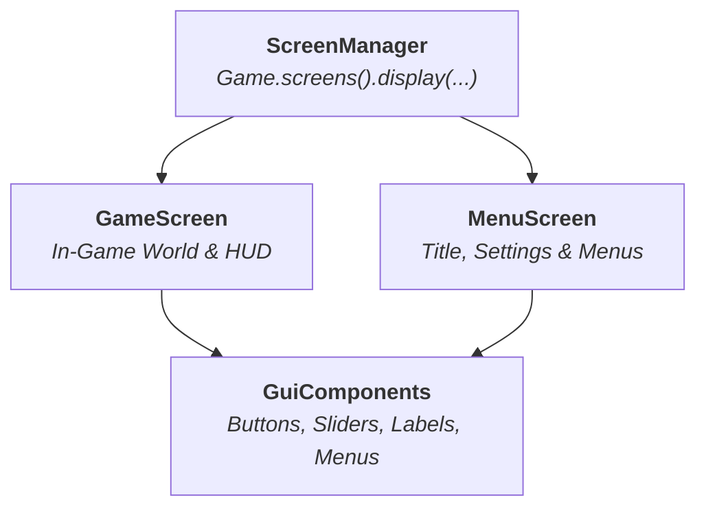

# User Interface

LITIENGINE includes a dedicated 2D GUI and screen management framework (`de.gurkenlabs.litiengine.gui`). Whether you need a main title menu with keyboard/mouse navigation, in-game HUDs displaying health and ammo counters, dialog speech bubbles, or custom inventory grids, the UI framework provides modular components with built-in input and rendering lifecycles.



## Core Architectural Concepts

### 1. Screens (`Screen` and `ScreenManager`)
Screens represent distinct display states of your game (e.g. Title Screen, Level Select, Pause Menu, Ingame Screen).
* Registered globally using `Game.screens().add(new MenuScreen())`.
* Displayed using `Game.screens().display("MENU")`.
* A screen manages a list of `GuiComponent` instances and renders them on top of the graphics context.

### 2. GuiComponents (`GuiComponent`)
The building blocks of LITIENGINE's UI. Every component has:
* **Bounding Box**: Location (`setX()`, `setY()`) and dimensions (`setWidth()`, `setHeight()`).
* **Input Listeners**: Mouse events (`onClicked`, `onHovered`, `onMouseMoved`) and keyboard focus.
* **Appearance & Styling**: Foreground/background colors, borders, custom fonts, and spritesheet states.
* **Component Tree**: Components can contain child components (e.g. `ImageComponentList`, `Menu`).

### 3. In-Game HUDs vs. Menus
* **Menus**: Typically hosted on dedicated `Screen` instances (like `MenuScreen`) before loading game worlds.
* **HUDs (Heads-Up Displays)**: Rendered either directly inside a custom `GameScreen.render(Graphics2D g)` override, or attached as GUI components that stay fixed to screen coordinates while the camera moves through the environment.

## Chapter Topics

| Guide | Description |
| :--- | :--- |
| **[GuiComponents: An Overview](guicomponents-an-overview.md)** | Complete catalog of UI components: `Button`, `CheckBox`, `Slider`, `TextFieldComponent`, `ListField`, `DropdownListField`, `SpeechBubble`, and `ImageComponent`. |
| **[Creating Menus](creating-menus.md)** | Step-by-step guide to building complete title screens, interactive menus with keyboard/mouse navigation, and screen transitions. |
| **[Screens API](../game-api/screens.md)** | Learn how the `ScreenManager` controls display states and resolution rendering. |

## Quick Example: Creating a Clickable Button

```java
Button playButton = new Button(100, 200, 160, 40, "Start Game");
playButton.setFont(Resources.fonts().get("custom-font.ttf", 18f));
playButton.setForeground(Color.WHITE);
playButton.setBackground(new Color(40, 40, 40));

playButton.onClicked(e -> {
  Game.screens().display("INGAME");
  Game.world().loadEnvironment("level1");
});

// Add to your active screen
this.getComponents().add(playButton);
```
