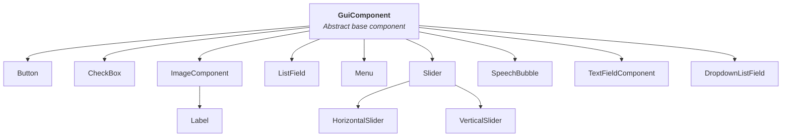

# GuiComponents Overview

LITIENGINE provides a comprehensive GUI framework for creating menus, HUDs, and in-game interfaces. All GUI components extend `GuiComponent`, which provides positioning, rendering, and input handling.

## Component Hierarchy



## Common Properties

All `GuiComponent` instances share positioning and appearance properties:

```java
component.setX(100);
component.setY(50);
component.setWidth(200);
component.setHeight(40);

component.setVisible(true);
component.setEnabled(true);
component.setSuspended(false);

component.setText("Hello");
component.getAppearance().setForeColor(Color.WHITE);
component.getAppearance().setBackgroundColor1(Color.DARK_GRAY);
```

## Core Components

### Label

Display static or dynamic text with a transparent background:

```java
Label label = new Label(20, 20, 200, 30);
label.setText("Score: 0");
label.setFont(Resources.fonts().get("gamefont.ttf", 24f));
label.getAppearance().setForeColor(Color.WHITE);
```

### Button

Clickable button with text or spritesheet background:

```java
Button button = new Button(100, 100, 200, 45);
button.setText("Start Game");
button.onClicked(e -> {
  Game.screens().display("GAME");
});
```

### CheckBox

Toggleable checkbox using built-in font icons or custom spritesheets:

```java
CheckBox checkbox = new CheckBox(100, 160, 24, 24, null, true);
checkbox.onChange(checked -> {
  Game.config().sound().setSoundVolume(checked ? 1.0f : 0.0f);
});
```

### Slider

Draggable value selector (`HorizontalSlider` or `VerticalSlider`):

```java
HorizontalSlider slider = new HorizontalSlider(100, 200, 200, 20, 0f, 100f, 1f);
slider.setCurrentValue(50f);
slider.onChange(val -> {
  Game.config().sound().setMusicVolume(val / 100f);
});
```

### TextFieldComponent

Interactive text input field:

```java
TextFieldComponent textField = new TextFieldComponent(100, 240, 200, 35, "Enter name...");
textField.onChangeConfirmed(text -> {
  playerName = text;
});
```

### ListField

Scrollable 1D or 2D list of items:

```java
String[] options = new String[] {"Option 1", "Option 2", "Option 3"};
ListField list = new ListField(100, 290, 160, 90, options, 3);
list.onChange(index -> {
  String selected = (String) list.getSelectedObject();
});
```

### DropdownListField

Dropdown selection list:

```java
String[] options = new String[] {"Easy", "Medium", "Hard"};
DropdownListField dropdown = new DropdownListField(100, 400, 160, 35, options, 3);
dropdown.onChange(index -> {
  String selected = (String) dropdown.getSelectedObject();
});
```

## Component Events

All components support standard input and focus events:

```java
// Mouse events
component.onClicked(e -> { /* clicked */ });
component.onMousePressed(e -> { /* mouse down */ });
component.onMouseReleased(e -> { /* mouse up */ });
component.onMouseMoved(e -> { /* mouse moved */ });
component.onHovered(e -> { /* mouse entered */ });
component.onMouseLeave(e -> { /* mouse left */ });

// Focus events
component.onFocusGained(e -> { /* gained focus */ });
component.onFocusLost(e -> { /* lost focus */ });
```

## Adding Components to Screens

```java
public class MenuScreen extends Screen {
  public MenuScreen() {
    super("MENU");
  }

  @Override
  protected void initializeComponents() {
    super.initializeComponents();
    Button startButton = new Button(100, 100, 180, 45);
    startButton.setText("Start");
    startButton.onClicked(e -> startGame());

    this.getComponents().add(startButton);
  }
}
```

## Component Appearance

### Fonts & Alignment

```java
component.setFont(Resources.fonts().get("font.ttf", 24f));
component.setTextAlign(Align.CENTER);
```

### Colors & Styling

```java
// Default state styling
component.getAppearance().setForeColor(Color.WHITE);
component.getAppearance().setBackgroundColor1(new Color(0, 0, 0, 180));
component.getAppearance().setBorderColor(Color.GRAY);
component.getAppearance().setBorderStyle(new BasicStroke(2));

// Hover & Selected states
component.getAppearanceHovered().setForeColor(Color.YELLOW);
component.getAppearanceHovered().setBackgroundColor1(new Color(40, 40, 40, 220));
```

### Images

```java
ImageComponent image = new ImageComponent(50, 50, 200, 150, Resources.images().get("banner.png"));
```

## Visibility and State

```java
// Show/hide
component.setVisible(false);

// Enable/disable interaction
component.setEnabled(false);

// Suspend updates (for performance)
component.setSuspended(true);
```

## Creating Custom Components

Extend `GuiComponent` for custom UI elements:

```java
public class HealthBar extends GuiComponent {

  private int currentHealth;
  private int maxHealth;

  public HealthBar(double x, double y, double width, double height) {
    super(x, y, width, height);
    this.maxHealth = 100;
    this.currentHealth = 100;
  }

  @Override
  public void render(Graphics2D g) {
    super.render(g);

    // Draw background
    g.setColor(Color.DARK_GRAY);
    g.fillRect((int) getX(), (int) getY(), (int) getWidth(), (int) getHeight());

    // Draw health
    g.setColor(Color.RED);
    float healthPercent = (float) currentHealth / maxHealth;
    g.fillRect((int) getX(), (int) getY(), (int) (getWidth() * healthPercent), (int) getHeight());
  }

  public void setHealth(int health) {
    this.currentHealth = Math.clamp(health, 0, maxHealth);
  }
}
```

## See Also

- [Creating Menus](creating-menus.md) - Building complete menus
- [Screens](../game-api/screens.md) - Screen management
