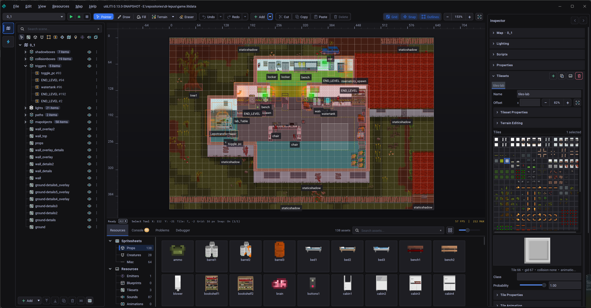

# utiLITI Editor Overview

**utiLITI** is the official 2D level design and asset management editor designed specifically for LITIENGINE games.

*The utiLITI editor layout featuring the visual level design canvas, entity hierarchy, property inspector, and asset management panels.*

---

## Editor Toolset

- :lucide-map:{ .lg .middle } **[Maps & Environments](maps-and-environments.md)**

    ---

    Import `.tmx` maps, configure ambient darkness, and organize level layers.

- :lucide-images:{ .lg .middle } **[Sprite & Animation Editor](sprite-editor.md)**

    ---

    Slice spritesheets, configure keyframe durations, and preview character animations.

- :lucide-grid:{ .lg .middle } **[Tilesets & Wang Terrains](tileset-editor.md)**

    ---

    Configure terrain rules and smart Wang autotiling for fast terrain painting.

- :lucide-pen-tool:{ .lg .middle } **[Editing Tools & Viewport](tools-and-editing.md)**

    ---

    Multi-selection, grid snapping, collision box adjustments, and zoom navigation.

- :lucide-file-code-2:{ .lg .middle } **[Java Scripting in utiLITI](scripts.md)**

    ---

    Attach Java scripts to map entities with Monaco editor integration and hot reloading.

- :lucide-bot:{ .lg .middle } **[MCP Server Integration](mcp-server.md)**

    ---

    Connect AI coding agents directly to utiLITI via the Model Context Protocol.

