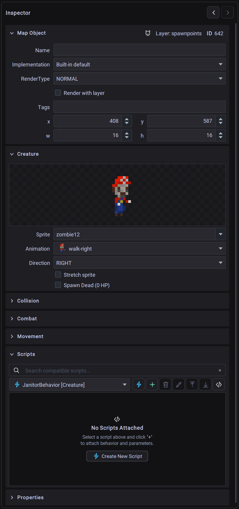

# Entity & Object Inspector

The **Property Inspector** (located on the right side of the Map Workspace) allows you to configure attributes, physics collision, combat statistics, particle behaviors, and script bindings for any placed map object.

---

## Inspector Layout & Expandable Cards

When an entity is selected on the canvas or in the scene graph, the inspector displays organized, collapsible sections:


*The utiLITI Entity Inspector showing collapsible configuration cards for general properties, entity-specific attributes, collision, combat, and scripts.*

```text
┌─────────────────────────────────────────────────────────────┐
│ ▼ GENERAL │
│ ID: 104 | Name: goblin_guard | RenderType: NORMAL │
│ Layer: entities | Implementation: mygame.GoblinAI │
│ Tags: [enemy] [patrol] │
│ Transform: X: 128 | Y: 64 | W: 32 | H: 32 │
├─────────────────────────────────────────────────────────────┤
│ ▼ ENTITY TYPE (CREATURE / PROP / TRIGGER / etc.) │
│ Spritesheet: goblin-run | Direction: DOWN | Scale: [x] │
├─────────────────────────────────────────────────────────────┤
│ COLLISION │
├─────────────────────────────────────────────────────────────┤
│ COMBAT │
├─────────────────────────────────────────────────────────────┤
│ MOVEMENT │
├─────────────────────────────────────────────────────────────┤
│ ▼ SCRIPTS │
│ Attached: [GoblinAI] (Order 1, Enabled) │
│ Properties: aggroRadius=150, attackPower=20 │
├─────────────────────────────────────────────────────────────┤
│ CUSTOM PROPERTIES │
└─────────────────────────────────────────────────────────────┘
```

---

## 1. General Properties Card

Common to all entity types:

| Property | Description |
| :--- | :--- |
| **ID** | Unique integer identifier automatically assigned to the entity on the map. |
| **Name** | Custom string identifier used for querying entities in code (`Game.world().environment().get("goblin_guard")`). |
| **RenderType** | Determines the rendering phase: `NORMAL`, `OVERLAY` (drawn above entities), `GROUND` (drawn below entities), `SURFACE`, or `UI`. |
| **Render with Layer** | Checkbox indicating whether the entity's render order is strictly tied to its layer index. |
| **Implementation** | Dropdown listing compiled custom Java entity classes discovered in your project classpath (e.g. `mygame.entities.Player`). |
| **Tags** | Tag management panel (`TagPanel`) for adding comma-separated gameplay tags (e.g. `hostile`, `destructible`, `interactable`). |
| **Layer** | The object layer where this entity resides. |
| **Transform (X, Y, W, H)** | World coordinate position and boundary dimensions. Interactive spinners support pixel and grid snapping. |

---

## 2. Entity-Specific Inspector Panels

### Props (`PropPanel`)
Interactive or static background scenery:

- **Spritesheet**: Select the visual sprite animation from project assets.
- **Material**: Material audio and particle archetype (`WOOD`, `STONE`, `STEEL`, `PLASTIC`, `CERAMIC`, `FLESH`, `FOLIAGE`, `UNDEFINED`).
- **State**: Initial visual state (`INTACT`, `DAMAGED`, `DESTROYED`).
- **Add Shadow**: Automatically renders a dynamic ground contact shadow.
- **Flip / Rotation**: Horizontal/vertical flipping and rotation angles.
- **Collision Presets**: Configure whether the prop acts as a solid physical obstacle.

---

### Creatures (`CreaturePanel`)
Movable characters, NPCs, players, and enemies:

- **Spritesheet**: Character sprite set containing directional movement animations (idle, walk, attack).
- **Scale Sprite**: Toggle automatic sprite scaling to entity bounding dimensions.
- **Direction**: Initial facing orientation (`UP`, `DOWN`, `LEFT`, `RIGHT`).

---

### Triggers (`TriggerPanel`)
Spatial event triggers activated by player or creature interactions:

- **Activation Type**:
 - `COLLISION`: Fires when an entity enters the trigger's bounding box.
 - `INTERACT`: Fires when the player presses the action key within the trigger area.
 - `TOGGLE`: Switches state on and off repeatedly upon interaction.
- **Message**: Custom string payload broadcast to target entities or the messaging system.
- **Targets**: Target entity names or comma-separated integer IDs to receive the trigger event.
- **Cooldown**: Cooldown period in milliseconds before the trigger can fire again.
- **One-Time**: Checkbox to permanently deactivate the trigger after its initial activation.
- **Is Activated**: Initial boolean activation state.

---

### Light Sources (`LightSourcePanel`)
Dynamic 2D lighting emitters:

- **Light Shape**:
 - `CIRCLE`: Omnidirectional radial point light.
 - `RECTANGLE`: Area light.
 - `FAN`: Directional cone or flashlight beam.
- **Color**: Color picker for light tint and alpha blending.
- **Intensity**: Brightness value from `0` (off) to `255` (full intensity).
- **Active**: Checkbox to enable or disable lighting at startup.
- **Beam Angle & Arc**: Configurable arc width (in degrees) for `FAN` directional lights.

---

### Particle Emitters (`EmitterPanel`)
Visual particle effects (smoke, sparks, fire, magic, weather):

- **General**: Emitter type, particle limit, spawn rate, spawn amount, origin offset.
- **Particle Type**: `SPRITE`, `TEXT`, `RECTANGLE`, `CIRCLE`, `LINE`, `SHAPE`, `OVAL`.
- **Physics & Motion**:
 - Lifespan min/max (ms).
 - Gravity X/Y and delta velocity acceleration.
 - Velocity X/Y initial burst speeds.
 - Width/Height dimension expansion or contraction deltas.
 - Fade-in, fade-out, fade-on-collision, and anti-aliasing toggles.
- **Sub-Panels**:
 - `EmitterColorPanel`: Gradient color ranges, start/end color, alpha range.
 - `EmitterTextPanel`: Floating text list, font, text alignment.
 - `EmitterSpritePanel`: Spritesheet animation sequence, loop mode.

---

### Sound Sources (`SoundPanel`)
Positional 2D audio emitters:

- **Sound**: Sound asset picker from project audio resources.
- **Volume**: Audio playback volume slider (`0%`–`100%`).
- **Loop**: Checkbox to continuously loop the sound effect.
- **Range**: Acoustic attenuation radius in world pixels (volume drops off as the listener moves away).

---

### Spawnpoints (`SpawnpointPanel`)
Locations where players or creatures spawn into the environment:

- **Spawn Type**: Creature type filter string matching creature sprites or class names.
- **Direction**: Initial facing direction for spawned entities (`UP`, `DOWN`, `LEFT`, `RIGHT`).

---

### Collision Boxes (`CollisionBoxPanel`)
Static physics obstacles preventing player/creature passage:

- Static bounding geometry used to block movement without requiring a rendered visual sprite.

---

### Static Shadows (`StaticShadowPanel`)
2D directional shadow casters:

- **Shadow Type**: Directional projection offsets (`NOOFFSET`, `LEFT`, `RIGHT`, `DOWN`, `LEFTDOWN`, `RIGHTDOWN`).

---

### Map Areas (`MapArea`)
Non-rendered rectangular regions used for zone transitions, environmental weather effects, camera bounds, and scripting regions.

---

## 3. Sub-Inspector Sections

### Collision Panel (`CollisionPanel`)
Configures physics collision bounding geometry:

- **Collision Enabled**: Toggle solid physical body.
- **Collision Type**: `STATIC` (immovable geometry) or `DYNAMIC` (movable actors).
- **Collision Box Dimensions**: Custom width, height, and alignment offset (e.g. aligning a character's collision box to their feet rather than whole sprite).

### Combat Panel (`CombatPanel`)
Configures combat attributes for damageable entities:

- **Hitpoints (HP)**: Maximum and current health points.
- **Indestructible**: Prevents the entity from taking combat damage.
- **Team ID**: Integer team identifier for friend-or-foe targeting.

### Movement Panel (`MovementPanel`)
Configures entity locomotion:

- **Velocity**: Movement speed in pixels per second.
- **Acceleration / Deceleration**: Rate of speed ramp-up and braking.
- **Turn on Move**: Automatically rotates or flips sprite when moving.

---

## 4. Script Bindings Panel

The **Scripts** section attaches Java script components directly to map entities:

```text
┌─────────────────────────────────────────────────────────────┐
│ Attached Scripts: [+] │
│ ├ 1. [x] GoblinAI.java (Order: 1) [-] │
│ └ 2. [x] PatrolBehavior.java (Order: 2) [] │
├─────────────────────────────────────────────────────────────┤
│ Script Properties (GoblinAI): │
│ │ Property │ Type │ Value │
│ ├──────────────┼─────────┼──────────────────────────────────┤
│ │ aggroRadius │ Double │ 150.0 │
│ │ attackPower │ Integer │ 25 │
│ │ cowardly │ Boolean │ true │
└─────────────────────────────────────────────────────────────┘
```

1. **Attach Script**: Choose any script asset from the dropdown and click `+`.
2. **Execution Order**: Reorder scripts to control lifecycle execution sequence.
3. **Toggle Enabled**: Enable or disable script execution per entity without deleting the binding.
4. **Edit `@ScriptProperty` Fields**: Inspect and customize tweakable script variables with typed visual editors (text, numeric spinners, checkboxes, color pickers, and file choosers).
5. **Open in Workspace**: Click the magnifying glass or double-click to jump directly to the script in the **Scripts Workspace**.

---

## 5. Custom Properties Panel (`CustomPanel`)

Store arbitrary user-defined metadata on any map object:

- **Supported Types**: `String`, `Integer`, `Float`, `Boolean`, `Color`, and `File Path`.
- Accessible in code via `mapObject.getStringValue("key")`, `getIntValue()`, `getBoolValue()`, etc.
