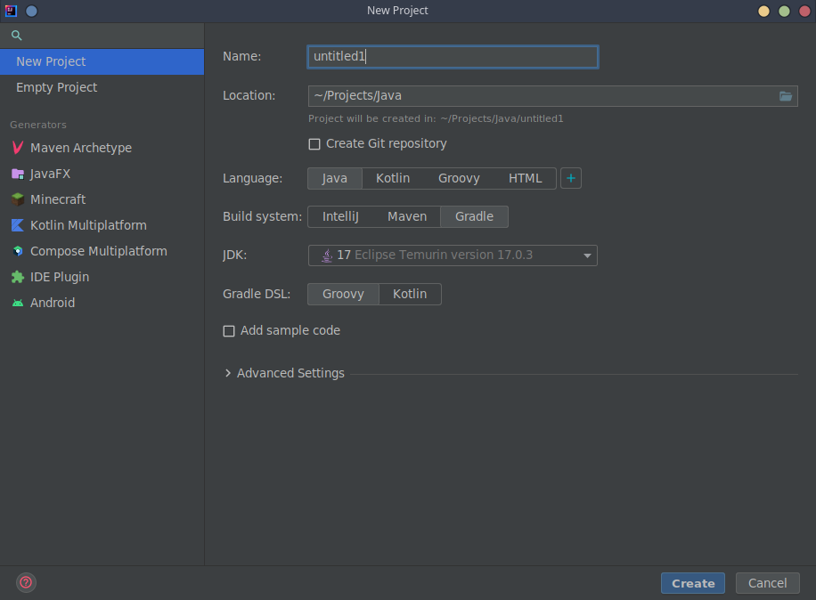
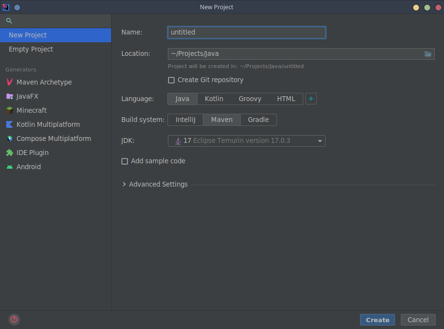

# Build Systems
## Choose a build system

Have you heard of build automation utilities? If you don't want to manage and compile your software and dependencies by hand with every release, you can rely on build automation utilities to compile and package your source code, manage dependencies, and run automated tests.
Three build systems are predominantly used for Java development:
* [Gradle](https://gradle.org/)
* [Apache Maven](https://maven.apache.org/)
* [Apache Ant](https://ant.apache.org/) 

LITIENGINE itself is built upon **Gradle** and uses it to seamlessly manage its build steps and dependent libraries.

## Install and set up a build system

### Example: Eclipse + Gradle
Assuming that you chose [Eclipse IDE](https://www.eclipse.org/downloads/packages/release/kepler/sr1/eclipse-ide-java-developers) and [Gradle](https://gradle.org/), you can create a Gradle project with these steps:
* [download Gradle](https://gradle.org/install/).
* create a new directory `C:\Gradle` and unzip the downloaded file there. 
* add `C:\Gradle\[your-gradle-version]\bin` to your system's *PATH* environment variable.
* if there is no gradle plugin in your Eclipse installation, go to Help -> Eclipse Marketplace to search and install Gradle integration.
* click File > New > Other and select Gradle Project as wizard.
* two files are required in a Gradle project's root folder: `build.gradle`, containing the build tasks, and `settings.gradle`, containing Gradle settings.

### Example: IntelliJ + Gradle
To use [Intellij](https://www.jetbrains.com/idea/) and [Gradle](https://gradle.org/), follow these steps:
> If you're on linux or mac, you can also use [SKDMAN!](https://sdkman.io/) to manage your Gradle installation. Once you've installed SDKMAN!, type `sdk install gradle` in your terminal. The latest recommend version of Gradle will be installed automatically for you. It should be registered in your IDE after you restart it. For further information look up the [SDKMAN! Docs](https://sdkman.io/usage). **In case you use SDKMAN! skip the next three steps**.
* **Usually you don't have to install any build tools manually, because they come bundled with IntelliJ. The next three steps in brackets of installing Gradle for IntelliJ below usually only have to be followed if IntelliJ didn't install those build tools in the installation process already.**
* \([download Gradle](https://gradle.org/install/).\)
* \(create a new directory `C:\Gradle` and unzip the downloaded file there.\)
* \(add `C:\Gradle\[your-gradle-version]\bin` to your system's *PATH* environment variable.\)
* usually the Gradle plugin is already installed in IntelliJ, if not, search for it in the plugin marketplace.
* create a new project and select `Gradle` under `Build system`.
* two files are required in a Gradle project's root folder: `build.gradle`, containing the build tasks, and `settings.gradle`, containing Gradle settings.

### Example: Intellij + Maven
Getting ready with [Intellij](https://www.jetbrains.com/idea/) and [Maven](https://maven.apache.org/):
> If you're on linux or mac, you can also use [SKDMAN!](https://sdkman.io/) to manage your Maven installation. Once you've installed SDKMAN!, type `sdk install maven` in your terminal. The latest recommend version of Maven will be installed automatically for you. It should be registered in your IDE after you restart it. For further information look up the [SDKMAN! Docs](https://sdkman.io/usage). **In case you use SDKMAN! skip the next three steps**.
* **Usually you don't have to install any build tools manually, because they come bundled with IntelliJ. The next three steps in brackets of installing Maven for IntelliJ below usually only have to be followed if IntelliJ didn't install those build tools in the installation process already.**
* \([download Maven](https://maven.apache.org/).\)
* \(create a new directory `C:\Maven` and unzip the downloaded file there.\)
* \(add `C:\Maven\[your-maven-version]\bin` to your system's *PATH* environment variable.\)
* usually the Maven plugin is already installed in IntelliJ, if not, search for it in the plugin marketplace.
* create a new project and select `Maven` under `Build system`.
* one file is required in a Maven project's root folder: `pom.xml`, containing the information and settings of your project.

