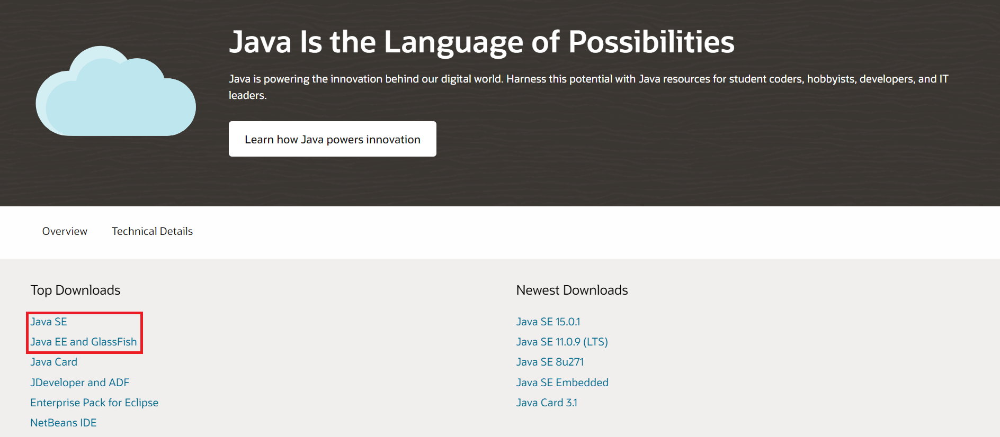
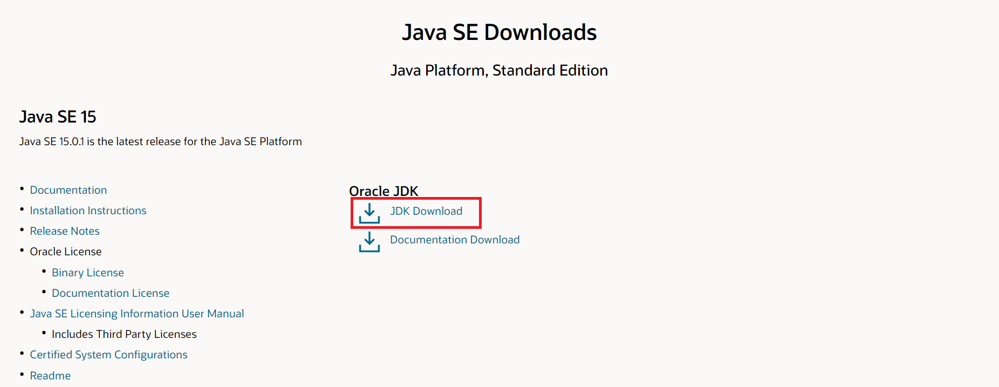
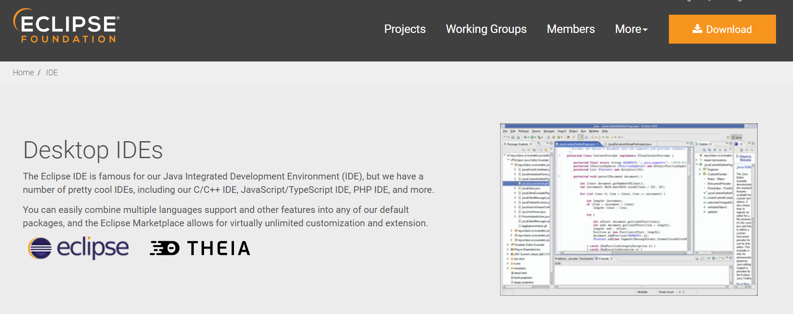
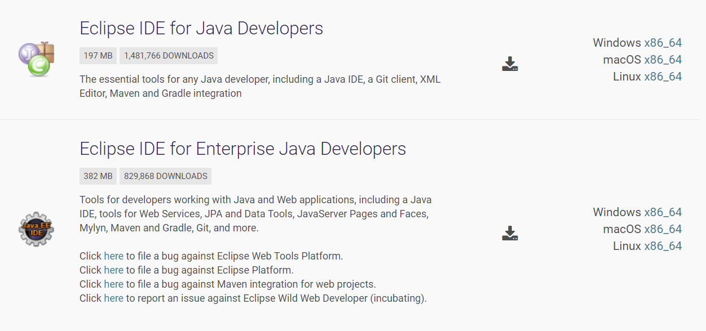
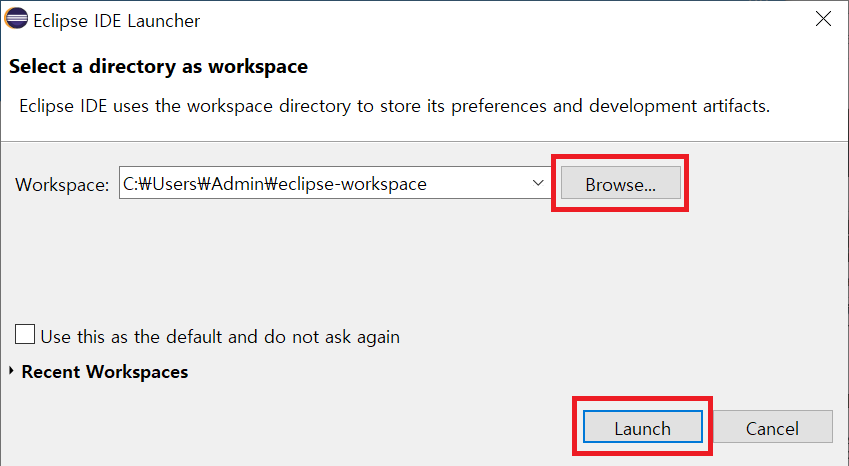
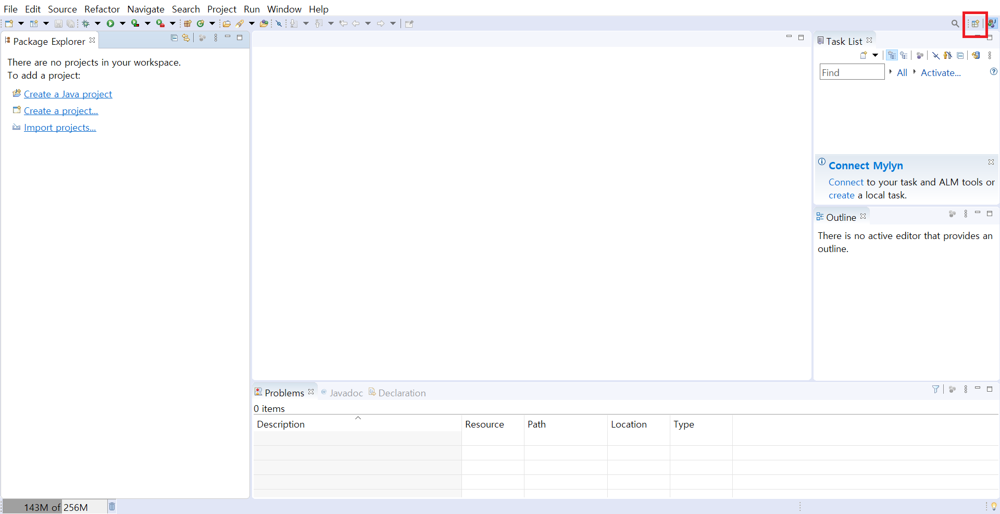
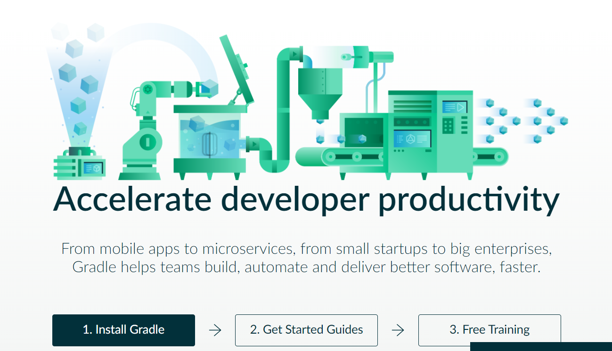
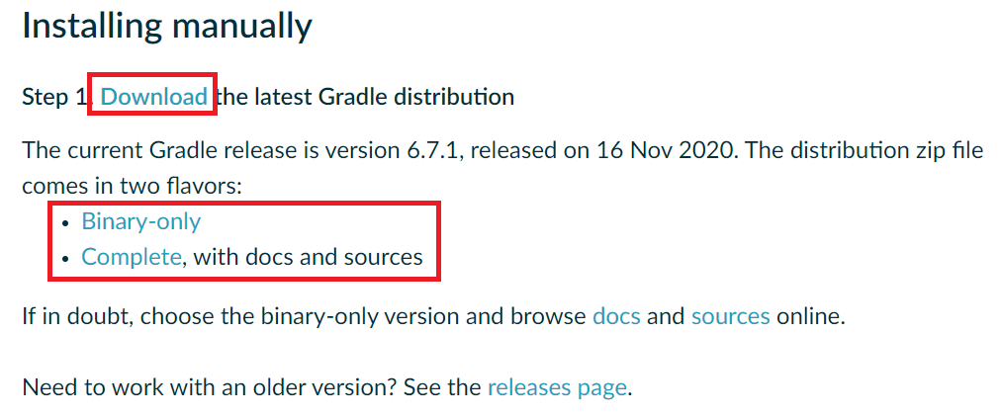

# Install and Start

## Start Eclipse

It is recommended to use IDE for LITIENGINE. Eclipse IDE and IntelliJ IDEA are available, and gurkenlabs recommend using Eclipse. So, we will discuss how to install and start Eclipse here.  

### Install JDK

First of all, you should download the [JDK](https://www.oracle.com/java/technologies/).  
    
There are two options: SE and EE.  
SE is standard edition, and EE is enterprise edition. EE has more APIs related to web programming. If this is your first Java project, SE will suffice.  
Click the link, then the following page will be opened.    
    
Click the **JDK Download** and find the file for your OS. Then click the download link and run the file to install JDK. When the installation is complete, click Close.      

### Install Eclipse

You can download Eclipse [Here](https://www.eclipse.org/ide/).  
    
Click **Download** and choose the package which you need. In normal cases, you may choose Eclipse IDE for Java Developers or Eclipse IDE for Enterprise Java Developers.  
    
After the download is complete, unzip the file and run the **eclipse.exe** file inside the ecilpse folder.  
Browse the workspace path and click Launch.  
    
Then close the welcome tab and click the Open Perspective icon at the upper right corner. Select the Java.  
    
Now you are ready to use Eclipse.    

## Start Gradle

LITIENGNINE supports Gradle and Maven. You can just download the .jar file and import it to use the library, but it is not recommended. Thus, here we will discuss how to install Gradle in Windows.    
You can download Gradle [Here](https://gradle.org/install/).  
    
In the first step for **Installing manually**, click the **Download** and find latest version. If you need docs and sources, choose complete or binary-only.  
    
Then create a new directory `C:\Gradle` and unzip the downloaded file in this folder.  
Search the `Advanced system setting` on windows search and click click `Environment Variables`. Under `System Variables` selet `Path`, then double click it. Add `C:\Gradle\[your-gradle-version]\bin` and click OK to save.    
Now you can use Gradle. If you need more detail how to use Gradle, look **Get LITIENGINE** in docs.
