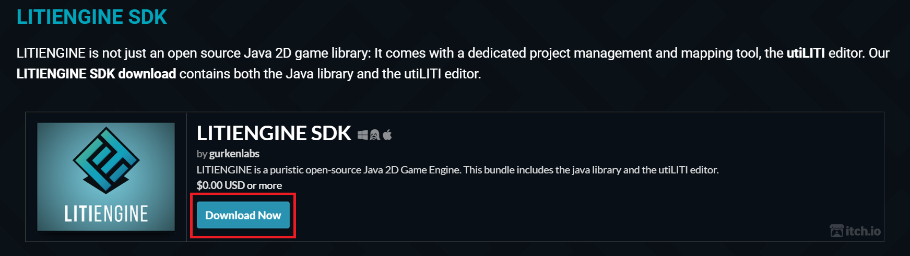
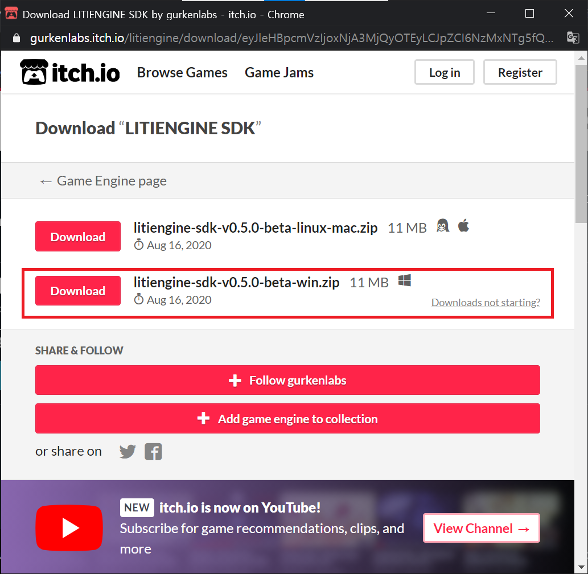
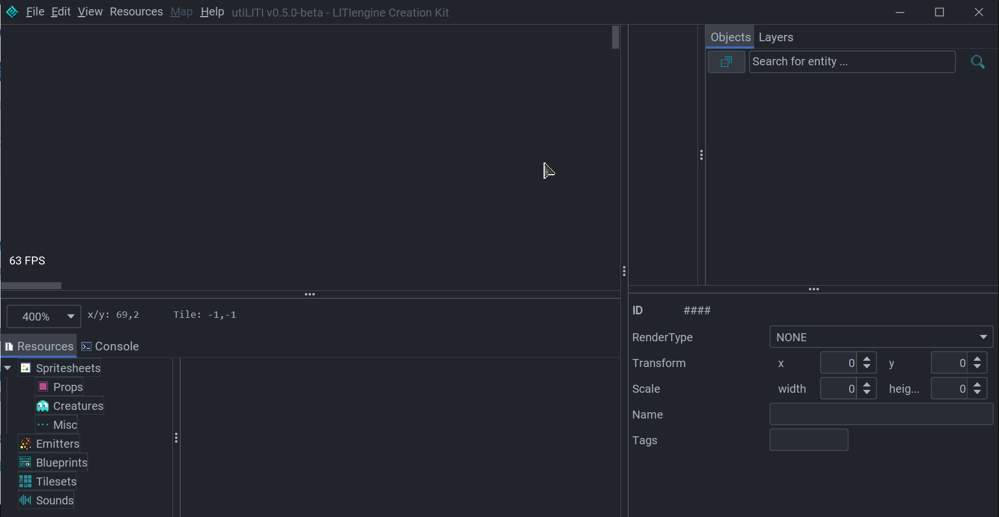
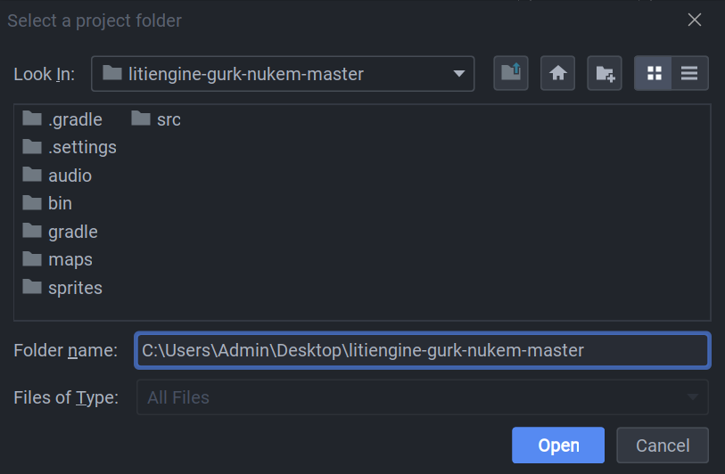
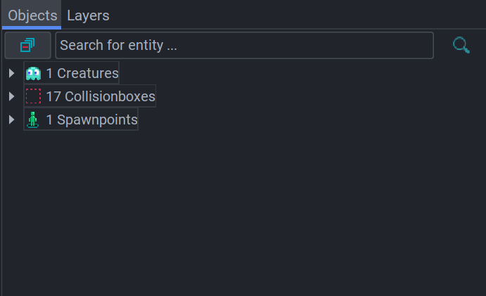
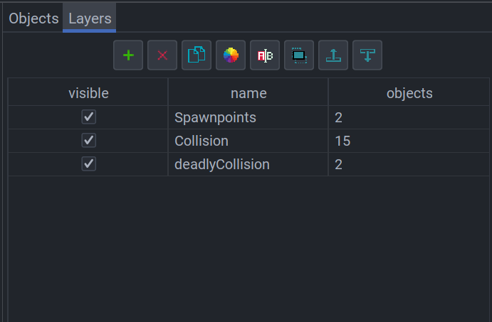
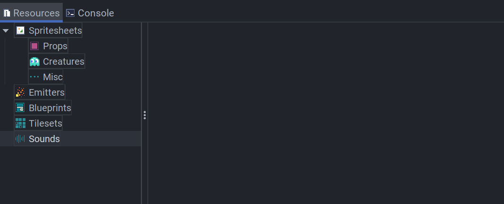
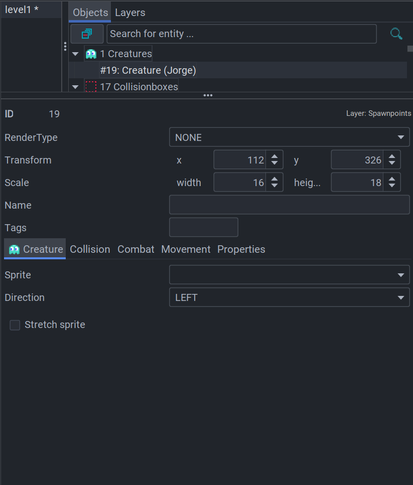

# Install and Start

## Start Eclipse

It is recommended to use IDE for LITIENGINE. **Eclipse IDE** and **IntelliJ IDEA** are available, and gurkenlabs recommend using Eclipse. So, we will discuss how to install and start Eclipse here.

### Install JDK

First of all, you should download the [JDK](https://www.oracle.com/java/technologies/).

There are two options: **SE** and **EE**.  
SE is standard edition, and EE is enterprise edition. EE has more APIs related to web programming. If this is your first Java project, SE will suffice.  
Click the link, then the following page will be opened.

Click the **JDK Download** and find the file for your OS. Then click the download link and run the file to install JDK. When the installation is complete, click `Close`.

### Install Eclipse

You can download Eclipse [Here](https://www.eclipse.org/ide/).

Click **Download** and choose the package which you need. In normal cases, you may choose Eclipse IDE for Java Developers or Eclipse IDE for Enterprise Java Developers.

After the download is complete, unzip the file and run the **eclipse.exe** file inside the `ecilpse` folder.

Browse the workspace path and click `Launch`.  
Then close the welcome tab and click the `Open Perspective` icon at the upper right corner. Select the `Java`.

Now you are ready to use Eclipse.

## Start Gradle

LITIENGNINE supports Gradle and Maven. You can just download the .jar file and import it to use the library, but it is not recommended. Thus, here we will discuss how to install Gradle in Windows.

You can download Gradle [Here](https://gradle.org/install/).

In the first step for **Installing manually**, click the **Download** and find latest version. If you need docs and sources, choose **complete** or **binary-only**.

Then create a new directory `C:\Gradle` and unzip the downloaded file in this folder.  
Search the `Advanced system setting` on windows search and click click `Environment Variables`. Under `System Variables` selet `Path`, then double click it.  
Add `C:\Gradle\[your-gradle-version]\bin` and click OK to save.

Now you can use Gradle. If you need more detail how to use Gradle, look **Get LITIENGINE** in docs.

## Start SDK in Windows

LITIENGINE provides an editor to creat game environments and manage resources. Here we will introduce how to use LITIENGINE SDK in Windows.  
First, you should download SDK [Here](https://litiengine.com/download/). Click this link and download the file for Windows.

Now you have a .zip file. Unzip it and execute `utiliti-v0.5.0-beta.exe` file under `utiliti-win` folder.  
Then you can see the following screen.

Click **File** on upper left corner, and click **New...** to make new `.litidata` file. Then select your game project folder and click open. We used the [tutorial game](https://github.com/gurkenlabs/litiengine-gurk-nukem) for explanation.

The basic step is over.

Let me introduce the useful functions of this SDK.

On upper right corner, you can find the `Objects` and `Layers` tabs. They manage the basic elements of game, such as Creature, Collision, and Spawn Point.  
The functions of each icon in the `Layers` tab are as follows: Add, Delete, Copy, Change Color, Rename, Show selected layer only, Send selected layer up, Send selected layer down.

On bottom left corner, you can find the `Resources` and `Console` tabs. You can manage your game resources, such as .png file for creature and sound file. 

You can edit your objects in botton right corner. If you select an object in `Objects` tab, then the Properties of the object will appear. You can easily set up the objects' collision or movement through this.

Now you can use LITIENGINE SDK.
