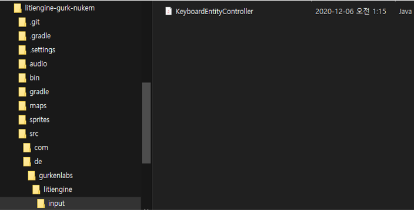

# Keyboard Input

## Chapter 1: Setting
1) Clone the code
```bash
git clone https://github.com/gurkenlabs/litiengine-gurk-nukem.git
```

2) Create a directory
Create a directory de/gurkenlabs/litiengine/input inside src folder.
Create KeyboardEntityController.java file inside the input folder.


## Chapter 2: Let's move the character with the directional keys


