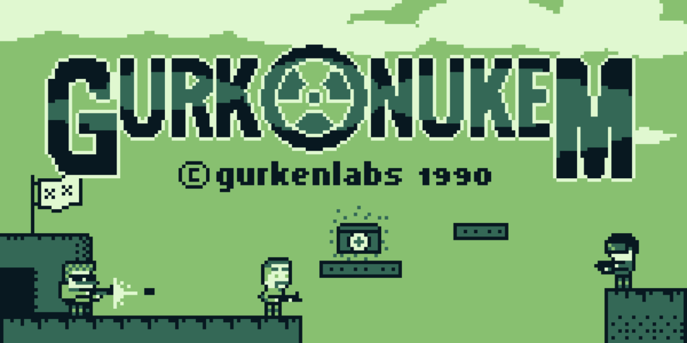
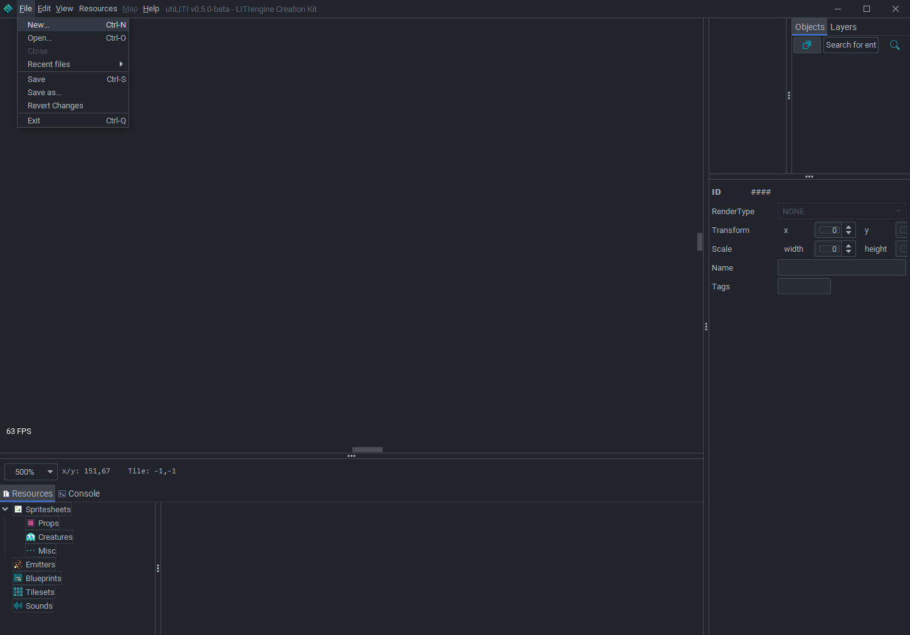
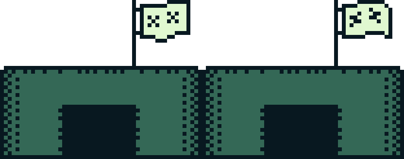
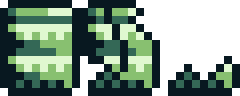
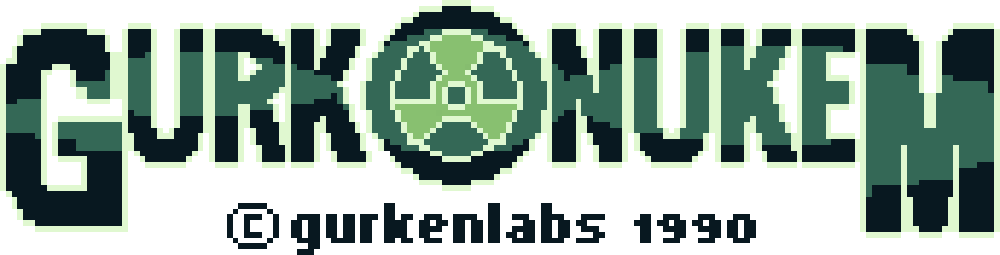
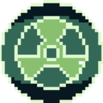
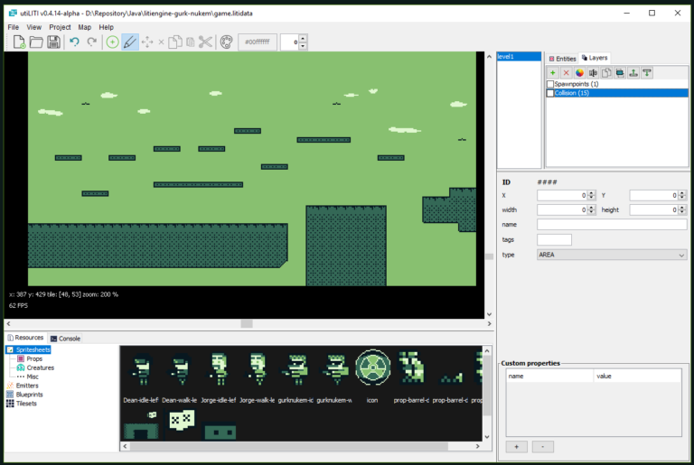
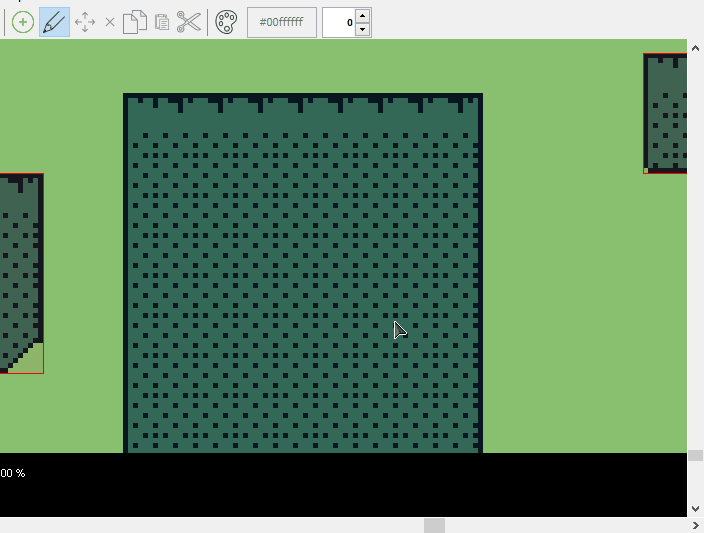
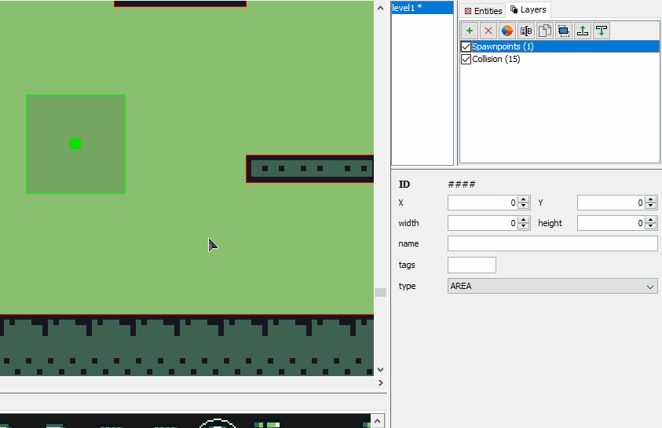
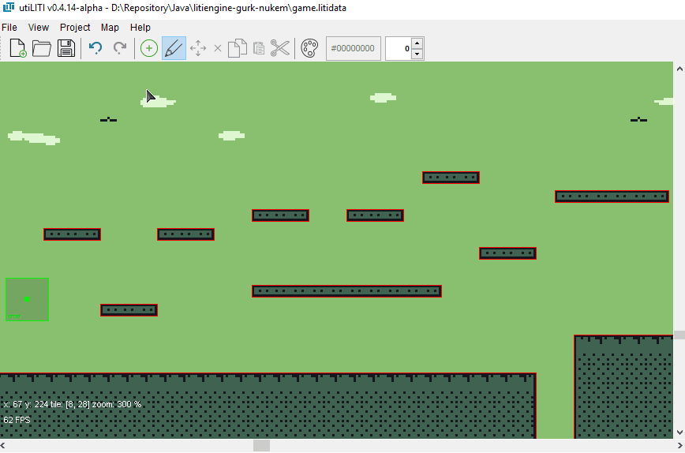

# Creating a platformer with LITIENGINE

So, you’ve learned about LITIENGINE – great!

You’ve created a project in eclipse and imported LITIENGINE.
If not, check out our [Download Page](https://staging.litiengine.com/download/) that comes with detailed installation instructions.

Now you’ve probably come to the point where you’ve asked yourself:
> “How am I supposed to actually make a game with this?”

In this How-To-Series, we guide you through the steps necessary for creating a platformer game inspired by the old Duke Nukem games, made in a glorious four-colour gameboy look.

The this project is entirely open sourced (under the MIT license). You can find the code among all the assets in the [GitHub repository for Gurk Nukem](https://github.com/gurkenlabs/litiengine-gurk-nukem).

Each blog chapter will represent the work that can be done in one day by following our step-by-step explanations.

## Chapter 1:  The first Level

### Creating a project in utiLITI
For a general idea about what utiLITI is, read the [docs page about utiLITI](https://litiengine.com/docs/utiliti-editor/) first.

Start the utiLITI editor. Hit "**File -> New...**"  (`CTRL+N`)

In the file browser that pops up, navigate to your project directory and hit "**Open**".
Even if you still have done nothing, hit "**File -> Save...**" (`CTRL+S`) to create a game resource file.
You can name it whatever you want, we go for something like “game.litidata” in this guide.

#### Importing Assets
Let’s assume that you’ve already created assets for your game. In our case, we picked a 4-colour GameBoy style for our project.
So what basic Assets do we have at this point?

**Player sprites:** 

For entities that are child classes of Creature, there are naming conventions for walking and idle sprites.

We need sprites named like `{SPRITE_PREFIX}-{STATE}-{DIRECTION}.{EXTENSION}`.
Following these naming conventions, we create **gurknukem-idle-left.png** and **gurknukem-walk-left.png**.
You only need to provide a left or a right sprite in both cases, the CreatureAnimationController will automatically flip it when necessary.

 
*gurknukem-walk-left.png*

**Enemy sprites:** 

We also add two enemy designs to the game. The naming is done in the same way as for our main character, so we end up with four image files: **dean-idle-left.png**, **dean-walk-left.png**, **jorge-idle-left.png**, and **jorge-walk-left.png**.

 
*dean-walk-left.png*

 
*jorge-walk-left.png*

**Prop sprites:**

For now, we will only add two props: a bunker and a destructive barrel.
For props, there are naming conventions, too:
`prop-{PROPNAME}-{STATE}.{EXTENSION}`

This means that we need three image files for our destructible barrel:
**prop-barrel-intact.png**, **prop-barrel-damaged.png**, and **prop-barrel-destroyed.png**
Non-destructible props such as our bunker only need one animation file, in our case prop-bunker.png.

 
*prop-bunker.png*

 
*prop-barrel.png*

**Our game logo:**

* **Our game icon:**

We also need:
* **A music track**
* **A .tsx tileset created with Tiled editor from an image file**
* **A .tmx map created with Tiled editor using our Tileset**

To import Sprite files into utiLITI, either **drag&drop selected files into the Asset panel** on the lower end of the screen or hit "**Resources -> Import Spritesheets...**". The same goes for tilesets ("**Resources -> Import Tilesets...**"). Maps can be imported by clicking "**Map -> Import...**". If a map was successfully imported, it will be rendered in the map panel and listed in the map list right to it.

#### Basic mapping
Adjust your grid and snapping settings in the "**View**" menu.

In the **Layer** toolbox in the upper right corner, you can **Add, Delete, Recolor, Rename, Duplicate, Focus / Hide, and reorder** MapObjectLayers.
To maintain a comprehensive structure to our map files, we try to create at least one layer for each Entitytype (There is the “Entities” tab to help you navigate through entities by type, as well).

Let us now create your first `Entity`!
Select a MapObjectLayer, then right-click somewhere on the map and hit "**Add -> Add CollisionBox**".
**Click and drag** with your mouse to specify the bounding box of your Collision box as shown in the gif below.

In the same manner, create a `Spawnpoint` that will be used to spawn our player entity.
Edit the Spawnpoint’s Attributes in the Map Object Panel on the right as shown below.
You can give the Spawpoint a name for identification and set the spawn direction for our Player.

Before we look into coding now, we will set some basic properties for your map such as its name, description, and static shadow color.
Simply hit "**Map -> Properties**" and you will see a popup for editing Map properties.

**Congratulations!** You’ve successfully completed the first steps on your way to creating a platforming shooter with LITIENGINE.
Learn about setting up the basic functionality of our game in the next chapter.

## Chapter 2: Time to pull out your hacker gloves