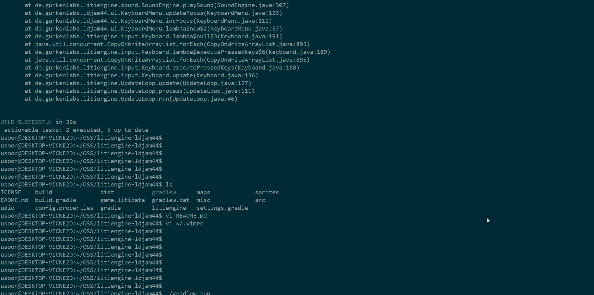

# Modifying existing LITIENGINE Sample Projects

## Chapter 1: Start trying the example

### What is Gradle?

Gradle is a build automation system using groovy. It adopts a domain language similar to Groovy, and is also the official build system of Android Studio, which is required to create Android apps. It supports several languages such as Java, C / C++ , and Python. [Wikipedia contributors. (2020b, November 26). Gradle. Wikipedia. https://en.wikipedia.org/wiki/Gradle](https://en.wikipedia.org/wiki/Gradle)

To install gradle and execute it firstable download <https://gradle.org/install/>. Next set $PATH and $CLASSPATH. For more specific settings about the environment variable visit [Getting started](/getting-started/start-gradle.md).

If things are going well, type gradle -v and check. 
```bash
gradle -v 
``` 

Make a JAVA project and file to build, and in the project folder make buld.gradle file. In this file apply plugin:'java'
```bash
plugin:'java' 
``` 
Now, almost there!
```bash
gradle build
```  
If you do "gradle build", gradle tests, compiles and then makes jar file.
This is it for basic gradle execution. For more complicated project dependency resolution process is needed. However, in this example, SERVUS BONUS, gradle wrapper is used. So, I will wrap it up here. 

### Gradle Wrapper

In this tutorial, SERVUS BONUS, gradle wrapper which is preferred way to build project is used. The biggest advantage of using it is when executing an project that already exists on a new environment, it enables direct build without any installation nor settings for different version of JAVA or Gradle. 

However, in this case, executing "./gradlew build" makes an error message telling that JAVA version does not match with the SERVUS BONUS project. The SERVUS BONUS requires some JAVA 8 library which does not match with latest JAVA version,11. 

Therefore, check the below code, and if JAVA version is other than JAVA 8, download JAVA 8 and set environment variable accordingly where the jdk file exist.

```bash
java --version
``` 
## Chapter 2:  SERVUS BONUS


SERVUS BONUS is a 2D game made by gurkenlabs, the creators of LITIENGINE. You can find the code at https://github.com/gurkenlabs/litiengine-ldjam44.git. The project is available under the MIT license, so it can be modified freely.

**A good slave is a good servant. A great slave is currency!**

Play the tale of a slave monger with only one wish… to get admission to the great Roman open-air bath. Coming from the slums of Memphis, you have a long way of hardship before you. Gain respect by becoming the greatest slave monger of the Imperium Romanum.

SERVUS BONUS is a 2D action game about the story of defeating Roman soldiers and rescuing slaves as described above.  Use this example to check how to execute and modify the example and the results of the modification.

### How can I modify the example code?

Let's run the example first to see what it looked like before the modification.
The process of building and running the example code will be carried out through the gradle. The environment was conducted at ubuntu 20.04 WSL, but it also works normally with normal native or virtual machine Linux.

#### 1. For WSL
WSL users should set up the environment so that they can float the display of the window using the ubuntu terminal.

##### 1) Setting up .bashrc
```bash
vi ~/.bashrc
```
Using the above command. Enter the bashrc file and add the following command to the last line.
```bash
export DISPLAY=0:0
```

##### 2) Installing Xming
Xming performs when wsl users request to float the display of the window using the ubuntu terminal to configure the display. To run a game made with LITIENGINE on WSL, Xming must be installed so that the game screen can be printed out.

By the end of the above process, WSL users can complete the WSL setup to float the LITIENGINE-based game.

## Chapter 2: Build and Run with gradle

Gradle's usage is detailed above, so omit it. However, it is not necessary to install the gradle directly to run SERVUS BONUS. If you use the gradlew file inside the *litiengine-ldjam44* folder, you can download and run the appropriate version of the gradle to install SERVUS BONUS. However, if you run `./gradlew build` from the litiengine-ldjam44 folder, the code folder of SERVUS BONUS, the build will fail. The reason is that the LITIENGINE folder inside the litiengine-ldjam44 folder is empty. SERVUS BONUS uses the library code inside the LITIENGINE folder, and if this LITIENGINE folder is empty, it does not run because there is no code in the API used by SERVUS BONUS. 

### 1. Downloading the LITIENGINE code

The LITIENGINE code can be downloaded from github. Use the command below to download the LITIENGINE code.
```bash
git clone https://github.com/gurkenlabs/litiengine.git/
```
Use this command to insert the downloaded LITIENGINE code into the litiengine-ldjam44 folder.
The LITIENGINE code downloaded at this time is the latest code created by the efforts of the people who participated in the LITIENGINE project. However, SERVUS BONUS needs a code as of April 2019, not the most recent one. As LITIENGINE develops, SERVUS BONUS is using some of the deprecated codes, so it is necessary to downgrade them to the previous version.
```bash
git log 
```
Use the above command to check the LITIENGINE commit log. If you lower this page, you will find a commit entitled **Allow holding a speechbubble.**

If you find this log, use the command below to downgrade the LITIENGINE. Use the *\-\-hard* option because subsequent codes are unnecessary when using this example.
```bash
git reset --hard 61dbc657e772b3a05e262078e13a636b60c29e9
```
So we prepare the appropriate version of the LITIENGINE code for SERVUS BONUS.

### 2. Get Permission of Gradlew
*gradlew* files allow you to proceed with build and run processes without installing *gradle*. However, the first time you download the litiengine-ldjam44 code, you cannot run it because you do not have the execution permission in the *gradlew* file. Use the command below to give the execution permission.
```bash
sudo chmod 775 ./gradlew
```

### 3. Build and Run

Now that we're all set, let's run with build. Use the commands below to build and execute SERVUS BONUS.
```bash
./gradlew build
./gradlew run
```
If you do not insert **./** in front of the gridlew, an error may appear that there is no command called *gridlew*, so please insert ./ to specify that the gridlew inside the folder is executed.
After completing all of the above steps, the screen below is output and you can run SERVUS BONUS.



## Chapter 3. Modify the code

Let's modify the downloaded SERVUS BONUS code so that the game can do what we want. There are three parts to modify through the code. 1) Attack speed, 2) Movement speed, 3) Change jump to dash. To modify the code, you must access the *src/de/gurkenlabs/ldjam44* folder inside the litiengine-ldjam44 folder. Inside the final folder, ldjam44, there are codes that implement SERVUS BONUS's game operating mechanism.

### 1. Attack speed
Let's open the *Strike.java* file inside the *abilities* folder. Then you can find the code below.
```java
@AbilityInfo(name = "Strike", cooldown = 700, range = 0, impact = 15, impactAngle     = 360, value = 1, duration = 400, multiTarget = true, origin = AbilityOrigin.DIM    ENSION_CENTER)
```
This code applies information about the ability of the character to be a Strike. The lower the cooldown, the more attacks can be carried out, so let's reduce the cooldown.
```java
@AbilityInfo(name = "Strike", cooldown = 60, range = 0, impact = 15, impactAngle     = 360, value = 1, duration = 400, multiTarget = true, origin = AbilityOrigin.DIM    ENSION_CENTER)
```
Cooldown was reduced to 60 for much faster attack speed. Then try building and running and you'll get the following results.


**Before**


**After**

We can see the speed of attack that has been overwhelmingly faster.

### 2. Moving speed
Let's open the *Player.java* file inside the *entities* folder. Then you can find the code below.
```java
@MovementInfo(velocity = 30)
```
This code applies information about the movement speed of the character of the player. Let's increase Velocity to increase the speed of movement speed.
```java
@MovementInfo(velocity = 100)
```
Increase the Velocity to 100 for much faster movement speed. Then try building and running and you'll get the following results.


**Before**


**After**

We can see the speed of movement that has been overwhelmingly faster.

### 3. Change Jump to Dash
Let's open the *JumpEffect.java* file inside the *abilities* folder. Then you can find the code below.

```java
String jumpAnimation = "monger-jump";
if (this.angle < 180) {
	jumpAnimation = "monger-jump-right";
}
```
This code allows the player to take an action called *monger-jump* or *monger-jump-right*, which is set in advance when the player requests a jump. These actions are printed on the screen through the code below.

```java
Spritesheet jump = Resources.spritesheets().get("monger-jump");
controller.add(new Animation(jump, false));

final BufferedImage rightJump = Imaging.flipSpritesHorizontally(jump);
Spritesheet rightJumpSprite = Resources.spritesheets().load(rightJump, "monger-jump-right", jump.getSpriteWidth(), jump.getSpriteHeight());
controller.add(new Animation(rightJumpSprite, false));
```

The jump is carried out by reading *monger-jump* or *monger-jump-right* from spritesheets and printing them on the screen. These spritesheets are stored inside the *game.litidata* file in the litiengine-ldjam44 folder.

```html
<sprite width="14" height="20" name="monger-jump">
  <image>iVBORw0KGgoAAAANSUhEUgAAACoAAAAUCAYAAAD7s6+GAAABGklEQVR42uWTMQ7CMAxFew     AmJFbYutCtHIEViZtwD47BAZgZ2bkCB0AqKytBrvRRcO20cUqEhCWrkWP3Od9JUfyjVfOpg/8s1M/P1m     wslPZPu23HLYeMajIWSnuL2aR1ysWafMghTZOwQCm+39StUw3WfeCkSVigIeC3JmGGUs69aVofqox1Ei     Yo7WF9KGtHDmDKe4h6WACGoM/jyuFL7gMRG0uUjjoxUNQgh9dgnSqIqI7fWHV7ON44b5Q3hxo/rvEsU3     hDcblRhJ8hroGlGn6PtXxJkL5JiEr5RdoPyuXacUczIYYkSIgzqFENTDHJtHvNlZME6b0CmjqhQ/mNni     /Xj0ZDylgmZ1In1WIEGU2dWMspiNlyCpLVXjWC/o8GBZLKAAAAAElFTkSuQmCC</image>
   <keyframes>150,200,150</keyframes>
</sprite>
```
The code above shows that a specific image is called up and printed on the screen. This is data that cannot be modified through code. It is something that needs to be modified in utiLITI.

## Chapter 4. UtiLITI run and utilize it

To execute utiLITI, download [LITIENGINE](https://litiengine.com/download/)which consists of **litiengine-utiliti.exe**, the basic map editor called utiLITI tool. Let's run map editor with just one click!


Inside the litiengine-ldjam44 folder downloaded beforehand in chapter 2, go to File-Open and open the source, game.litidata for map editting in SERVUS BONUS. 


## Chapter 5. Modify the example in utiLITI

Let's modify three parts 1) Attack speed, 2) Movement speed, 3) Change jump to dash just like in chapter 3 with utilLITI to notify difference between changing code and using utiLITI  and see what part is more efficient than other in comparison.

### 1. Attack speed

There is no figure that manipulate attack speed in utiLITI. Combat figure has hitpoints, still, it does not affect the attack speed nor attack degree just like moving speed.  (Manipulated hitpoints 100 to 1)


### 2.  Moving speed

If you click on icon(creature) you can see the figures of movement. UtiLITI provide acceleration, deceleration, velocity figures. These figures were used to consider whether utilLITI can moderate speed within only itself. Since code might affect the speed data, in this tutorial, horse creature was created which was created only within the utiLITI to make horse icon independent of JAVA library. Yet the horse's velocity never changed within the utiLITI operation. This indicate utiLITI cannot change the icon's physical activity.


### 3. Change Jump to Dash

To change jump to dash, two ways are possible. One is to moderate the library code which is too complicated, because all the "monger-jump", for example, must change to "dash" (both data types are string). Secondly, it is easier to change just the icon leaving the icon's name "moger-jump". In this case, modification is way easier than looking up for all the words in JAVA library. 


#### (Additional) Icon display

Setting the creatures' location is easily done by the utiLITI whether than library. You just need to drag the icon and place it in the location you.

#### (Additional) Spritesheets and sprite images

Editting on creature is also delivered by the utiLITI readily. Figure shown below show this well. In utiLITI, sprite images in spritesheets can pretend to be active by giving spritewidth and spriteheight a proper value. Also duration contributes for the smooth movement.


## Chapter 6. What is the difference between utiLITI and code? 

Code library and utiLITI compared, almost everything in the game can be changed with JAVA library itself. However, if you use the map editor, utiLITI makes it easier to modify the layout of icons or the icons themselves.

 In particular,  modification of the icon itself is possible only with utiLITI as shown in the figure. 


Note that icon name must be written in (creatures's name)-idle/walk to be added in map editor. Therefore, except for updating icon images, utiLITI is better used with JAVA library code interaction. 

```java
/**
 * This {@link AnimationController} implementation provides animation rules that
 * use naming conventions to provide {@link Animation}s for {@link Creature}
 * implementations.
 * 
 * The spritesheet images need to be named according to the following
 * conventions in order to be automatically used by this controller:
 * <ul>
 * <li>{@link #getSpritePrefix()}-idle-{DIRECTION}.{EXTENSION}</li>
 * <li>{@link #getSpritePrefix()}-walk-{DIRECTION}.{EXTENSION}</li>
 * </ul>
 * Where {DIRECTION} refers to a value of the {@link Direction} enum and
 * {@link #getSpritePrefix()} refers to the current sprite prefix of the entity.
 * {EXTENSION} refers to a value of the
 * {@link de.gurkenlabs.litiengine.graphics.ImageFormat} enum.
 * 
 * @see de.gurkenlabs.litiengine.entities.Creature
 * @see de.gurkenlabs.litiengine.Direction
 * @see de.gurkenlabs.litiengine.entities.IEntity#getName()
 */
```
